1. [Sudoku-Trainer](#sudoku-trainer)
   1. [Sudoku-Trainer Installation](#sudoku-trainer-installation)
   2. [Teilen der Sudoku-Trainer-App URL](#teilen-der-sudoku-trainer-app-url)
   3. [Manueller und automatischer Solver für klassisches Sudoku](#manueller-und-automatischer-solver-für-klassisches-sudoku)
   4. [Begriffe und Operationen des Sudoku-Trainers](#begriffe-und-operationen-des-sudoku-trainers)
      1. [Darstellungsformen von Sudoku-Puzzles](#darstellungsformen-von-sudoku-puzzles)
      2. [Die möglichen Inhalte einer Sudoku-Zelle](#die-möglichen-inhalte-einer-sudoku-zelle)
      3. [Widerspruchsvolle Puzzles](#widerspruchsvolle-puzzles)
      4. [Zwei Spielphasen](#zwei-spielphasen)
      5. [Jeder Lösungsschritt mit zwei Subschritten](#jeder-lösungsschritt-mit-zwei-subschritten)
      6. [Trainer-Operationen](#trainer-operationen)
   5. [Der automatische Solver](#der-automatische-solver)
      1. [Der Tastenblock des automatischen Solvers](#der-tastenblock-des-automatischen-solvers)
      2. [Solver-Einstellungen](#solver-einstellungen)
   6. [Die Puzzle-Datenbank](#die-puzzle-datenbank)
      1. [Operationen der Datenbank](#operationen-der-datenbank)
      2. [Import/Export](#importexport)
         1. [Puzzle teilen von SmartPhone zu SmartPhone](#puzzle-teilen-von-smartphone-zu-smartphone)
         2. [Puzzle Datenbank vom PC auf das Smartphone übertragen](#puzzle-datenbank-vom-pc-auf-das-smartphone-übertragen)
         3. [Puzzle kopieren und einfügen via Clipboard](#puzzle-kopieren-und-einfügen-via-clipboard)
   7. [Sudoku-Theorie](#sudoku-theorie)
      1. [Unzulässige Nummern und Kandidaten](#unzulässige-nummern-und-kandidaten)
      2. [Notwendige Kandidaten](#notwendige-kandidaten)
      3. [Singles (Einzige Kandidaten)](#singles-einzige-kandidaten)
      4. [Eliminierbare Kandidaten und versteckte Singles](#eliminierbare-kandidaten-und-versteckte-singles)
      5. [Kriterien für die Erkennung eliminierbarer Kandidaten](#kriterien-für-die-erkennung-eliminierbarer-kandidaten)
         1. [E1: Kriterium "Nacktes Paar"](#e1-kriterium-nacktes-paar)
         2. [E2: Kriterium: "Verstecktes Paar"](#e2-kriterium-verstecktes-paar)
         3. [E3 Kriterium: "Überschneidung"](#e3-kriterium-überschneidung)
         4. [E4 Kriterium: "Zeiger-Paar", "Zeiger-Triple"](#e4-kriterium-zeiger-paar-zeiger-triple)
      6. [Puzzle lösen durch Scannen, Eliminieren und Trial \& Error](#puzzle-lösen-durch-scannen-eliminieren-und-trial--error)
      7. [Lazy und strikte Kandidatenauswertung](#lazy-und-strikte-kandidatenauswertung)
      8. [Vergleich der Auswertungsmodi Lazy und Strikt](#vergleich-der-auswertungsmodi-lazy-und-strikt)
      9. [Schwierigkeitsgrade (Levels)](#schwierigkeitsgrade-levels)
   8. [Beispiele der Nutzung des Sudoku-Trainers](#beispiele-der-nutzung-des-sudoku-trainers)
      1. [Beispiel manuelle Puzzle-Lösung](#beispiel-manuelle-puzzle-lösung)
      2. [Beispiel automatische Puzzle-Lösung](#beispiel-automatische-puzzle-lösung)
   9. [Mit Hilfe des Sudoku-Trainers gewonnene Erfahrungen und Einsichten](#mit-hilfe-des-sudoku-trainers-gewonnene-erfahrungen-und-einsichten)
      1. [Übersicht über die Bedeutung der Schwierigkeitsgrade](#übersicht-über-die-bedeutung-der-schwierigkeitsgrade)
      2. [Welcher Schwierigkeitsgrad für welchen Spielertyp?](#welcher-schwierigkeitsgrad-für-welchen-spielertyp)
      3. [Faire Puzzles](#faire-puzzles)
      4. [Einsichten und Tatsachen über Sudokus](#einsichten-und-tatsachen-über-sudokus)
   10. [Schlussbemerkungen](#schlussbemerkungen)
   11. [Beispiel-Puzzles](#beispiel-puzzles)

# Sudoku-Trainer

## Sudoku-Trainer Installation

Technisch gesehen ist die App Sudoku-Trainer eine progressive Web-App (PWA). Als solche besitzt sie eine URL. Für die Installation benötigt man lediglich diese URL. Moderne Browser erkennen an der Manifest-Datei im Startverzeichnis, dass es sich um eine Web-App handelt, und zeigen die Möglichkeit der Installation an. Die Installation einer Web-App in einem Browser is

| Installation                                                     | Installation                                                      |
| ---------------------------------------------------------------- | ----------------------------------------------------------------- |
| 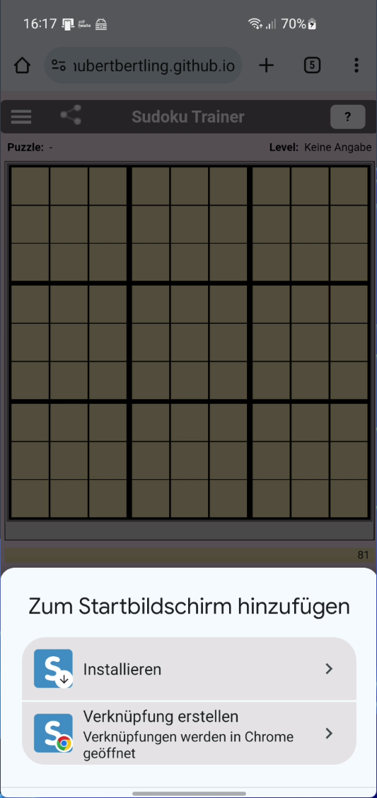{:width="250px"} | 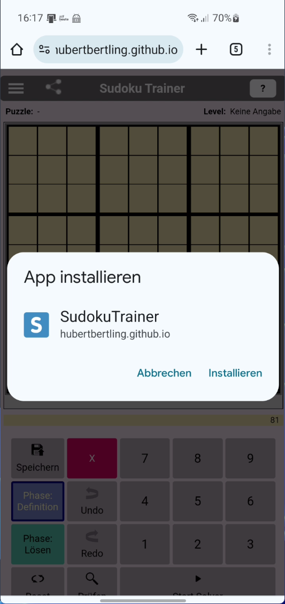{:width="250px"} |

Beim Browser Edge geht es ganz analog. Es wird empfohlen tatsächlich Chrome oder Edge als Installationsbasis zu wählen. Der Autor hat gute Erfahrung mit diesen beiden Browsern gemacht. Auch der Firefox ist möglich. Er ist aber signifikant langsamer als die beiden erstgenannten Browser. Hinsichtlich weiterer alternativer Browser liegen dem Autor keine Erfahrungen vor.

## Teilen der Sudoku-Trainer-App URL

In der Sudoku-Trainer-App kann die URL der App geteilt werden. Dies ist dann besonders nützlich, wenn man die App weitergeben will.

**Absender-Smartphone**

1. Teile-Taste
1. WhatsApp selektieren
1. Kontakt selektieren und senden

| Teile Taste                                                     | WhatsApp selektieren                                          |
| --------------------------------------------------------------- | ------------------------------------------------------------- |
| {: width="200px"} | {: width="200px"} |

**Ziel-Smartphone**

1. In WhatsApp in der empfangenen Nachricht auf den Link klicken.
1. In der geöffneten Web-Seite die PWAP-App installieren.

Hinweis: Bei dieser Vorgehensweise wird automatisch der eingestellte Standard-Browser als Installationsbasis gewählt. Z.B. der Samsung-Internet-Browser oder der Firefox-Browser. Besser ist es, Google-Chrome als Installationsbasis zu wählen. Wenn Chrome nicht als Standard-Browser eingestellt ist, kann man den Link aus der WhatsApp-Nachricht kopieren, den Chrome-Browser öffnen und den kopierten Link in das URL-Feld einfügen. Danach läuft alles wie beschrieben.

## Manueller und automatischer Solver für klassisches Sudoku

Diese App ist ein Trainer für klassisches Sudoku. Der [Sudoku-Trainer](https://hubertbertling.github.io/sudokuTrainer/) unterstützt das manuelle und automatische Lösen von Puzzles. Für Puzzles mit mehreren Lösungen liefert er eine Aufzählung aller Lösungen. Die Besonderheit dieses Trainers: man kann ihm bei der automatischen Suche nach der Lösung zuschauen und damit seine eigene Lösungskompetenz trainieren. Bei jeder automatischen Setzung einer Nummer zeigt der Solver den logischen Grund für die Setzung. Der Anwender kann ein Puzzle manuell lösen, oder Schritt für Schritt automatisch oder vollautomatisch. In der Schritt für Schritt automatischen Vorgehensweise zeigt der Solver den Grund für seine Nummernsetzung an. Vollautomatisch löst der Solver jedes Puzzle in wenigen Sekunden oder erkennt es als nicht lösbar, weil es widersprüchlich ist.

<figure >
   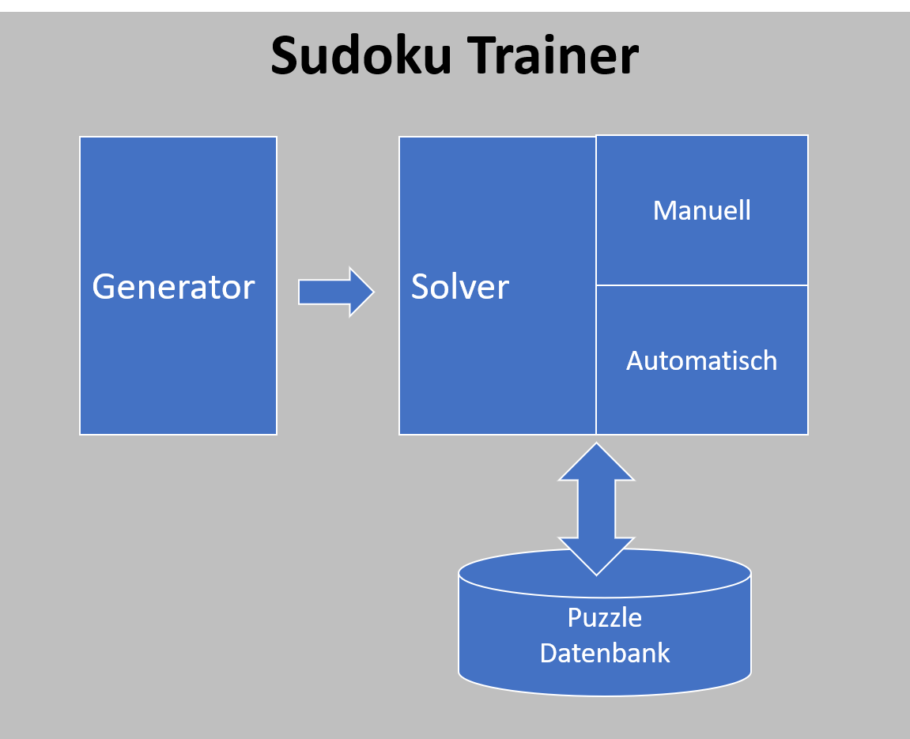
    <figcaption style="font-size: 16px; font-style: italic;">Architektur des Trainers</figcaption>
</figure>

Der Sudoku-Trainer besteht aus drei Komponenten, dem Solver, dem Generator und der Puzzle-Datenbank. Mit Hilfe des Solvers kann man beliebige Sudoku-Puzzles manuell oder automatisch lösen.

Der Generator generiert Puzzles für jeden definierten Schwierigkeitsgrad. Praktisch interessant sind besonders die fairen Schwierigkeitsgrade. 'Sehr leicht', 'Leicht', 'Mittel' und 'Schwer'. Puzzle mit diesen Schwierigkeitsgraden können allein durch logisches Schließen gelöst werden. Ohne Backtracking. Mehr dazu weiter unten.

Der Spielstand von Sudoku-Puzzles kann im lokalen Speicher des Browsers gespeichert werden. Die Tabelle (Datenbank) der gespeicherten Puzzles kann nach ihren Spalten sortiert werden.

## Begriffe und Operationen des Sudoku-Trainers

Die nachfolgend verwendeten Bezeichnungen sind im Laufe der Entwicklung dieses Trainers entstanden. Sie unterstützen primär das Verständnis dieses Trainers. Dennoch haben wir uns bemüht, Standardbegriffe zu verwenden, wie man sie im Internet findet, beispielsweise in [Wikipedia](https://en.wikipedia.org/wiki/Glossary_of_Sudoku). Großartige Seiten für Sudoku-Interessierte sind die Seiten von [Andrew Stuart](https://www.sudokuwiki.org/Main_Page) und von [Jan Feldmann](https://sudoku.coach/).

Ein **Sudoku-Puzzle** ist eine partiell gefüllte Tabelle. Die Tabelle hat 9 **Reihen**, 9 **Spalten** und 9 **Blöcke**. Die initial gesetzten Nummern heißen **Givens**. Eine Reihe, eine Spalte oder ein Block wird auch als **Gruppe** bezeichnet.

### Darstellungsformen von Sudoku-Puzzles

<figure >
   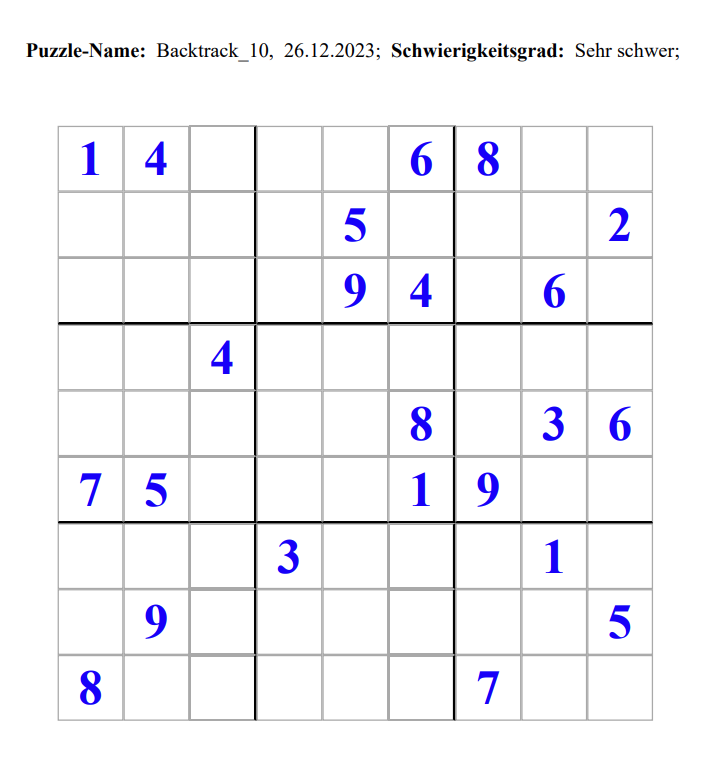
    <figcaption style="font-size: 16px; font-style: italic;">Printdarstellung eines Puzzles</figcaption>
</figure>

Es gibt verschiedene Darstellungsformen eines Puzzles. Oben ist die Druckdarstellung eines Puzzles zu sehen. Nachfolgend sind zwei reine Textdarstellungen des Puzzles angezeigt:

Textdarstellung 1:

    14.|..6|8..
    ...|.5.|..2
    ...|.94|.6.
    -----------
    ..4|...|...
    ...|..8|.36
    75.|..1|9..
    -----------
    ...|3..|.1.
    .9.|...|..5
    8..|...|7..

Textdarstellung 2

    140006800000050002000094060004000000000008036750001900000300010090000005800000700

Die Textdarstellungen eignen sich für den Austausch von Puzzles zwischen Spielern und zwischen Sudoku-Apps. Mit der Operation "Kopieren (Matrix)" der Navigationsbar wird das aktuell geladene Puzzle in der Textdarstellung 1 ins Clipboard kopiert, mit der Operation "Kopieren" in der Textdarstellung 2. Mit der Operation "Einfügen" wird das Puzzle in der Textdarstellung aus dem Clipboard in den Trainer geladen. Beide Textformate sind anwendbar.

Die 4. Darstellung ist die Darstellung des Puzzles in der App. Die Givens werden blau unterlegt angezeigt. Grün unterlegte Zellen enthalten Lösungsnummern, die vom Spieler oder dem Solver gesetzt wurden.

<figure >
   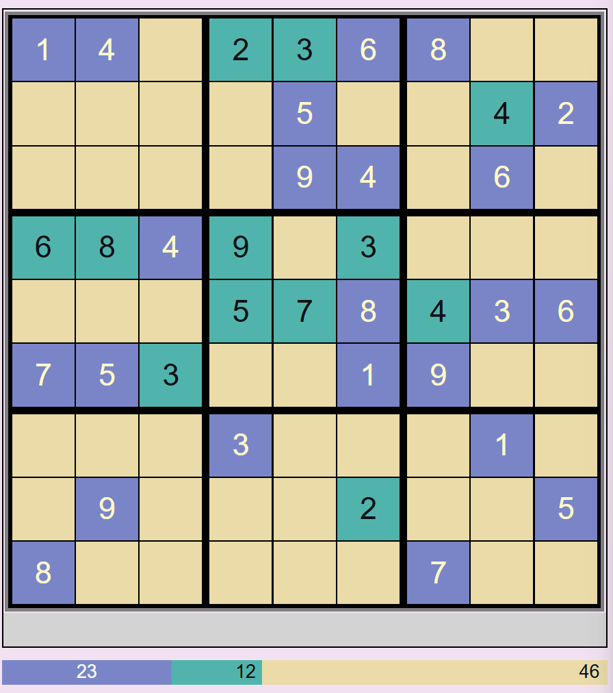
    <figcaption style="font-size: 16px; font-style: italic">App-Darstellung eines Puzzles</figcaption>
</figure>

Der Spieler kann sich bei der Lösungssuche unterstützen lassen, indem er in den noch nicht gesetzten Zellen [Kandidatennummern](#unzulässige-nummern-und-kandidaten) anzeigen lässt. Damit die Kandidatennummern angezeigt werden, muss in den [Solver-Einstellungen](#solver-einstellungen) der Parameter 'Kandidatenauswertung' auf 'Lazy' gesetzt sein.

<figure >
   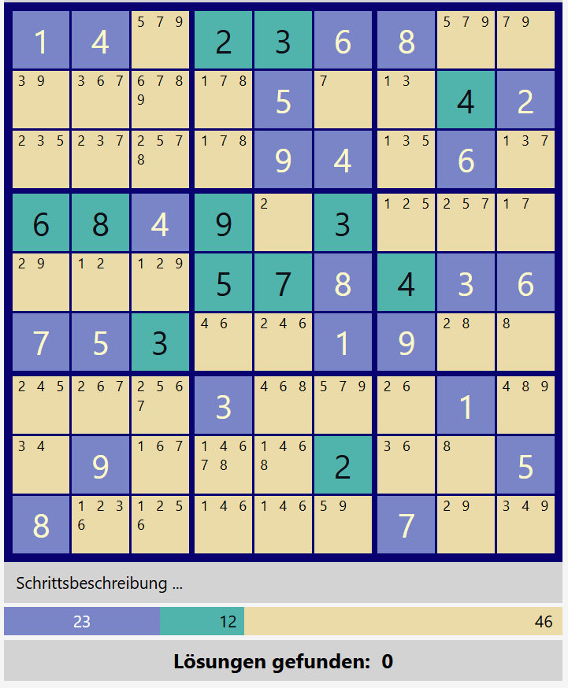
    <figcaption style="font-size: 16px; font-style: italic;">App-Darstellung eines Puzzles, lazy</figcaption>
</figure>

### Die möglichen Inhalte einer Sudoku-Zelle

| Zelle                                                                                                                                       | Bedeutung                                                                                                                                                                                                                                                                                                                                                                                                                                                                                                                                                                                                                                                                                                                                                                          |
| ------------------------------------------------------------------------------------------------------------------------------------------- | ---------------------------------------------------------------------------------------------------------------------------------------------------------------------------------------------------------------------------------------------------------------------------------------------------------------------------------------------------------------------------------------------------------------------------------------------------------------------------------------------------------------------------------------------------------------------------------------------------------------------------------------------------------------------------------------------------------------------------------------------------------------------------------- |
| {:width="100px"}                                                                                      | **Eine gegebene Nummer (Given):** In der Definitionsphase gesetzte Nummer.                                                                                                                                                                                                                                                                                                                                                                                                                                                                                                                                                                                                                                                                                                         |
| {:width="100px"}                                                                                      | **Eine Lösungsnummer:** In der Lösungsphase gesetzte Nummer. In dieser Zelle wurde in der Lösungsphase manuell oder automatisch die Nummer 1 gesetzt.                                                                                                                                                                                                                                                                                                                                                                                                                                                                                                                                                                                                                              |
| 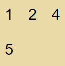{:width="100px"}                                                                                   | **Kandidaten:** Für diese Zelle wurde noch keine Nummer gesetzt. Nur noch eine der Nummern 1, 2, 4 und 5 kann gewählt werden. Das sind die Kandidaten der Zelle. Die nicht aufgeführten Nummern sind unzulässig, weil sie bereits in einer anderen Zelle des Blocks, der Reihe oder Spalte gesetzt sind.                                                                                                                                                                                                                                                                                                                                                                                                                                                                           |
| 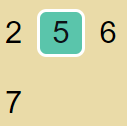{:width="100px}                                                                                    | **Notwendiger Kandidat:** Für die nebenstehende Zelle wurde noch keine Nummer gesetzt. Kandidatnummern sind die Nummern 2, 5, 6 und 7. Jedoch hat der Solver ermittelt, dass der Kandidat 5 notwendig ist, damit das Sudoku lösbar bleibt. 5 ist eine notwendige Nummer für diese Zelle. Ein Kandidat in einer Zelle ist notwendig, wenn die Kandidatnummer in ihrem Block, in ihrer Reihe oder Spalte einzig ist. D.h. sie kann nur noch hier gesetzt werden. Hinweis: Im Wikipedia-Artikel [Wikipedia](https://en.wikipedia.org/wiki/Glossary_of_Sudoku) werden notwendige Kandidaten als "Hidden Singles" bezeichnet. Wir wollen diese Bezeichnung hier nicht übernehmen, weil wir diese Bezeichnung schon anderweitig benutzen: siehe nachfolgende Definition 'Hidden Single'. |
| 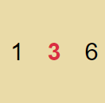{:width="100px}                                                                        | **Eliminierbarer Kandidat:** Für die nebenstehende Zelle wurde noch keine Nummer gesetzt. Kandidaten dieser Zelle sind die drei Nummern 1, 3 und 6. Jedoch hat der Solver ermittelt, dass die Kandidatnummer 3 [unzulässig](#unzulässige-nummern-und-kandidaten) ist. Wenn man sie setzen würde, würde der Solver sofort oder einige Schritte später die Widersprüchlichkeit des Puzzles feststellen.                                                                                                                                                                                                                                                                                                                                                                              |
| {:width="100px"}                                                                                     | **Einziger Kandidat (Single):** Eine Single-Nummer ist der Kandidat in einer Zelle, wenn es keine weiteren Kandidaten in der Zelle gibt. Im nebenstehendem Beispiel ist 1 ein Single.                                                                                                                                                                                                                                                                                                                                                                                                                                                                                                                                                                                              |
| {:width="100px"}                                                                         | **Versteckt einziger Kandidat (Hidden Single):** im nebenstehenden Beispiel ist die 9 ein Versteckt einziger Kandidat. Die 9 ist in dieser Zelle ein Hidden Single, weil die anderen Kandidaten, die rote 5 und 6, unzulässige Kandidaten sind.                                                                                                                                                                                                                                                                                                                                                                                                                                                                                                                                    |
| {: width="100px"} {:width="100px"} | **Widerspruch - Kein Kandidat:** Für diese Zelle wurde noch keine Nummer gesetzt. Allerdings gibt es keinen Kandidat mehr, der noch gesetzt werden könnte. Die Kandidaten 4 und 8 sind unzulässig. In der zweiten dargestellten Zelle gibt es nicht mal mehr Kandidatnummern. D.h. das Puzzle ist widersprüchlich. Wenn das Puzzle noch erfolgreich gelöst werden soll, müssen ein oder mehrere der bisherigen Nummernsetzungen zurückgenommen werden. Tritt während der automatischen Ausführung eine solche Zelle auf, schaltet der Solver in den Rückwärts-Modus um.                                                                                                                                                                                                            |
| {:width="100px"}                                                                     | **Widerspruch - Gleichzeitig mehrere notwendige Kandidaten:** Für diese Zelle wurde noch keine Nummer gesetzt. Kandidatnummern sind 1, 2 und 4. Jedoch hat der Solver zwei verschiedene notwendige Kandidaten für diese Zelle ermittelt: 1 und 2. Das geht natürlich nicht. Es können in einer Zelle nicht zwei Kandidaten gleichzeitig gesetzt werden. D.h. das Puzzle ist widersprüchlich. Wenn das Puzzle noch erfolgreich gelöst werden soll, müssen ein oder mehrere der bisherigen Nummernsetzungen zurückgenommen werden. Tritt während der automatischen Ausführung eine solche Zelle auf, schaltet der Solver in den Rückwärts-Modus um.                                                                                                                                  |
| {:width="100px"}                                                                                 | **Widerspruch - Die Nummer 5 ist bereits einmal gesetzt:** Für diese Zelle wurde die Nummer 5 gesetzt. Diese Nummer ist direkt unzulässig, weil in der Spalte, Reihe oder dem Block dieser Zelle bereits eine 5 gesetzt ist. Das zweite oder dritte Auftreten der Nummer wird ebenfalls mit rotem Rand angezeigt.                                                                                                                                                                                                                                                                                                                                                                                                                                                                  |
| 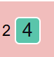{:width="100px"}                                                                    | **Automatisch selektierte Zelle:** mit einem Hidden Single. Etwas hellerer Hintergrund.                                                                                                                                                                                                                                                                                                                                                                                                                                                                                                                                                                                                                                                                                            |
| {:width="100px"}                                                                      | **Manuell selektierte Zelle:** mit zwei Kandidaten. Etwas dunklerer Hintergrund.                                                                                                                                                                                                                                                                                                                                                                                                                                                                                                                                                                                                                                                                                                   |

### Widerspruchsvolle Puzzles

Der automatische Solver setzt solange weitere Nummern in der Tabelle, bis er entweder alle Zellen gesetzt hat (das Sudoku ist gelöst), oder er erkennt, dass das Sudoku bei der aktuellen Befüllung widerspruchsvoll ist. Ein Sudoku-Puzzle ist widerspruchsvoll, wenn es

1. eine widerspruchsvolle Zelle besitzt, oder
1. eine widerspruchsvollen Gruppe.

Es können mehrere dieser Bedingungen gleichzeitig vorliegen. Der vorliegende Solver zeigt der Übersichtlichkeit halber immer nur eine Widerspruchsbedingung an.

**Widerspruchsvolle Zellen**

Widerspruchsvolle Zellen hatten wir oben schon kennengelernt. Es sind dies Zellen ohne zulässige Kandidaten, Zellen mit zwei notwendigen Nummern gleichzeitig und Zellen, die mit einer direkt unzulässigen Nummer belegt sind.

**Widerspruchsvolle Gruppen**

Wir betrachten hier die abstrakte Gruppe. Eine konkrete Gruppe ist immer entweder eine Reihe oder eine Spalte oder ein Block. So wie es widerspruchsvolle Zellen geben kann - erkennbar an ihrem roten Rand - kann es auch widerspruchsvolle Gruppen geben. Eine Gruppe ist widerspruchsvoll, wenn eine der folgenden Bedingungen vorliegt:

1. **Widerspruch - Zwei gleiche Singles:**

      <figure >
      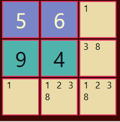
       <figcaption style="font-size: 16px; font-style: italic; text-align:center">Widerspruch - Zwei gleiche Singles</figcaption>
   </figure>

   Ein Single taucht gleichzeitig in verschiedenen Zellen der Gruppe auf. Fordert also dieselbe Nummer mehrmals in der Gruppe zu setzen. Ein Widerspruch.

3. **Widerspruch - Fehlende Nummer:** 

   <figure >
      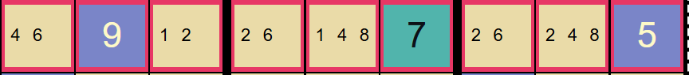
       <figcaption style="font-size: 16px; font-style: italic; text-align:center">Widerspruch - Fehlende Nummer</figcaption>
   </figure>
   
   In der Gruppe kommt eine Nummer überhaupt nicht vor. Hier die 3. Wir sehen, dass gleichzeitig mehrere Bedingungen für einen Gruppenwiderspruch vorliegen können. Tritt während der automatischen Ausführung eine solche widerspruchsvolle Gruppe auf, schaltet der Solver in den Rückwärts-Modus um.

### Zwei Spielphasen

| Phase                                                | Bedeutung                                                                                                                                                                                                                                                                                                                                |
| ---------------------------------------------------- | ---------------------------------------------------------------------------------------------------------------------------------------------------------------------------------------------------------------------------------------------------------------------------------------------------------------------------------------- |
| {:width="200px"} | Die Taste **Phase: Definition**. Das Drücken dieser Taste versetzt den Solver in die Definitionsphase. In dieser Phase überträgt man das zu lösende Puzzle, sprich die Givens des Puzzles, in den Trainer. Nach der Initialisierung ist diese Taste automatisch gesetzt.                                                                 |
| {:width="200px"}      | Die Taste **Phase: Lösen**. Das Drücken dieser Taste versetzt den Trainer in die Lösungsphase. Gleichzeitig ermittelt der Trainer den Schwierigkeitsgrad des eingegebenen Puzzles. Die Lösungsphase kann manuell oder automatisch durchgeführt werden. Wird die automatische Ausführung gestartet, wird diese Taste automatisch gesetzt. |

Hinweis: Gegebene Nummern, die Givens - dies sind blaue Nummern - können in der Lösungsphase nicht gelöscht werden. Falls Givens gelöscht werden sollen, muss man zuvor die Phase-Definition-Taste drücken.

### Jeder Lösungsschritt mit zwei Subschritten

Beim Eingeben wie auch beim Lösen besteht ein **Lösungsschritt** aus zwei Subschritten:

1. **Sudoku-Zelle selektieren.**
2. **Nummer setzen bzw. löschen:** D.h. eine Nummer im rechten Tastenblock wählen. Es kann auch einfach nur eine Nummerntaste auf der Tastatur für die Eingabe einer Nummer benutzt werden.

Soll eine Nummern-Setzung zurückgenommen werden, muss die betroffene Zelle selektiert werden und dann die rote Lösch-Taste gedrückt werden.

### Trainer-Operationen

Die Operationen des Sudoku-Trainers werden über die Tasten und die seitliche Navigationsbar angeboten.

| Navigationsbar                                                    | Tastenfeld                                                                 |
| ----------------------------------------------------------------- | -------------------------------------------------------------------------- |
| 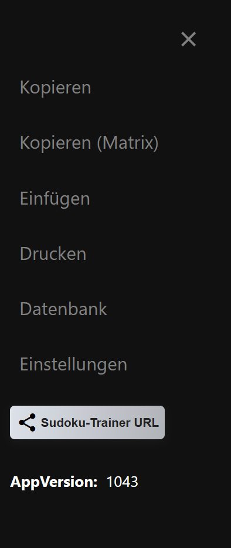{:width="150px"} | 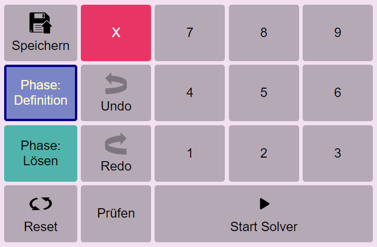{: width=100%} |

**Menü-Option: Initialisieren.** Jederzeit kann der Trainer initialisiert werden. Dabei wird das aktuell gespielte Puzzle gelöscht und der Solver initialisert. Die bereits gespeicherten Puzzles bleiben unverändert erhalten.

**Taste Reset.** Das aktuelle Puzzle wird zurückgesetzt auf die Aufgabenstellung. D.h. alle in der Lösungsphase gesetzten Zellen, die grünen Zellen, werden gelöscht. Die Givens bleiben erhalten. Per Undo kann diese Operation zurückgenommen werden.

**Taste: Undo.** Durch das Drücken dieser Taste wird die letzte Zellenoperation zurückgenommen.

**Taste: Redo.** Rücknahme des Undo.

**Taste: Prüfen.** Die gesetzten Lösungsnummern werden geprüft. Wenn sie falsch gesetzt sind, werden sie als fehlerhaft gekennzeichnet. Diese Funktion ist dann nützlich, wenn man das Puzzle manuell lösen will und man vermutet, dass man bereits einen Fehler gemacht hat.

**Taste: Tipp.** Wenn man bei der manuellen Lösung nicht mehr weiter weiss, kann man diese Taste nutzen. Siehe [Beispiel manuelle Puzzle-Lösung](#beispiel-manuelle-puzzle-lösung), Anwendungsfall "Tipp".

**Taste: Puzzle speichern.** Der Spielstand des aktuellen Puzzles wird in der Datenbank gespeichert. Gegebenenfalls wird das Puzzle in der DB neu angelegt und erhält dabei einen generierten Namen: 'PZ (>>Datum<<)'. Falls es schon in der Datenbank ist, wird es mit dem aktuellen Spielstand überschrieben. Der Name des Puzzles kann jederzeit umbenannt werden.

**Taste: Starte Suche.**
Die Taste "Starte Suche" startet den automatischen Solver der App.

**Menü-Option: Neu.**

<figure >
   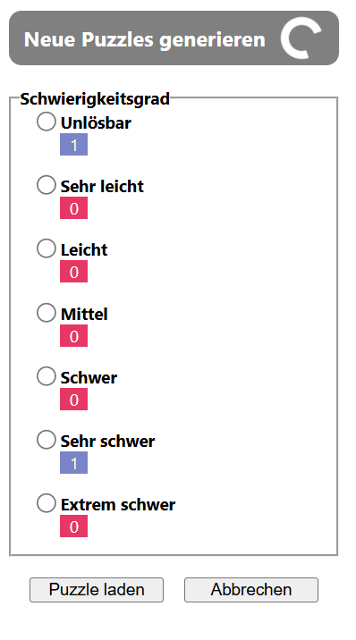
    <figcaption style="font-size: 16px; font-style: italic;" 
>Neues Puzzle selektieren noch während weitere Puzzles generiert werden.</figcaption>
</figure>

Mittels der Option **Neu** im Menu kann der Dialog "Neue Puzzles" geöffnet werden. Der Trainer besitzt einen Vorrat neuer Puzzles, für jeden Schwierigkeitsgrad mindestens 1 Puzzle. Unmittelbar nach Start der App ist dieser Vorrat noch nicht vorhanden.

Die App startet im Hintergrund einen Puzzle-Generator, der solange neue Puzzles erzeugt, bis für jeden Schwierigkeitsgrad mindestens ein neues Puzzle existiert.

Hinweis: der Generator kann nicht gezielt ein Puzzle für einen vorgegebenen Schwierigkeitsgrad erzeugen. Vielmehr generiert er ein neues Puzzle und bestimmt dann, welchen Schwierigkeitsgrad das erzeugte Puzzle hat.

Der Spieler kann im Dialog einen nicht leeren Schwierigkeitsgrad selektieren und ein entsprechendes Puzzle laden. Er braucht nicht auf den Stop des Generators warten.

**Menü-Option: Drucken.** Das aktuelle Puzzle wird ausgedruckt. Falls es noch nicht gespeichert wurde wird es zuvor mit einem Default-Namen 'Druck->>Datum<<' in der Datenbank gespeichert.

## Der automatische Solver

<figure >
   
    <figcaption style="font-size: 16px; font-style: italic;">Solver mit eigenem Tasteblock</figcaption>
</figure>

### Der Tastenblock des automatischen Solvers

Die Tasten des automatischen Solvers haben folgende Bedeutung:

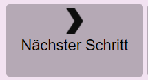{:width="200px"}

**Nächster Suchschritt**.
Der Solver führt den nächsten automatischen Suchschritt aus. Wenn bereits ein automatischer Suchlauf aktiv ist, wird dieser pausiert. Mit dieser Taste kann man den Solver Schritt für Schritt arbeiten lassen und so jeden einzelnen seiner Schritte beobachten und verstehen.

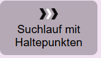{:width="200px"}

**Suchlauf mit Haltepunkten.**
Ein Timer wird gestartet, der die Ausführung automatischer Suchschritte anstößt. Wenn der automatische Suchprozess bereits läuft, wird er pausiert. Wenn er pausiert ist, wird er wieder gestartet. Der Suchlauf kann jederzeit unterbrochen werden, manuell oder durch gesetzte Haltepunkte. Der markanteste Haltepunkt ist wohl der Haltepunkt "bei Lösung". Der Suchlauf traversiert den gesamten Suchraum bis er schließlich sein Ende erreicht. Hinweis: der Haltepunkt "bei Lösung" ist verschieden vom Haltepunkt "Ende des Suchlaufs".

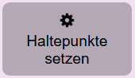{:width="200px"}

**Haltepunkte setzen.**
Der Haltepunktedialog zur Einstellung von Haltepunkten wird geöffnet. Er ist Teil des Einstellungsdialogs der App.

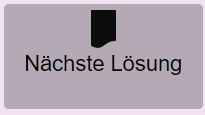{:width="200px"}

**Weitere Lösung anzeigen**.
Beim Drücken dieser Taste führt der Solver im Hintergrund eine Sequenz von Suchschritten durch bis er zur nächsten Lösung gelangt.

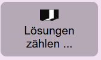{:width="200px"}

**Lösungen zählen ...**
Ein Timer wird gestartet, der die Ausführung automatischer Suchschritte im Hintergrund anstößt. Für den Anwender sichtbar ist das Zählen der Lösungen. Interessant ist diese Funktion für extrem schwere Puzzles, also Puzzles mit mehreren Lösungen. Diese Operation ist sehr schnell, sodass für viele extrem schwere Puzzles die Anzahl möglicher Lösungen berechnet werden kann.

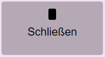{:width="200px"}

**Schließen.**
Die automatische Suche wird abgebrochen bzw. beendet.

{:width="100px"}

**Reset.**
Reset Puzzle, ohne den Solver zu verlassen.

### Solver-Einstellungen

**Menü-Option: Einstellungen.** Aktuell kennt der Sudoku-Trainer 2 Einstellungsparameter

1. Kandidatenauswertung
1. Haltepunkte der automatischen Lösungssuche

{: style="text-align:center"}
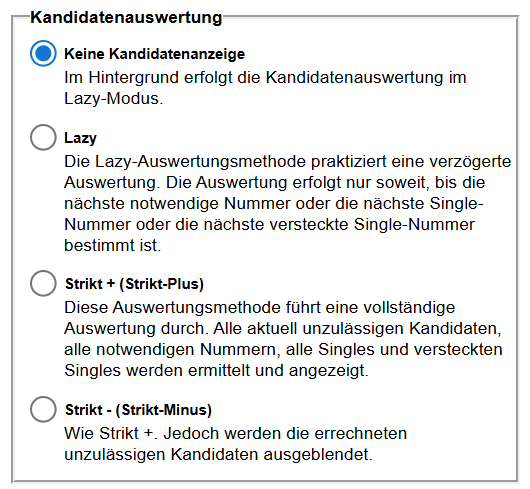{:max-width="75%"}

{: style="text-align:center"}
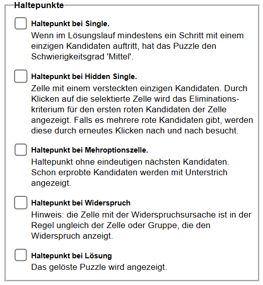{:max-width="75%"}

## Die Puzzle-Datenbank

Sudoku-Puzzles und ihre Lösungen können im lokalen Speicher des Browsers gespeichert werden, aber nur mit Einschränkungen auf dem Computer selbst. D.h. Man kann seine gespeicherten Puzzles nur in dem Browser wiederfinden, in dem sie gespeichert wurden.

<figure >
   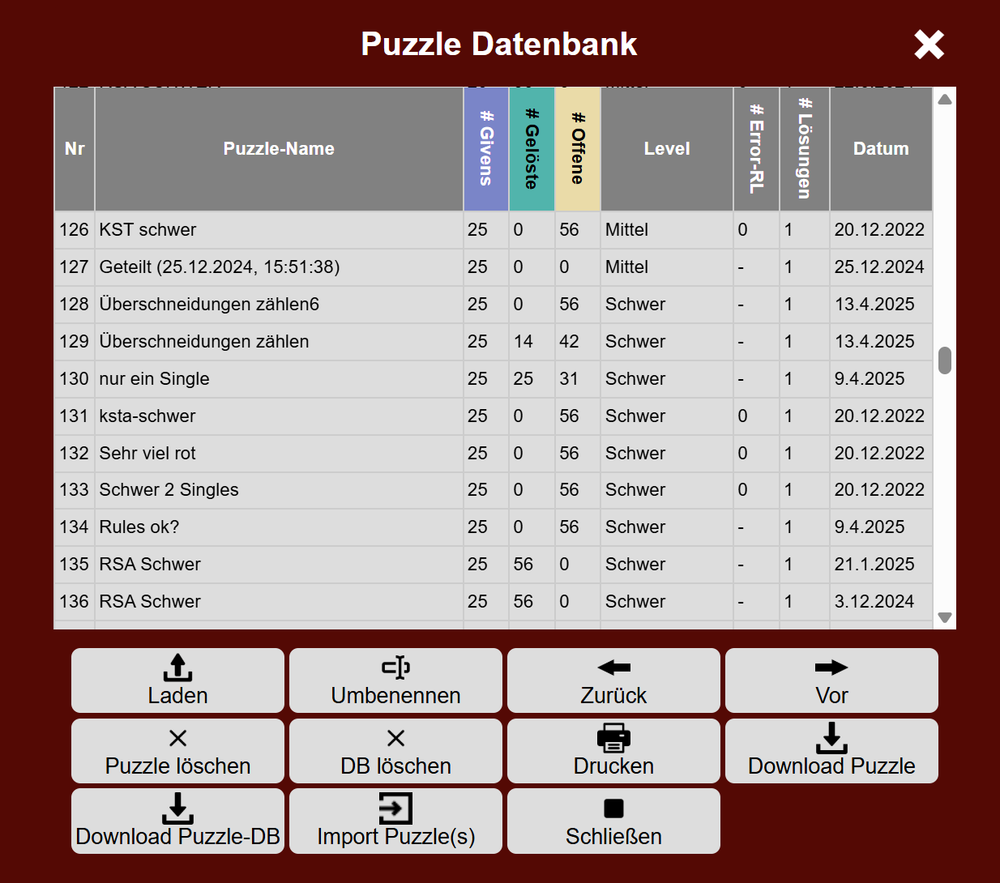
    <figcaption style="font-size: 16px; font-style: italic;">Puzzle Datenbank</figcaption>
</figure>

Beim Abspeichern erhält das gespeicherte Puzzle automatisch einen Namen, das aktuelle Datum. Bei Bedarf kann der Name umbenannt werden. Bezüglich der Namen gibt es keine Einschränkungen.

| Attribut     | Bedeutung                                                                                                                                                                                                                                                                                                                                                                                                                                                                                                                                                                                                                     |
| ------------ | ----------------------------------------------------------------------------------------------------------------------------------------------------------------------------------------------------------------------------------------------------------------------------------------------------------------------------------------------------------------------------------------------------------------------------------------------------------------------------------------------------------------------------------------------------------------------------------------------------------------------------- |
| Laufende Nr. | Laufende Nr. in der Tabelle. Sie ist keine ID für Puzzles                                                                                                                                                                                                                                                                                                                                                                                                                                                                                                                                                                     |
| Puzzle-Name  | Name des gespeicherten Puzzles. Muss nicht eindeutig sein.                                                                                                                                                                                                                                                                                                                                                                                                                                                                                                                                                                    |
| #Givens      | Die Zahl der Givens des Puzzles.                                                                                                                                                                                                                                                                                                                                                                                                                                                                                                                                                                                              |
| #Gelöste     | Die Zahl der gelösten Zellen des Puzzles.                                                                                                                                                                                                                                                                                                                                                                                                                                                                                                                                                                                     |
| #Offene      | Die Zahl der offenen, ungelösten Zellen des Puzzles.                                                                                                                                                                                                                                                                                                                                                                                                                                                                                                                                                                          |
| Level        | Der ermittelte Schwierigkeitsgrad des gespeicherten Puzzles.                                                                                                                                                                                                                                                                                                                                                                                                                                                                                                                                                                  |
| #Error-RL    | Die Anzahl der Error-Rückwärtsläufe, die der Solver durchgeführt hat, um das Puzzle zu lösen. **Error-Rückwärtsläufe** erfolgen nach Auftreten eines Widerspruchs. Hinweis: Error-Rückwärtsläufe sind nur für sehr schwere Puzzles von Bedeutung. Sehr schwere Puzzles benötigen Backtracking für die Ermittlung ihrer eindeutigen Lösung. Leichtere Puzzles werden ohne Backtracking und damit ohne Rückwärtsläufe gelöst. Für extrem schwere Puzzles, also Puzzles mit mehreren Lösungen, gibt es zusätzlich **Lösungs-Rückwärtsläufe** nach dem Auftreten einer Lösung. Auf eine entsprechende Auswertung wird verzichtet. |
| Datum        | Datum, an dem das Puzzle angelegt wurde.                                                                                                                                                                                                                                                                                                                                                                                                                                                                                                                                                                                      |

### Operationen der Datenbank

| Taste                                                      | Bedeutung                                                                                                                                                                                                                                                                                                                                                 |
| ---------------------------------------------------------- | --------------------------------------------------------------------------------------------------------------------------------------------------------------------------------------------------------------------------------------------------------------------------------------------------------------------------------------------------------- |
| Spaltenkopf                                                | **Sortieren.** Die Puzzles der Datenbank können sortiert werden nach jeder Spalte. Dazu einfach den Spaltenkopf klicken. Wiederholtes Klicken wechselt zwischen der aufsteigenden und der absteigenden Sortierung.                                                                                                                                        |
| Pfeiltasten                                                | **Navigieren.** Mit den Pfeiltasten kann in der Tabelle vorwärts und rückwärts navigiert werden. Durch Klicken auf eine Reihe der Tabelle kann ein Puzzle direkt selektiert werden.                                                                                                                                                                       |
| Laden                                                      | **Puzzle laden.** Durch Drücken der Lade-Taste wird das selektierte Puzzle in den Sudoku-Solver geladen.                                                                                                                                                                                                                                                  |
| Puzzle löschen                                             | **Puzzle löschen.** Gespeicherte Puzzles können auch wieder gelöscht werden.                                                                                                                                                                                                                                                                              |
| DB löschen                                                 | **DB löschen.** Die ganze DB kann gelöscht werden. Nützlich, wenn man die DB von einem anderen Gerät übernehmen will und die Übernahme nicht mit der aktuellen DB mischen will.                                                                                                                                                                           |
| Drucken                                                    | **Puzzle drucken.** Mittels der Taste Drucken kann das aktuell selektierte Puzzle gedruckt werden. Dabei wird nur die Aufgabe, nicht aber die Lösung ausgedruckt. Dies ist besonders dann nützlich wenn man ein generiertes Puzzle von Hand auf dem Papier lösen möchte.                                                                                  |
| Download Puzzle-DB                                         | **Puzzle-Datenbank exportieren.** Durch Drücken dieser Taste wird die aktuelle Puzzle-Datenbank in ein txt-File 'Puzzle-DB.text' ausgegeben. Es befindet sich im Download-Ordner.                                                                                                                                                                         |
| Download Puzzle                                            | **Puzzle exportieren.** Durch Drücken dieser Taste wird die aktuelle Puzzle mit dem Namen >>PuzzleName<< in ein txt-File '>>PuzzleName<<.text' ausgegeben. Es befindet sich im Download-Ordner.                                                                                                                                                           |
| Import Puzzle(s)                                           | **Puzzle(s) importieren.** Mit dieser Taste wird ein File-Selection-Dialog gestartet. nur txt-Files können selektiert werden.                                                                                                                                                                                                                             |
| 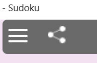{:width="50px"} | **Puzzle teilen.** Die Sudoku-Trainer-App ist Progressive Web App (PWA). Wie eine native App kann sie daher Inhalte, in unserem Fall ein Puzzle-File, mit anderen Apps teilen, z.B. mit WhatsApp oder einer EMAIL-App. Auf dem PC startet bei Doppel-Click auf diese Datei die Sudoku-App. Auf dem Android-SmartPhone ist dies leider noch nicht möglich. |

### Import/Export

Die Operationen Import/Export und Teilen sind sehr abhängig von der vorliegenden Betriebssystem- und Browser-Version. Konkret von den verfügbaren APIs. Es kann also vorkommen, dass manche der nachfolgend gezeigten Beispiele auf dem System des interessierten Anwenders nicht funktionieren.

Nachfolgend einige Beispiele für den Austausch von Puzzles zwischen Sudoku-Trainer-Apps.

#### Puzzle teilen von SmartPhone zu SmartPhone

In diesem Beispiel wird das aktuelle Puzzle >>DemoPuzzle<< verschickt.

**Absender-Smartphone**

1. Teile-Taste in der Hauptansicht klicken.
1. WhatsApp selektieren (oder eine MAIL App).
1. Kontakt selektieren und senden.

**Ziel-SmartPhone**

1. WhatsApp starten.
1. Die in der empfangenen Nachricht enthaltene Datei >>sharedPuzzle.text<< downloaden.
1. Die App Soduku-Trainer starten.
1. In der App den Datenbank-Dialog öffnen (Menü Datenbank).
1. Die Taste Import-Puzzle klicken.
1. {:width="auto"}
1. Die Aktion Dateien auswählen.
1. Die im Download-Ordner abgelegte Datei >>sharedPuzzle.text<< selektieren.

#### Puzzle Datenbank vom PC auf das Smartphone übertragen

**Absender-PC**

1. Sudoku-Trainer starten
1. In den Datenbank-Dialog wechseln
1. 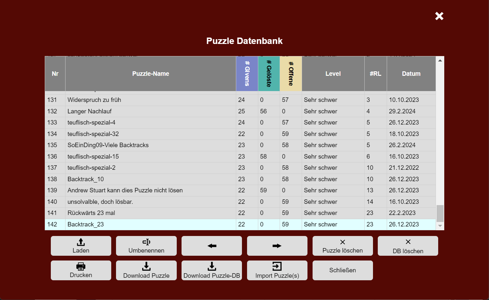{: width="auto"}
1. Download-Puzzle-DB-Taste in der Hauptansicht klicken.
1. WhatsApp starten (oder eine MAIL App).
1. Datei >>downloadedPuzzleDB.text<< in den Anhang laden.
1. Kontakt selektieren und senden.

**Ziel-SmartPhone**

1. WhatsApp starten.
1. Die in der empfangenen Nachricht enthaltene Datei downloaden.
1. Die App Soduku-Trainer starten.
1. In der App den Datenbank-Dialog öffnen (Menü Datenbank).
1. Die Taste Import-Puzzle klicken.
1. {:width="auto"}
1. Die Aktion Dateien auswählen.
1. Die im Download-Ordner abgelegte Datei >>downloadedPuzzleDB.text<< selektieren.

#### Puzzle kopieren und einfügen via Clipboard

Die Textdarstellungen eignen sich für den sehr einfachen Austausch von Puzzles zwischen Spielern und zwischen Sudoku-Apps.

Textdarstellung 1:

    14.|..6|8..
    ...|.5.|..2
    ...|.94|.6.
    -----------
    ..4|...|...
    ...|..8|.36
    75.|..1|9..
    -----------
    ...|3..|.1.
    .9.|...|..5
    8..|...|7..

Textdarstellung 2

    140006800000050002000094060004000000000008036750001900000300010090000005800000700

Mit der Operation "Kopieren (Matrix)" der Navigationsbar wird das aktuell geladene Puzzle in der Textdarstellung 1 ins Clipboard kopiert, mit der Operation "Kopieren" in der Textdarstellung 2. Mit der Operation "Einfügen" wird das Puzzle in der Textdarstellung aus dem Clipboard in den Trainer geladen. Beide Textformate sind anwendbar.

## Sudoku-Theorie

### Unzulässige Nummern und Kandidaten

**Unzulässige Nummern:** Für eine noch nicht belegte Zelle der Sudoku-Tabelle unterscheiden wir Unzulässige Nummern und Kandidatennummern, kurz Kandidaten. Für eine unbelegte Zelle ist eine **Nummer unzulässig**, wenn in dem Block, in der Reihe oder Spalte dieser Zelle eine andere Zelle existiert, in der diese Nummer bereits gesetzt ist. Alle anderen Nummern heißen **Kandidatnummern** oder einfach **Kandidaten** dieser Zelle. In einer unbelegten Zelle werden die Kandidaten der Zelle angezeigt, sofern in der Werkzeugeinstellung für den Einstellungsparameter "Kandidatenauswertung" nicht der Wert "Keine Kandidatenanzeige" gesetzt ist.

**Eliminierbare Kandidaten.** Auch Kandidaten können unzulässig sein. Eine Kandidatennummer ist unzulässig bzw. eliminierbar, wenn sie das Puzzle widersprüchlich macht. Der Solver würde das sofort oder einige Schritte später aufdecken. Eliminierbare Kandidaten werden in roter Farbe angezeigt.

### Notwendige Kandidaten

<figure>
   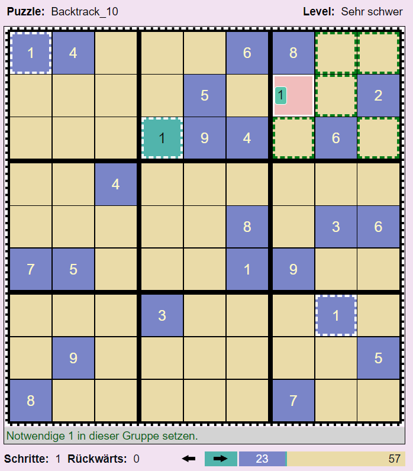
    <figcaption style="font-size: 16px; font-style: italic;">Notwendiger Kandidat 1</figcaption>
</figure>

Eine Kandidatnummer in einer Zelle ist notwendig, wenn die Nummer in ihrem Block, in ihrer Reihe oder Spalte einzig ist. D.h. sie kann nur hier gesetzt werden. Im Bild ist die grüne 1 in der selektierten Zelle notwendig, weil sie in ihrem Block kein weiteres mal zulässig ist. Stuart spricht von _der letzten verbleibenden Zelle für die 1 im dritten Block_. Im Lazy-Auswertungsmodus zeigt der Solver den die Notwendigkeit verursachenden Block, Spalte oder Reihe an, wenn man die Zelle mit der notwendigen Nummer selektiert hat. Die Zellen des Blocks besitzen einen grün gestrichelten Rahmen. Die Zellen mit den weiß gestrichelten Rahmen zeigen Einsen an, deretwegen in den grün gestrichelten Rahmen keine 1 mehr gesetzt werden kann.

### Singles (Einzige Kandidaten)

<figure>
   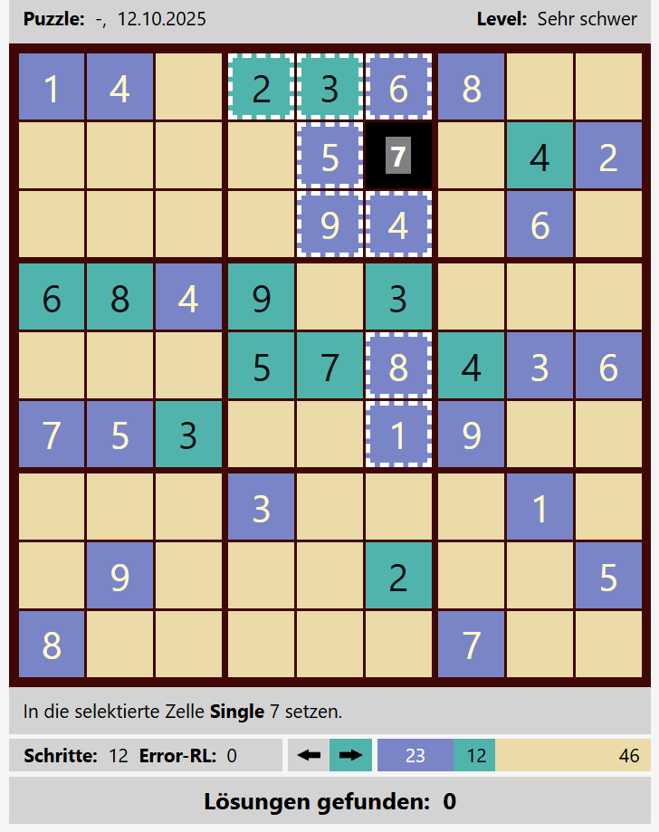
    <figcaption style="font-size: 16px; font-style: italic;">Single 9</figcaption>
</figure>

Eine Kandidatnummer in einer Zelle heißt "Single", wenn es keine weiteren Kandidaten in der Zelle gibt. Im Beispiel ist die 9 ein einziger Kandidat. Die Nummern 1 - 8 sind in dieser Zelle keine Kandidaten. Die gestrichelt weiß umrandeten Zellen sind die Gründe für das Nicht-Kandidat-sein der jeweiligen Nummer. Stuart spricht von der _Last Possible Number_.

### Eliminierbare Kandidaten und versteckte Singles

Eliminierbare Kandidaten werden in roter Schrift angezeigt. Eine Kandidatennummer ist **eliminierbar**, wenn ihre Setzung in der Zelle das Puzzle widerspruchsvoll machen würde.

<figure>
   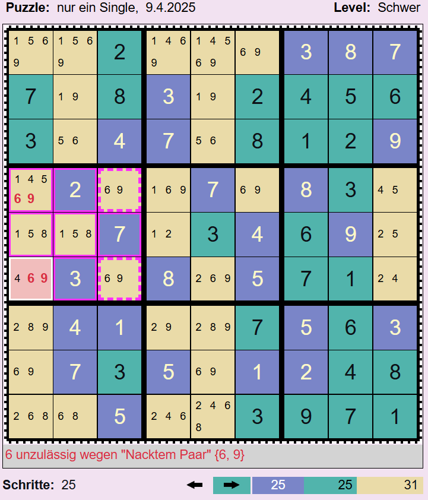
    <figcaption style="font-size: 16px; font-style: italic;">Versteckter Single 4</figcaption>
</figure>

Warum interessieren wir uns für eliminierbare Kandidaten? Wenn in einer Zelle alle Kandidatennummern bis auf eine (ein **versteckter Single**) eliminierbar sind, dann kann der versteckt einzige Kandidat, hier die 4, in der Zelle gesetzt werden.

### Kriterien für die Erkennung eliminierbarer Kandidaten

Im Sudoku-Internet werden zahlreiche Kriterien genannt. Siehe z.B. die teilweise bereits erwähnten Seiten von [Andrew Stuart](https://www.sudokuwiki.org/Main_Page), von [Jan Feldmann](https://sudoku.coach/) oder die von [Christoph Lauble](https://sudoku.soeinding.de/sudokuExtraTeuflischSchwer.php). Man achte auf die in den Details unterschiedlichen Begriffe und Definitionen. Grundsätzlich ist die rein logische Erkennung der Eliminierbarkeit von Kandidaten unvollständig. D.h. es gibt so schwere Puzzles, dass nicht alle eliminierbaren Kandidaten mittels der Anwendung von logischen Kriterien erkannt werden können. Egal, ob nur die 4 in diesem Trainer implementierten Kriterien zur Anwendung kommen, oder alle in der Community bekannten Kriterien. Sudokus, für die es bisher keine rein logische Lösung gibt, können immer noch durch Backtracking gelöst werden. Der vorliegende Solver unterstützt nachfolgend beschriebene logische Kriterien für das Erkennen der Eliminierbarkeit von Kandidaten.

#### E1: Kriterium "Nacktes Paar"

<figure >
   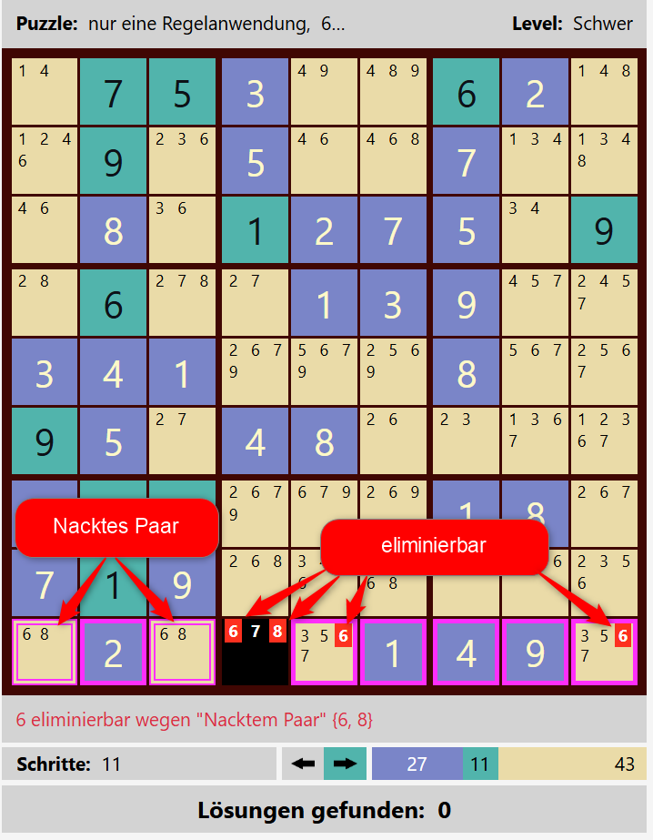
    <figcaption style="font-size: 16px; font-style: italic;">Nacktes Paar</figcaption>
</figure>

Eine Kandidatnummer ist eliminierbar, wenn es in einem Block, einer Reihe oder Spalte Paare gibt und Nummern dieser Paare zusätzlich in weiteren Zellen dieses Blocks, dieser Spalte oder Reihe auftauchen. Im Beispiel ist das 6-8-Paar ein nacktes Paar. Das 6-8-Paar macht in seiner Reihe alle 6 und 8 unzulässig. Der Grund: Das Paar bedeutet, dass die 6 und die 8 auf jeden Fall in einer der beiden Zellen des Paares gesetzt werden muss. Aktuell steht nur noch nicht fest, ob die 6 oder die 8 links ist. Fest steht aber jetzt schon, dass in den übrigen Zellen der Reihe keine 6 oder 8 mehr vorkommen können. Die 6 und 8 sind hier eliminierbar. Diese Reihendarstellung mit den gestrichelten Kanten zeigt der Solver nur im Lazy-Auswertungsmodus, wenn man eine Zelle mit eliminierbaren Nummern selektiert hat.

#### E2: Kriterium: "Verstecktes Paar"

<figure >
   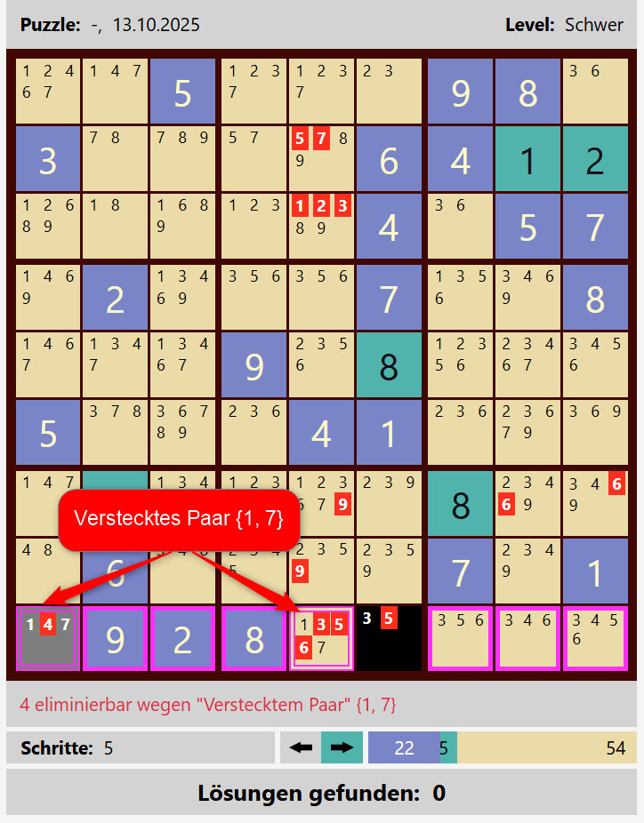
    <figcaption style="font-size: 16px; font-style: italic;">Verstecktes Paar</figcaption>
</figure>

In einem Block, einer Spalte oder Reihe kann es ein verstecktes Paar geben. Ein verstecktes Paar besteht aus zwei Zellen, die zwei gemeinsame Nummern haben, im Beispiel 1 und 8, die in den übrigen Zellen nicht vorkommen. Daneben können sie weitere Nummern haben. Am Ende können in diesen beiden Zellen nur die beiden Nummern 1 und 8 untergebracht werden. Deshalb müssen die übrigen Nummern der beiden Zellen eliminiert werden.

#### E3 Kriterium: "Überschneidung"

<figure >
   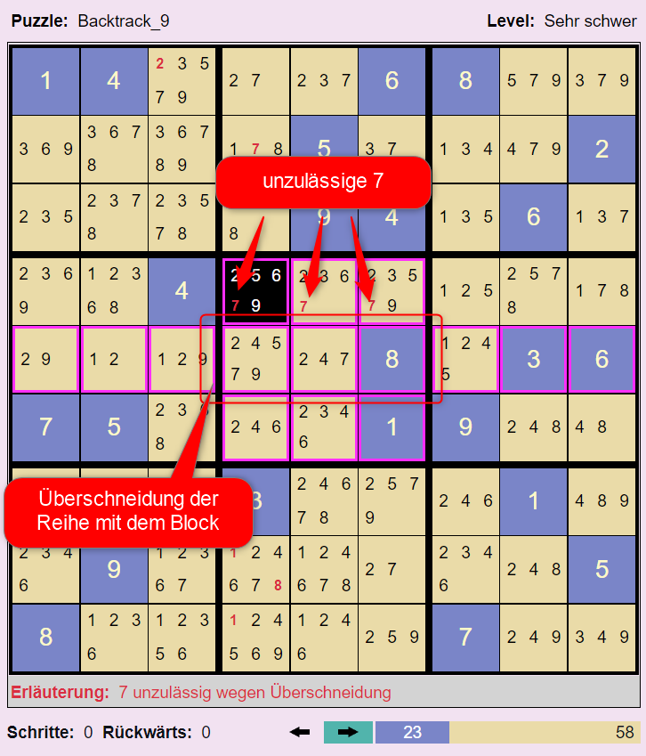
    <figcaption style="font-size: 16px; font-style: italic;">Überschneidung</figcaption>
</figure>

Ein Block und eine Spalte oder Reihe überschneiden sich. In der Reihe gibt es Nummern, die nur in den gemeinsamen Zellen mit dem Block auftauchen. Im Beispiel die 7. Damit es am Ende in der Reihe überhaupt eine 7 gibt, muss eine 7 in der Reihe gewählt werden. Dies wiederum bedeutet, dass die Nummern 7 in dem Block jenseits der Reihe gestrichen werden müssen.

#### E4 Kriterium: "Zeiger-Paar", "Zeiger-Triple"

<figure >
   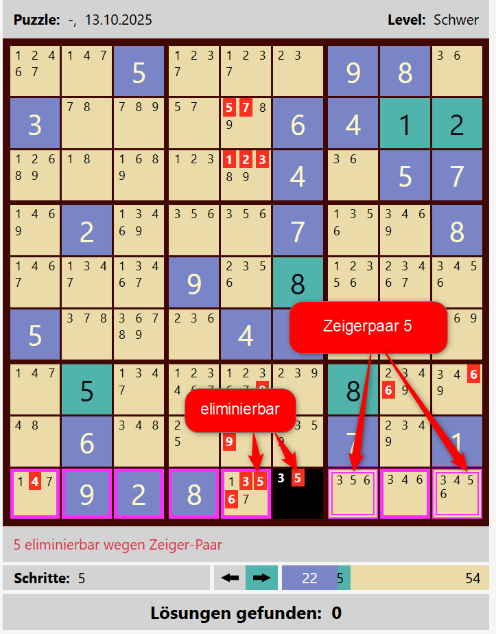
    <figcaption style="font-size: 16px; font-style: italic;">Zeiger-Paar, Zeiger-Tripel</figcaption>
</figure>

Das "Pointing Pair"-Kriterium kommt zur Anwendung, wenn ein Kandidat zweimal in einem Block vorkommt und zwar so, dass sich diese Vorkommen in derselben Zeile oder Spalte befinden. Ein Beispiel. Betrachten wir den mittleren oberen Block. Alle Zellen, die die Zahl 2 enthalten könnten, befinden sich in einer Zeile. Da die Zahl 2 in diesem Block mindestens einmal vorkommen sollte, wird eine der hervorgehobenen Zellen sicher die Zahl 2 enthalten. In den übrigen Zellen der Zeile kann daher die 2 gestrichen werden.

### Puzzle lösen durch Scannen, Eliminieren und Trial & Error

Der automatische Solver dieser App wendet für das Lösen von Sudoku-Puzzles ein ineinander verschränktes Verfahren aus Scannen, Eliminieren und Trial & Error an. Solange das Puzzle nicht gelöst ist, werden folgende Schritte durchgeführt:

1. **Scanne notwendige Kandidaten:** Der Solver wählt in der Tabelle zunächst eine offene Zelle, die in der Menge ihrer Kandidaten eine notwendige Nummer hat. Diese notwendige Nummer wird dann in der Zelle gesetzt.
2. **Scanne Singles:** Wenn es keine Zelle mit notwendigem Kandidat mehr gibt, wählt der Solver eine Zelle mit nur einem einzigen Kandidat. Er setzt diese Nummer.
3. **Scanne versteckte Singles** Wenn es keine Zelle mit notwendiger Nummer oder mit Single mehr gibt, eliminiert der Solver Kandidaten, solange bis ein **verstecktes Single** übrig bleibt und setzt es. Dabei wendet er Regeln aus der Menge der folgenden 4 Eliminationsregeln an:
   1. **Nacktes Paar**
   2. **Verstecktes Paar**
   3. **Überschneidung**
   4. **Zeiger-Paar, Zeiger-Tripel**
4. **Trial & Error**
   1. **Scanne Kandidaten-Optionen:** Sind keine Zellen mehr verfügbar mit notwendigem Kandidat, mit einem einzigen Kandidat oder mit eimem versteckt einzigen Kandidat, wählt der Solver eine Zelle mit minimaler Anzahl von Kandidaten. Die sogenannten **Optionen der Zelle**. Meist besteht die minimale Optionenmenge aus zwei Optionen. Die Selektion ist aber nicht eindeutig, d.h. es gibt in der Regel mehrere Zellen mit zwei Optionen. In dieser Menge wählt der Solver zufällig eine Zelle.
   2. **Trial and Error der Optionen** Der Solver setzt eine der beiden Optionennummern. Im Laufe der weiteren Suche kann sich herausstellen, dass diese Nummer keine Lösung des Puzzles erlaubt. Der Backtracking-Prozess kehrt im weiteren Verlauf zu dieser Zelle zurück und versucht dann mit der Wahl einer anderen Nummer aus der Optionenmenge die Lösung zu finden.
   3. **Vorwärts und Rückwärts** (Backtracking) Der Solver zeigt an, wie er im Suchprozess vorwärts und rückwärts geht. Rückwärts muss er gehen, wenn die aktuell gesetzte Nummer zur Widersprüchlichkeit des Sudokus führt. **Rückwärtsgehen** bedeutet, dass der Solver der Reihe nach zuvor gesetzte Nummern wieder zurücknimmt, bis er auf eine Zelle trifft, in der er mehrere Kandidatnummern zur Auswahl hatte, also eine Zelle mit Optionen. Er wählt dann die nächste noch nicht probierte Zahl der Optionenmenge und geht wieder in den Vorwärts-Modus. Sind alle Kandidatnummern durchprobiert, geht er weiter rückwärts. Wenn er im Rückwärtsgehen bei der ersten gesetzten Zelle ankommt, und die erste Zelle keine weiteren unprobierten Kandidaten mehr hat, hat das Sudoku-Puzzle keine Lösung. Der Solver zeigt die Anzahl der zurückgelegten Schritte an. Jedes Setzen einer Zelle sowie die Rücknahme einer Setzung erhöht den Zähler um 1. Ebenso zeigt der Solver die Anzahl der **Error-Rückwärtsläufe** an. Hinweis: Error-Rückwärtsläufe erfolgen nach Auftreten eines Widerspruchs. Für extrem schwere Puzzles, also Puzzles mit mehreren Lösungen, gibt es zusätzlich **Lösungs-Rückwärtsläufe**.

### Lazy und strikte Kandidatenauswertung

Unter Kandidatenauswertung verstehen wir die Anwendung der Scan-und Eliminationsregeln, die im vorigen Abschnitt eingeführt wurden. Der Solver unterscheidet mehrere Methoden der Kandidatenauswertung.

1. **Keine Kandidatenanzeige** Kandidatenauswertung. Der Solver zeigt keine Kandidaten an, wenngleich er im Hintergrund weiter mit Kandidaten arbeitet. Diese Option ist wünschenswert, wenn der Spieler ohne Hilfe des Solvers eine manuelle Lösung des Puzzles suchen will.

1. **Lazy** Kandidatenauswertung. Wenn die Anzahl eliminierbarer Kandidaten (die roten Nummern) groß wird, wird es immer schwieriger, nackte Paare oder versteckte Paare zu erkennen. Die Lazy-Auswertungsmethode praktiziert eine verzögerte Auswertung. Die Auswertung erfolgt nur soweit, bis die nächste notwendige Nummer oder die nächste Single-Nummer oder die nächste versteckte Single-Nummer bestimmt ist. Nur im Lazy-Modus, können in den oben gezeigten Beispielen die Erläuterungen der Kandidatennummern angezeigt werden.

1. **Strikt +**: Diese Auswertungsmethode führt eine vollständige Auswertung durch. Alle aktuell eliminierbaren Kandidaten, alle notwendigen Nummern, alle Singles und versteckten Singles werden ermittelt und angezeigt.

1. **Strikt -** : Wie Strikt +. Jedoch werden die errechneten eliminierbaren Kandidaten ausgeblendet.

Das nachfolgende Bild zeigt ein Puzzle im Strikt-Plus-Auswertungsmodus. Bei genauerer Betrachtung dieses Beispiels fällt auf, dass in allen Zellen nur noch eine Nummer zulässig ist.

<figure >
   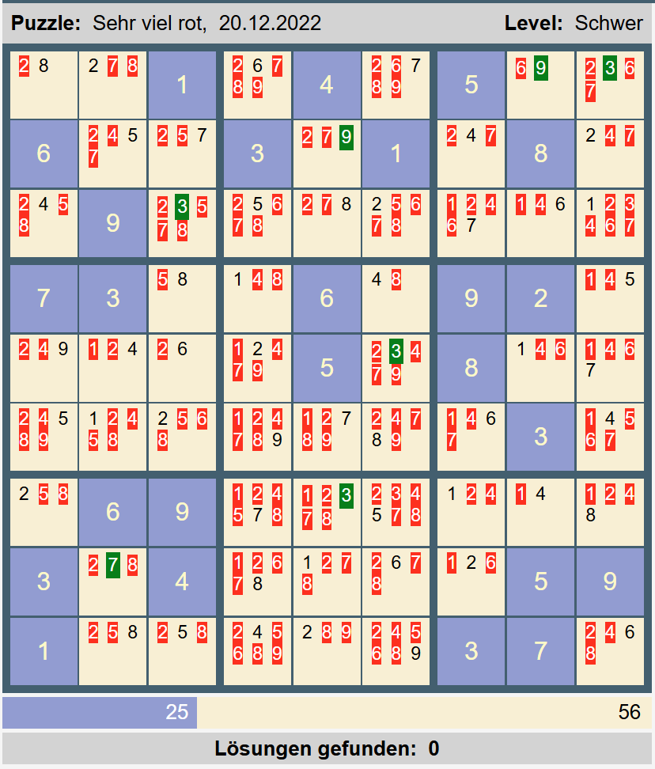
    <figcaption style="font-size: 16px; font-style: italic;">Strikt-Plus</figcaption>
</figure>

Das nachfolgende Bild zeigt die vorige Tabelle im Strikt-Minus-Modus. Im Strikt-Minus-Modus ist unmittelbar sichtbar, dass alle Zellen dieses Beispiels nur noch genau eine zulässige Nummer haben. Alle Nummern sind Singles. Mit anderen Worten: wir sehen hier die Lösung des Sudokus. Der Solver präsentiert hier eine Lösung ohne Backtracking. Nur die zuvor erläuterten Kriterien für eliminierbare Kandidaten wurden angewandt.

<figure >
   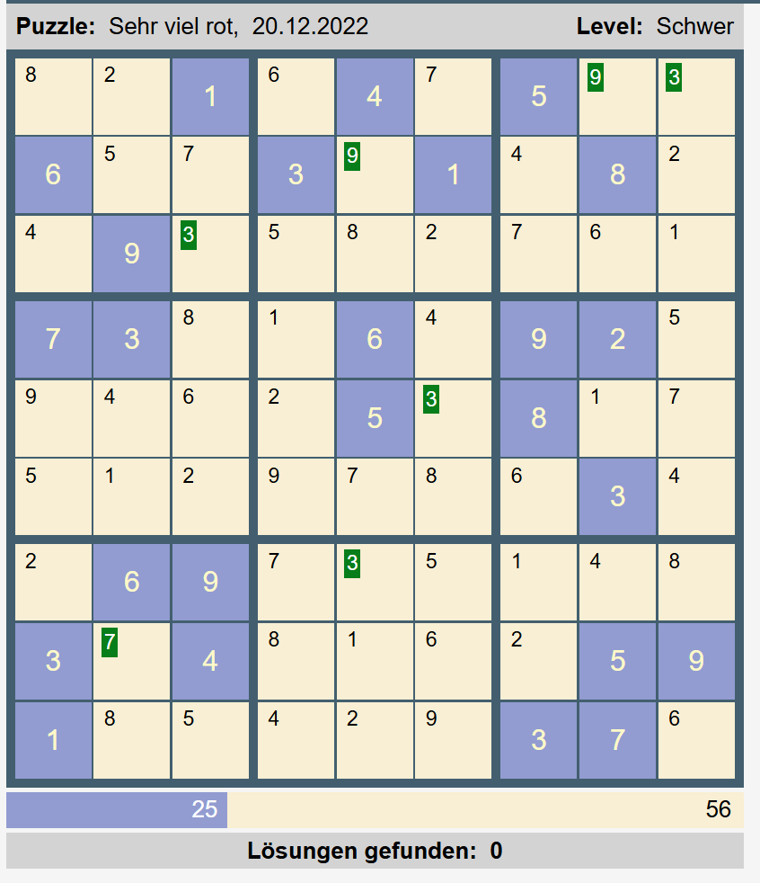
    <figcaption style="font-size: 16px; font-style: italic;">Strikt-Minus</figcaption>
</figure>

### Vergleich der Auswertungsmodi Lazy und Strikt

Wir vergleichen die jeweiligen Vorteile der Auswertungsmodi.

**Vorteil der Lazy-Auswertung: Nachvollziehbarkeit des Lösungsweges.** Die Lazy-Auswertung ist vorteilhaft, wenn man den Lösungsweg im Einzelnen nachvollziehen will. Es werden nur eliminierbare Kandidaten berechnet und angezeigt, die für den nächsten Schritt relevant sind. Für diese wenigen eliminierbaren Kandidaten ist ihre Verursachung leicht visuell darstellbar und damit verstehbar.

Im Lazy-Modus wird die Verursachung notwendiger Nummern oder eliminierbarer Kandidaten angezeigt durch gestrichelte Border, wenn die Zelle der notwendigen Nummer oder eliminierbaren Nummer selektiert ist. Durch erneutes Klicken der selektierten Zelle können die Ursachen der notwendigen und eliminierbaren Kandidaten der Reihe nach jeweils angezeigt werden. Wenn alle Kandidaten angezeigt wurden, führt das erneute Klicken der Zelle zur Deselektion der Zelle.

**Vorteil der strikten Auswertung: Lösung des Puzzles mit weniger Schritten.** Im Auswertungsmodus Strikt benötigt der Solver im Allgemeinen weniger Schritte bis zur Lösung des Puzzles als im Ausführungsmodus Lazy. Im Lazy-Modus braucht der Solver für die Lösung des Puzzles 'Backtrack_10' 224 Schritte und 5 Rückwärtsläufe. Im Strikt-Modus dagegen nur 76 Schritte.

Woran liegt das? Es liegt daran, dass der Solver im Ausführungsmodus Strikt sehr viel früher die Widersprüchlichkeit, falls vorhanden, der aktuellen Nummernbelegungen feststellt. Dies wiederum führt dazu, dass die Anzahl der Vorwärts- und Rückwärtsschritte entsprechend geringer wird und damit die Anzahl der Schritte insgesamt. Die Anzahl der Rückwärtsläufe bleibt in beiden Ausführungsmodi gleich. Der Solver untersucht in beiden Auswertungsmodi dieselben möglichen Nummernsetzungen.

Dieser Sudoku-Trainer zeichnet sich in erster Linie durch seine nachvollziehbare Lösungssuche aus. Die Schrittminimierung ist kein Ziel. Daher ist die Einstellung "Keine Kandidatenanzeige" mit der Lazy-Auswertung im Hintergrund der Default-Auswertungsmodus.

### Schwierigkeitsgrade (Levels)

Der Schwierigkeitsgrad eines Sudoku-Puzzles kann auf verschiedene Weisen definiert werden. Dieser Solver unterscheidet Schwierigkeitsgrade anhand der Komplexität der erforderlichen Lösungstechniken. Folgende Schwierigkeitsgrade werden unterschieden:

1. **Sehr Leicht:** Allein durch das Scannen [Notwendiger Kandidaten](#notwendige-kandidaten) kann die Lösung des Sudokus erreicht werden.
1. **Leicht:** Wie Sehr Leicht, jedoch ist die Anzahl der Givens minimal.
1. **Mittel:** Neben dem Scannen notwendiger Kandidaten benötigt der Solver mindestens einen Scann-Single-Schritt, um das Puzzle zu lösen.
1. **Schwer:** Bei diesem Schwierigkeitsgrad benötigt der Solver mindestens ein Scann-Verstecktes-Single, um das Puzzle zu lösen. Für die Bestimmung des versteckten Singles müssen eliminierbare Kandidaten (rot dargestellt) bestimmt werden mit Hilfe der [Kriterien für die Erkennung eliminierbarer Kandidaten](#kriterien-für-die-erkennung-eliminierbarer-kandidaten). Dies unterscheidet diesen Schwierigkeitsgrad vom Schwierigkeitsgrad 'Mittel'. Zugleich ist dies der höchste Schwierigkeitsgrad, der ohne Backtracking auskommt.
1. **Sehr Schwer:** Bei diesem Schwierigkeitsgrad muss der Solver für mindestens eine Zelle ein Trial & Error durchführen, also eine Nummer raten und ausprobieren. "Backtracking" ist das dazugehörige Stichwort. Der Solver führt für die Berechnung der eindeutigen Lösung unter Umständen zahlreiche Error-Rückwärtsläufe (Error-RL)durch. Die Anzahl der für die (eindeutige) Lösung nötigen Rückwärtsläufe '# Error-RL' wird in der Datenbanktabelle angezeigt.
1. **Extrem Schwer**: 'Extrem schwer' sind Puzzles, die mehrere Lösungen haben. Mit der Taste 'Lösungen zählen ...' kann die Suche nach den Lösungen angestoßen werden. Wenn alle Lösungen aufgezählt sind, hält der Suchprozess an und zeigt die Anzahl der gefundenen Lösungen an. Aber Achtung: Die Anzahl der Lösungen kann sehr groß werden. Betrachten wir beispielsweise das vollständig leere Puzzle. Es hat überhaupt keine Givens. Die Menge der Lösungen dieses Puzzles entspricht der Menge der verschiedenen, vollständig ausgefüllten 9×9-Standard-Sudokus. Die Größe dieser Menge liegt bei ca. 6,7 Trilliarden. Siehe Wikipedia Abschnitt "Die Anzahl der Sudokus". [https://de.wikipedia.org/wiki/Sudoku](https://de.wikipedia.org/wiki/Sudoku). Wenn die Anzahl der Lösungen sehr groß ist, wird der Spieler den automatischen Suchprozess sinnvollerweise abbrechen.

## Beispiele der Nutzung des Sudoku-Trainers

### Beispiel manuelle Puzzle-Lösung

Werkzeugeinstellung:

- **Kandidatenauswertung:** Keine Kandidatenanzeige

**Anwendungsfall: Prüfen**
Manuelles Lösen bedeutet, dass der Spieler die Lösungsnummern (grün) in den Zellen setzt. Will der Spieler sich der Herausforderung einer manuellen Lösungssuche ernsthaft stellen, verzichtet er auf jede Hilfe durch den Solver. Keine Kandidatenanzeige: denn sie würde ja die notwendigen Kandidaten anzeigen.

Beim manuellen Lösen kann es passieren, dass eine Nummer falsch gesetzt wird. Viele Setzungen danach laufen in Abhängigkeit von dieser ersten Fehlersetzung Gefahr, ebenfalls falsch gesetzt zu werden. Mit der Prüfen-Taste kann in diesem Fall geprüft werden, ob und welche bisherigen Setzungen bereits fehlerhaft sind.

{: style="text-align:center"}
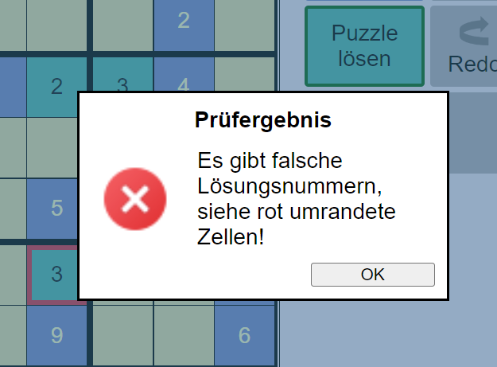{: width="400px"}

**Anwendungsfall: Tipp**

Wenn man bei der manuellen Lösung nicht mehr weiter weiss, kann man die Taste "Tipp" nutzen. Durch das Drücken dieser Taste wird automatisch die Zelle in der Matrix selektiert, die der Solver bei der automatischen Lösung als nächste Zelle selektieren würde.

<figure >
   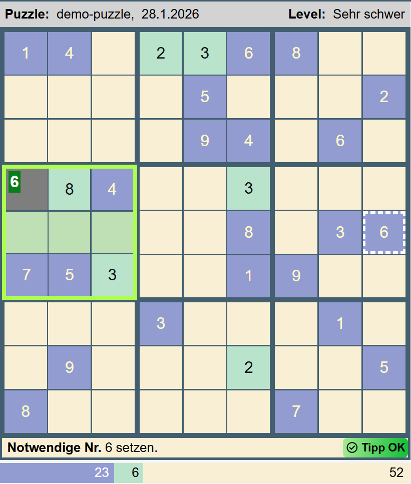
    <figcaption style="font-size: 16px; font-style: italic;">Tipp Ok Taste</figcaption>
</figure>

Der Spieler hat dann zwei Möglichkeiten:

1. Die vorgeschlagene Nummer in der Zelle setzen, durch Drücken der Ok-Taste unten rechts an der Tabelle, oder
1. Die Tipp-Taste erneut drücken. Dann wird die Selektion zurückgenommen.

### Beispiel automatische Puzzle-Lösung

Werkzeugeinstellung:

- **Kandidatenauswertung:** Keine Kandidatenanzeige oder Lazy.
- **Haltepunkte:** Haltepunkte nach Bedarf zu- und abschalten.

In dieser Nutzungsform zeigt der Sudoku-Trainer seinen vollen Funktionsumfang. Sie ist damit besonders lehrreich. Der Spieler beobachtet die Lösungssuche anstatt selber die Lösung zu suchen, indem er automatische Lösungsschritte ausführen lässt. Deshalb an dieser Stelle eine Übersicht über die Arten automatischer Schritte. Die folgenden Darstellungen nehmen Bezug auf das Puzzle

**Backtrack_5:**
140006800000050002000094060004000000000008036750001900000300010090000005800000700

Dies ist ein Puzzle mit dem Schwierigkeitsgrad "Sehr schwer". Die im Folgenden dargestellten Schritte erreichen wir durch Drücken der Schritttaste oder der Suchlauftaste. Für die Verwendung der Suchlauftaste im Beispiel werden jeweils die gewünschten Haltepunkte gesetzt.

{: style="text-align:center"}
{:width="200px"}

{: style="text-align:center"}
{:width="200px"}

<h3> ==> Schritttaste einmal gedrückt:</h3>

**Schritt 1: Zelle mit mehreren Optionen.** Schon im ersten Schritt erweist sich dieses Puzzle als sehr schwer, da der Solver keine Zelle mit eindeutiger Nummernbelegung findet und stattdessen eine Zelle mit 2 Optionen selektiert: 2 und 7. Der Solver versucht zuerst die 2.

<figure>
   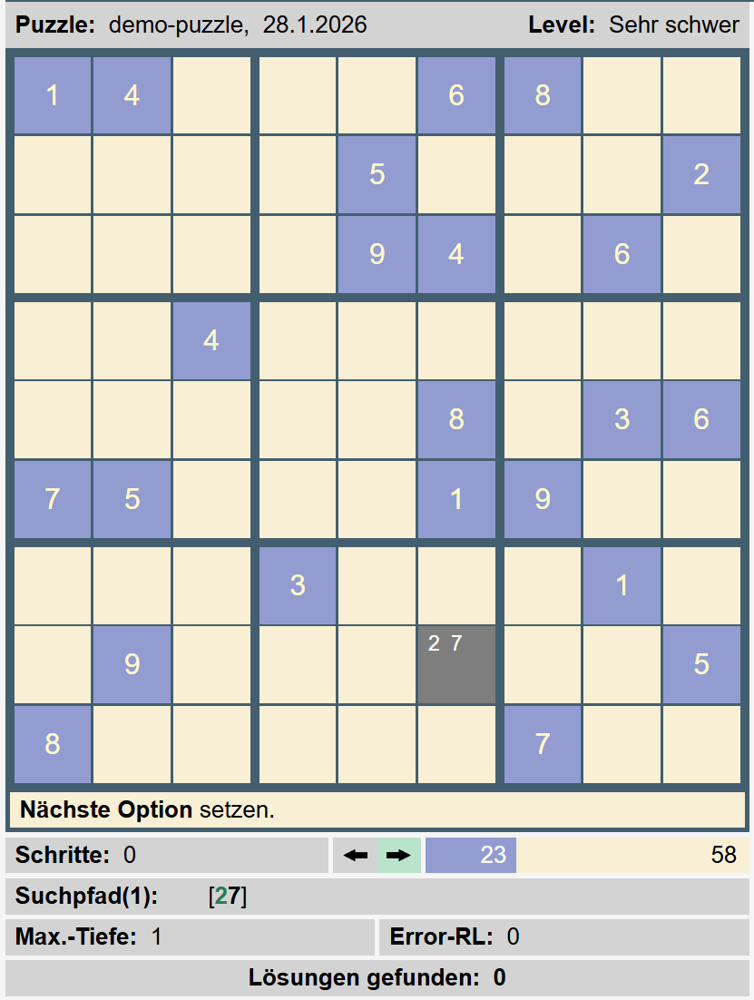
    <figcaption style="font-size: 16px; font-style: italic;">Schritt 1.a: Zelle mit Optionen {2, 7}</figcaption>
</figure>

Nach der Setzung der ersten Option.

<figure>
   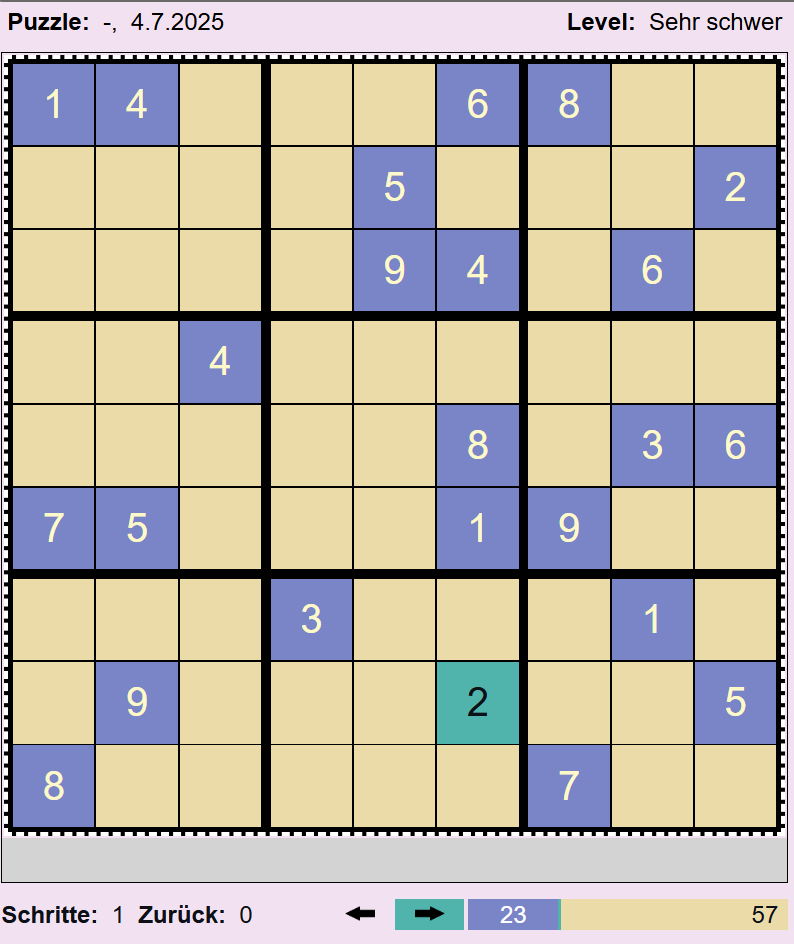
    <figcaption style="font-size: 16px; font-style: italic;">Schritt 1.b: Kandidat 2 gesetzt.</figcaption>
</figure>

<h3> ==> Schritttaste mehrmals drücken bis Schritt 4.a: </h3>

<figure>
   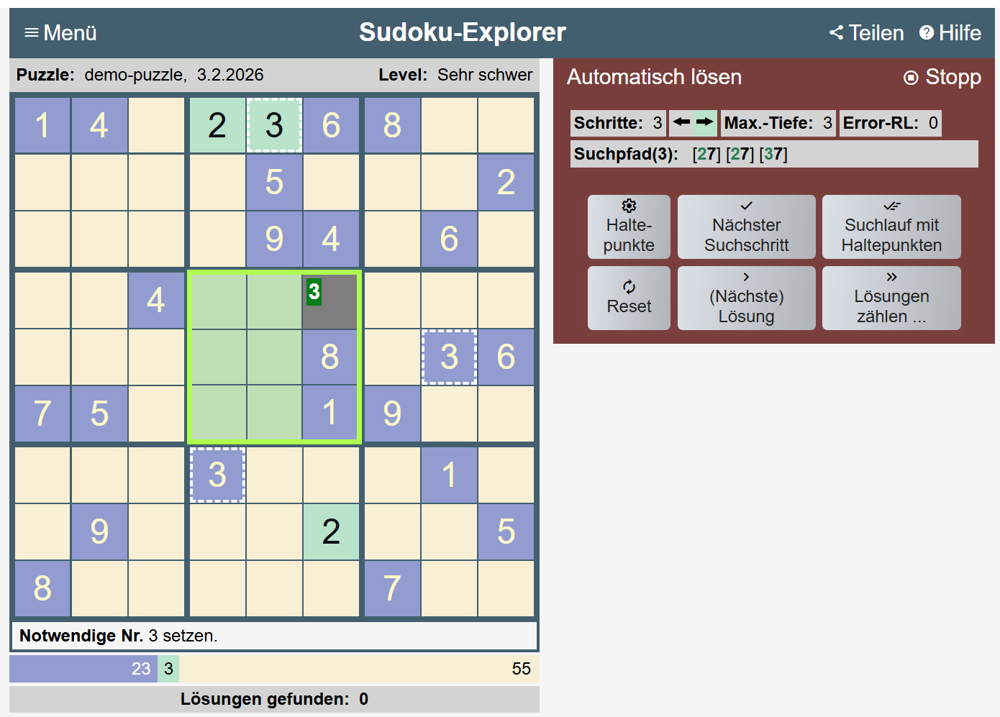
    <figcaption style="font-size: 16px; font-style: italic;">Schritt 4.a</figcaption>
</figure>

**Schritt 4: Zelle mit notwendiger Nummer.** Im vierten Schritt selektiert der Solver eine Zelle mit notwendiger Nummer 3. Sie ist notwendig, weil in dem Block in allen freien Zellen, grün gestrichelte Rahmen haben und keine 3 mehr gesetzt werden kann. Die weiß gerahmten Zellen liefern die Begründung. Das heißt alle diese Zellen tragen die Nummer 3.

<figure>
   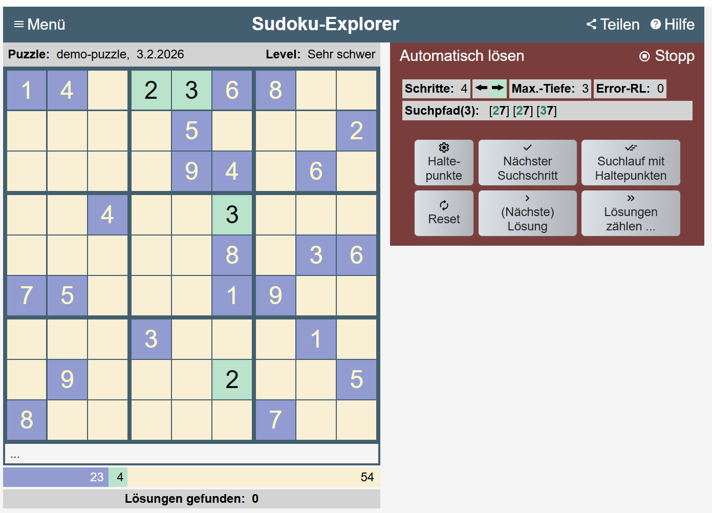
    <figcaption style="font-size: 16px; font-style: italic;">Schritt 4.b: Notwendiger Kandidat 3 gesetzt.</figcaption>
</figure>

<h3> ==> Haltepunkt "Bei Single gesetzt". Suchlauftaste gedrückt: </h3>

**Schritt 13: Zelle mit Single.** Im Schritt 13.a selektiert der Solver eine Zelle mit nur einem Kandidaten, die 7, einem Single. Alle anderen Nummern sind in dieser Zelle unzulässig. Die Zellen mit gestricheltem weißen Rand liefern die Bedingung dafür. Das heißt, für jede Zahl außer 7 gibt es eine solche Zelle.

<figure>
   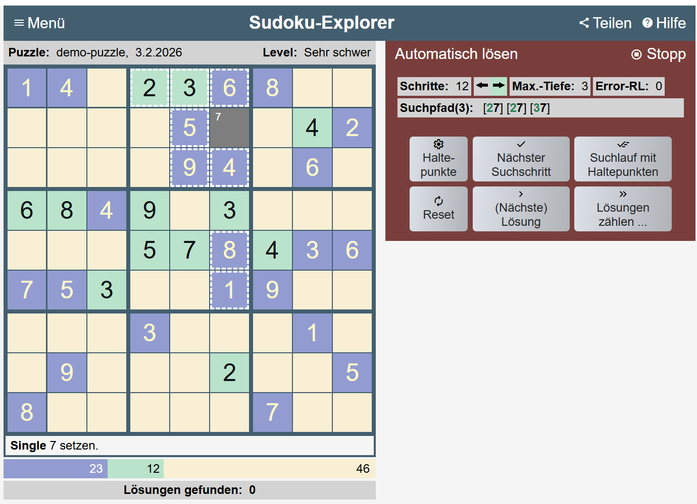
    <figcaption style="font-size: 16px; font-style: italic;">Schritt 13.a: Single</figcaption>
</figure>

<h3> ==> Haltepunkt "Bei Widerspruch" gesetzt". Suchlauftaste gedrückt: </h3>

**Schritt 23: Block mit Widerspruch.** Im Schritt 23.a entdeckt der Solver einen widerspruchsvollen Block. Deshalb wurde der Solver in den Rückwärts-Modus gesetzt (grüner Pfeil links).

<figure>
   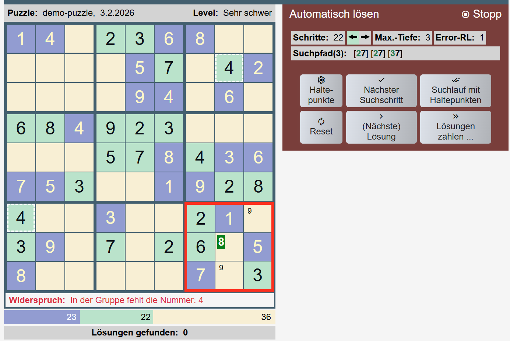
    <figcaption style="font-size: 16px; font-style: italic;">Schritt 22.b: Widerspruch</figcaption>
</figure>

<h3> ==> Schritttaste einmal gedrückt</h3>

**Schritt 23: Zelle im Rückwärts-Modus zurücksetzen (Rückwärtsschritt)**

<figure>
   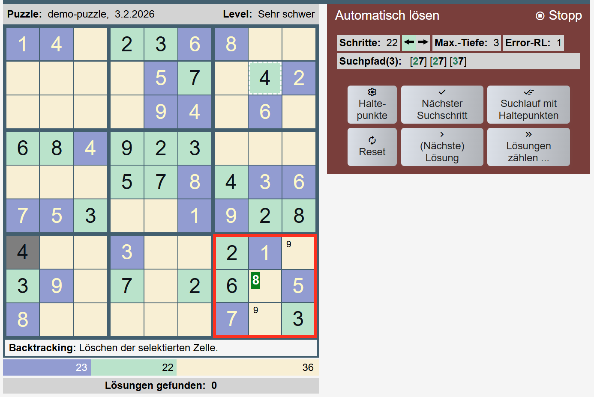
    <figcaption style="font-size: 16px; font-style: italic;">Schritt 23.a: Zurückzusetzende Zelle mit der Nummer 4 selektiert</figcaption>
</figure>

<h3> ==> Haltepunkt "Bei Selektionsoptionen" gesetzt und "Bei Widerspruch" zurückgenommen. Suchlauftaste gedrückt:</h3>

**Schritt 43: Zweiter Besuch in der Zelle.** Im Schritt 43.a kehrt der Solver in die Zelle zurück, in der er beim ersten Besuch die 3 gewählt hatte. Zu sehen an der unterstrichenen 3. Nun schaltet er wieder in den Vorwärts-Modus, grüner Pfeil rechts, und selektiert den zweiten Kandidaten mit der Nummer 7.

<figure>
   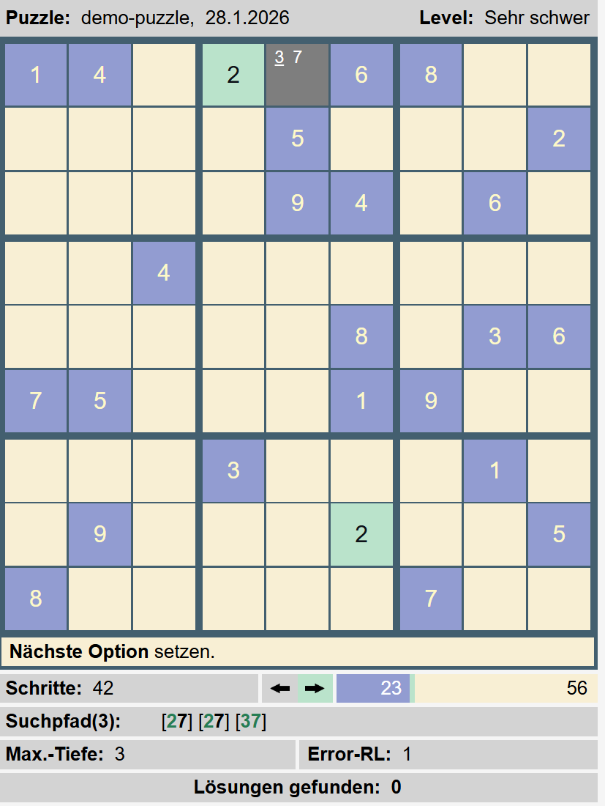
    <figcaption style="font-size: 16px; font-style: italic;">Schritt 43.a: Zweiter Besuch in der Zelle</figcaption>
</figure>

<h3> ==> Schritttaste gedrückt:</h3>

<figure>
   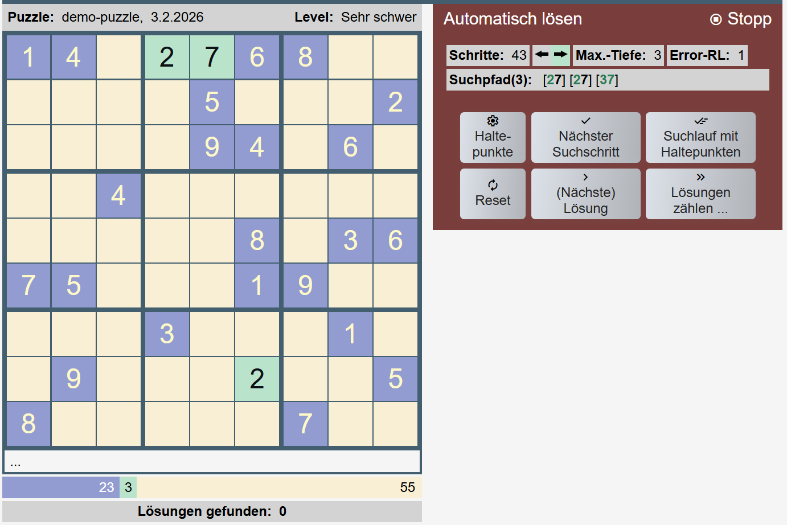
    <figcaption style="font-size: 16px; font-style: italic;">Schritt 43.b: Zweite Option in der Zelle, die 7,  gesetzt.</figcaption>
</figure>

<h3> ==> Haltepunkt "Bei Lösung" gesetzt und andere Haltepunkte zurückgenommen. Suchlauftaste gedrückt:</h3>

**Schritt 224: Alle Zellen belegt.** Im Schritt 224 belegt der Solver die letzte offene Zelle. Das Puzzle ist gelöst.

<figure>
   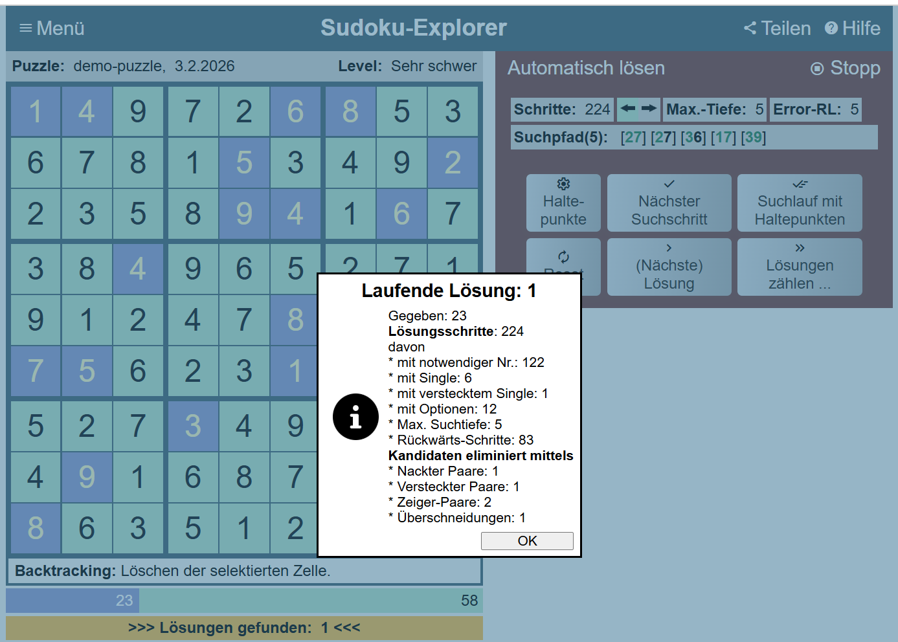
    <figcaption style="font-size: 16px; font-style: italic;">Schritt 224.b: Alle Zellen belegt.</figcaption>
</figure>

## Mit Hilfe des Sudoku-Trainers gewonnene Erfahrungen und Einsichten

### Übersicht über die Bedeutung der Schwierigkeitsgrade

| Level         | Lösung / Methode                | Angewandte Regeln und Kommentare                                                                                                                                                                                                                                   |
| ------------- | ------------------------------- | ------------------------------------------------------------------------------------------------------------------------------------------------------------------------------------------------------------------------------------------------------------------ |
| Sehr Leicht   | Eindeutig / Logik               | Allein Scan-1: "Notwendige Kandidaten"                                                                                                                                                                                                                             |
| Leicht        | Eindeutig / Logik               | Allein Scan-1: "Notwendige Kandidaten"                                                                                                                                                                                                                             |
| Mittel        | Eindeutig / Logik               | Scan-1: "Notwendige Kandidaten" und mindestens einmal Scan-2: "Einziger Kandidat"                                                                                                                                                                                  |
| Schwer        | Eindeutig / Logik               | Scan-1: "Notwendige Kandidaten", Scan-2: "Einziger Kandidat" und mindestens ein "Versteckt einziger Kandidat", gewonnen durch Elimination.                                                                                                                         |
| Sehr schwer   | Eindeutig / Backtracking        | Es gibt Puzzles, die nicht allein mit logischen Schlussregeln gelöst werden können.                                                                                                                                                                                |
| Extrem schwer | Mehrere Lösungen / Backtracking | Mittels Backtracking können prinzipiell alle Lösungen eines extrem schweren Puzzles angezeigt werden. Das können sehr viele sein. Dass leere Puzzle hat über eine Trilliarde Lösungen. Pragmatisch wird der Spieler eine solche Auflistung der Lösungen abbrechen. |

### Welcher Schwierigkeitsgrad für welchen Spielertyp?

| Level                       | Spielertyp                                                                                                                                                                                                                                                                                                                                                   | Quelle der Puzzles                                                                                                                                                                                                                 |
| --------------------------- | ------------------------------------------------------------------------------------------------------------------------------------------------------------------------------------------------------------------------------------------------------------------------------------------------------------------------------------------------------------ | ---------------------------------------------------------------------------------------------------------------------------------------------------------------------------------------------------------------------------------- |
| Sehr leicht, Leicht, Mittel | **Gelegenheitsspieler**, die Puzzles in Zeitungen und Zeitschriften lösen wollen. Die beiden einfachen Regeln, Scan-1: "Notwendige Kandidaten" und Scan-2: "Einziger Kandidat", sind ohne Notizen anwendbar.                                                                                                                                                 | Puzzles in **Zeitungen und Zeitschriften** sind fast immer Sehr leicht, Leicht oder Mittel gemäß unserer Definition. Meist werden die Schwierigkeitsgrade mit einer abweichenden Definition genutzt.                               |
| Schwer                      | **Hochleistungsbereite Spieler**, die mit Ehrgeiz Puzzles logisch lösen wollen. Unter Anwendung komplexer Eliminationsregeln. Den **Freaks** in dieser Community reicht auch das nicht. Sie suchen nach Puzzles, die man mit den bekannten Regeln nicht lösen kann. Und nach neuen logischen Regeln, die mehr Puzzles lösen können als die bisher bekannten. | Bei [Andrew Stuart](https://www.sudokuwiki.org/Main_Page) gibt es eine Rubrik „**The weekly unsolvable**“. Dort findet man Puzzles, die nicht wirklich unlösbar sind, sondern für die bisher keine logische Lösung gefunden wurde. |
| Alle Schwierig-keitsgrade   | **Alle Spieler und Interessierte**, die ihr Puzzle nicht manuell lösen wollen sondern mit Hilfe eines **beobachtbaren Backtrackers**.                                                                                                                                                                                                                        | Der vorliegende Sudoku-Trainer unterstützt die Beobachtung des Backtracking-Lösungsprozesses mit Hilfe von **benutzersetzbaren Haltepunkten**.                                                                                     |

### Faire Puzzles

Extrem oder sehr schwere Sudokus eignen sich nicht für die manuelle Lösungssuche, da das notwendige Backtracking mit Papier und Bleistift durchgeführt werden müsste. Die in den Zeitungen oder Zeitschriften als 'Leicht', 'Mittel' oder 'Schwer' klassifizierten Sudoku-Puzzles sind meistens in dem hier dargestellten Sinn 'Sehr leicht', 'Leicht' oder 'Mittel'. Selten auch einmal 'Schwer'. D.h. die Zeitungs-Sudokus sind in der Regel fair. Sie können ohne Backtracking gelöst werden.

Dies macht die Anwendung des Sudoku-Trainers auf faire Puzzles gleich ein wenig langweilig. Es werden immer nur exakt soviel Schritte für die Lösung des Puzzles gebraucht, wie das Puzzle offene Zellen hat. Also mit der Schritttaste einmal alle offenen Zellen klicken und schon ist das Puzzle gelöst. Wieder spannend wird es, wenn man die Gründe für jeden Schritt nachvollziehen will. Der vorliegende Solver zeigt mit seinem beobachtbaren Backtracker für jede automatische Nummernsetzung die zugehörige Begründung an. Auf Wunsch gibt er auch einen Tipp für die nächste setzbare Zelle, siehe
[Beispiel manuelle Puzzle-Lösung](#beispiel-manuelle-puzzle-lösung).

### Einsichten und Tatsachen über Sudokus

Im Laufe der Entwicklung dieser App ergaben sich für den Autor zahlreiche neue Einsichten und Tatsachen über klassische 9x9-Sudokus. Viele davon stammen von Recherchen im Internet. Nicht wenige aber auch aus den Erfahrungen mit der vorliegenden App. Diese sollen in diesem Abschnitt vorgetragen werden.

**1. Die Standardisierung von Sudoku-Begriffen und Sudoku-Regeln ist (nur) ansatzweise vorhanden.**

Im Kontext von Sudoku werden verschiedene Begriffe verwendet, die das Spielfeld, die Zahlen und die Lösungsstrategien beschreiben. Die zum Spielfeld gehörenden Begriffe sind weitestgehend standardisiert. Dazu gehören die Begriffe: Feld/Zelle, Reihe, Spalte, Block/Box, Kandidat und Lösung. Die nachfolgenden Begriffe stammen aus [Wikipedia](https://de.wikipedia.org/wiki/Sudoku#L%C3%B6sungsmethoden).

- **Feld/Zelle**: Die einzelnen Quadrate im Sudoku-Gitter, in die Zahlen eingetragen werden.
- **Reihe**: Horizontale Linien im Sudoku-Gitter, die aus neun Feldern bestehen.
- **Spalte**: Vertikale Linien im Sudoku-Gitter, die ebenfalls aus neun Feldern bestehen.
- **Block/Box**: Ein 3x3-Quadrat innerhalb des 9x9-Gitters, das ebenfalls neun Felder enthält.
- **Kandidat**: Eine Zahl, die potentiell in ein bestimmtes Feld eingetragen werden könnte, basierend auf den Regeln, aber noch nicht endgültig entschieden ist.
- **Lösung**: Die vollständige, korrekte Belegung aller Felder mit den Zahlen 1 bis 9, wobei jede Zahl in jeder Reihe, Spalte und jedem Block nur einmal vorkommt.

Die Begriffe rund um genutzte und definierte Eliminationsregeln sind ähnlich, variieren aber im Detail von Werkzeug zu Werkzeug. So auch im vorliegenden Werkzeug. Daher kommt es zur folgenden Beobachtung.

**2. Beobachtung: Die Schwierigkeitsgrade von Sudoku-Puzzles sind in der Regel werkzeugabhängig definiert.**

Das trifft für den vorliegenden Sudoku-Trainer zu, aber auch für den Sudoku-Coach von [Jan Feldmann](https://sudoku.coach/) und dem Solver von [Andrew Stuart](https://www.sudokuwiki.org/Main_Page). Das hat seine Ursache darin, dass die Definition der Schwierigkeitsgrade von den Definitionen und Implementierungen der Kandidaten-Eliminationsregeln abhängig sind. Letztere sind werkzeugabhängig definiert.

**3. Sudokus in Zeitschriften sind häufig 'Sehr leicht', 'Leicht', 'Mittel' oder selten auch einmal 'Schwer'.**

Sudoku-Puzzles in den Zeitschriften und Magazinen besitzen in der Regel die Schwierigkeitsgrade 'Sehr leicht', 'Leicht'
'Mittel' oder selten auch einmal 'Schwer'. Die Schwierigkeitsgrade gemäß der Definition dieser App. D.h. für die Puzzles benötigt man kein Backtracking und nur selten die Anwendung von Kandidaten-Eliminationsregeln.

**4. Tatsache: Ein Puzzle mit eindeutiger Lösung besitzt mindesten 17 Givens.**

2012 haben Mathematiker bewiesen, dass 17 die kleinste Anzahl von Givens ist, die noch eine eindeutige Lösung garantieren können. [FAZ 2012](https://www.faz.net/aktuell/wissen/physik-mehr/mathematik-der-heilige-gral-der-sudokus-11682905.html).

**5. Falsche Vermutung: Je weniger Givens ein Puzzle hat, um so schwieriger ist das Puzzle.**

Wir betrachten das folgende Puzzle und kopieren die Textdarstellung des Puzzle in die Zwischenablage. D.h. wir selektieren die Textdarstellung vollständig und kopieren mit der Kopier-Operation in der Navgationsbar oder mit Strg+C. Dann öffnen wir die App und fügen die Kopie mit der Einfüge-Operation der Navigationsbar in den Sudoku-Trainer ein.

<figure >
   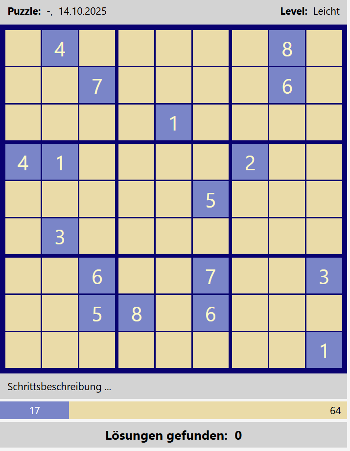
    <figcaption style="font-size: 16px; font-style: italic;">17 Givens, kleinstes Puzzle. 
    Puzzle = 040000080007000060000010000410000200000005000030000000006007003005806000000000001</figcaption>
</figure>

Der Sudoku-Trainer berechnet nach dem Einfügen des Puzzles den Schwierigkeitsgrad, in diesem Fall Leicht, siehe oben rechts. Das Puzzle hat nur 17 Givens. Lassen wir das Puzzle lösen: Taste "Starte Suche", dann Taste "Weitere Lösung anzeigen".

<figure>
   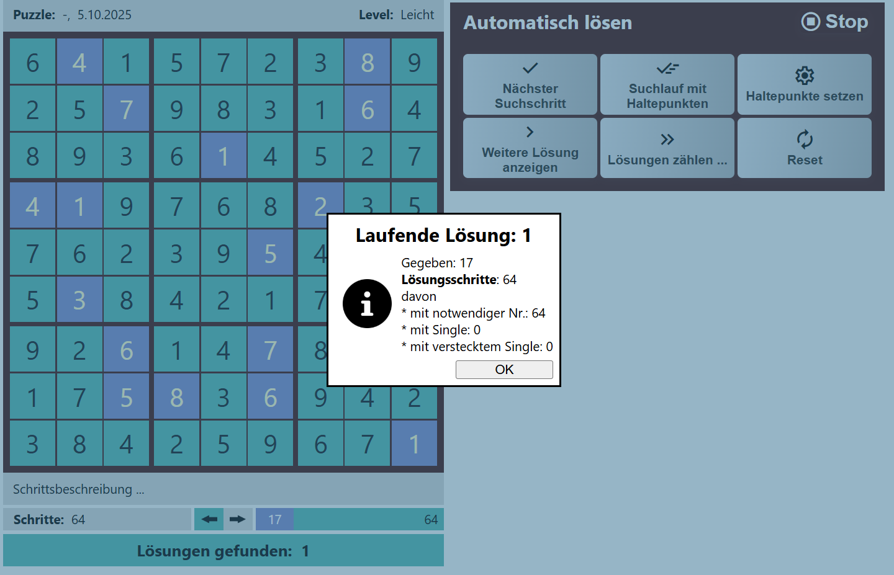
    <figcaption style="font-size: 16px; font-style: italic;">Puzzle gelöst</figcaption>
</figure>

Das Puzzle ist gelöst. Für seine Lösung brauchten nur Notwendig-Schritte angewendet zu werden. D.h. das Puzzle hat den Schwierigkeitsgrad Leicht. Die Vermutung "Je weniger Givens ein Puzzle hat, um so schwieriger ist das Puzzle." ist also falsch.

**6. Falsche Vermutung: Je mehr Givens ein Puzzle hat, um so einfacher ist das Puzzle.**

Wir kopieren die Textdarstellung des Puzzle in die Zwischenablage und in den Sudoku-Trainer ein.

<figure >
   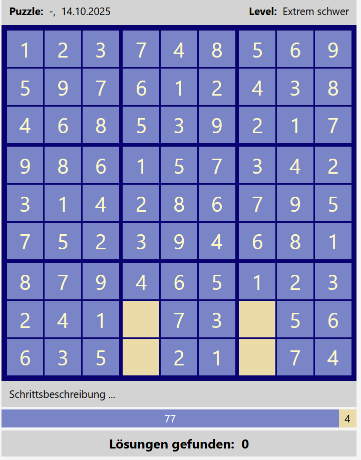
    <figcaption style="font-size: 16px; font-style: italic;">77 Givens
    Puzzle = 123748569597612438468539217986157342314286795752394681879465123241073056635021074</figcaption>
</figure>

Der Sudoku-Trainer berechnet nach dem Einfügen des Puzzles den Schwierigkeitsgrad, in diesem Fall "Extrem schwer", siehe oben rechts. Extrem schwer bedeutet, dass das Puzzle mehrere Lösungen hat. Schauen wir uns die Lösungen an: Taste “Starte Suche”, dann Taste “Weitere Lösung anzeigen”.

<figure >
   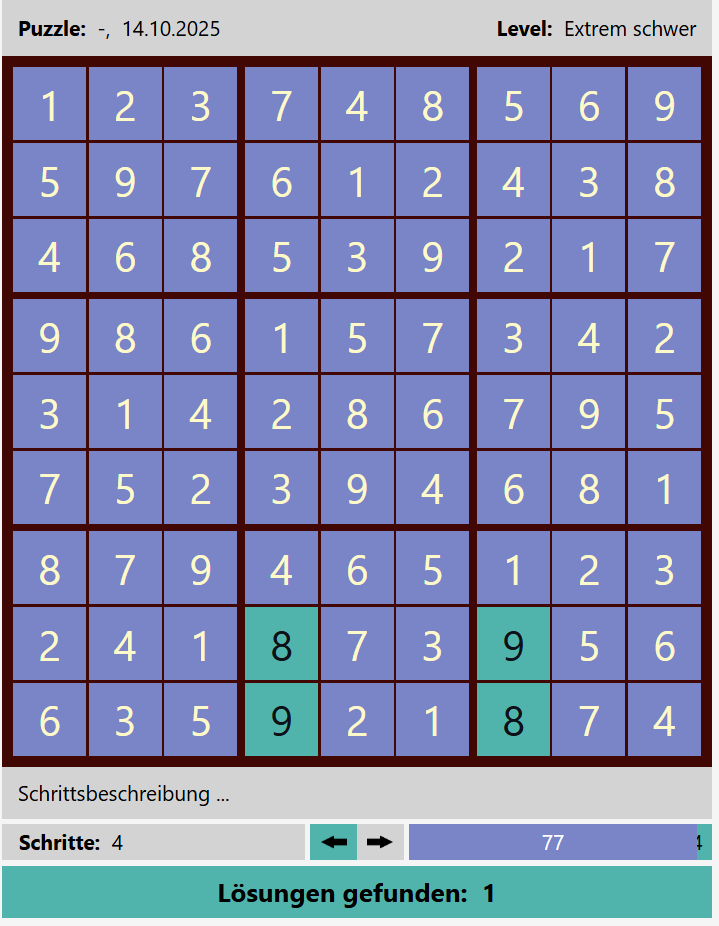
    <figcaption style="font-size: 16px; font-style: italic;">77 Givens, Lösung 1</figcaption>
</figure>

<figure >
   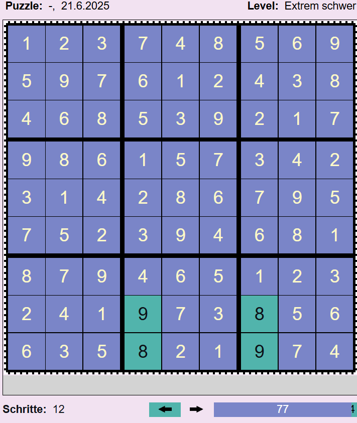
    <figcaption style="font-size: 16px; font-style: italic;">77 Givens, Lösung 2</figcaption>
</figure>

<figure >
   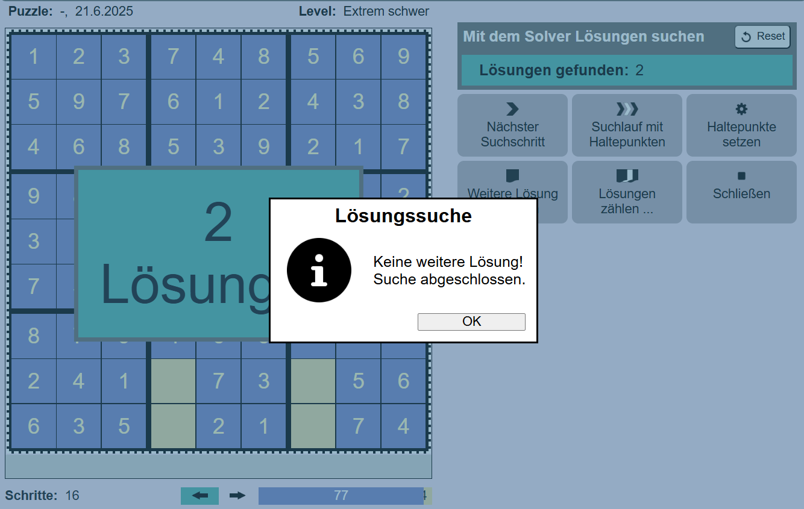
    <figcaption style="font-size: 16px; font-style: italic;">77 Givens, Keine weitere Lösung</figcaption>
</figure>

Dieses Puzzle hat genau zwei Lösungen.

**7. Einsicht: Puzzles mit mehreren Lösungen lassen sich nicht "lösen" sondern ihre Lösungen lassen sich aufzählen.**

Puzzles, die mehrere Lösungen besitzen, lassen sich nicht "lösen" sondern ihre Lösungen lassen sich aufzählen. In dem besonders einfachen Fall des vorigen Beispiels gibt es nur zwei Lösungen, die unmittelbar ersichtlich sind. Es kann aber sehr viel mehr Lösungen eines Puzzles geben. So gibt es ca. 6,7 Trilliarden verschiedene, vollständig ausgefüllte 9×9-Standard-Sudokus [Wikipedia](https://de.wikipedia.org/wiki/Sudoku#Die_Anzahl_der_Sudokus). D.h. die Lösungen mehrdeutiger Puzzles lassen sich prinzipiell aufzählen. Pragmatisch stößt diese Aufzählung bei großen Lösungsmengen an ihre Grenzen.

**8. Vermutung: Nicht alle Puzzles mit eindeutiger Lösung können durch logisches Schließen gelöst werden.**
Betrachten wir das folgende Beispiel.

<figure >
   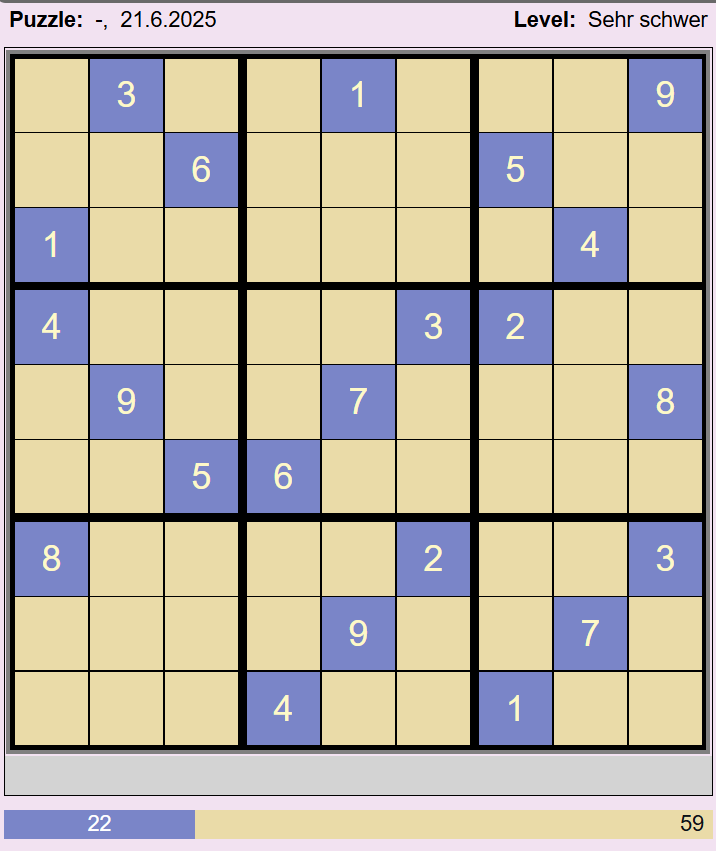
    <figcaption style="font-size: 16px; font-style: italic;">Logisch unlösbar. Puzzle = 030010009006000500100000040400003200090070008005600000800002003000090070000400100
</figcaption>
</figure>

<figure >
   
    <figcaption style="font-size: 16px; font-style: italic;">Logisch unlösbar, per Backtracking lösbar</figcaption>
</figure>

<figure >
   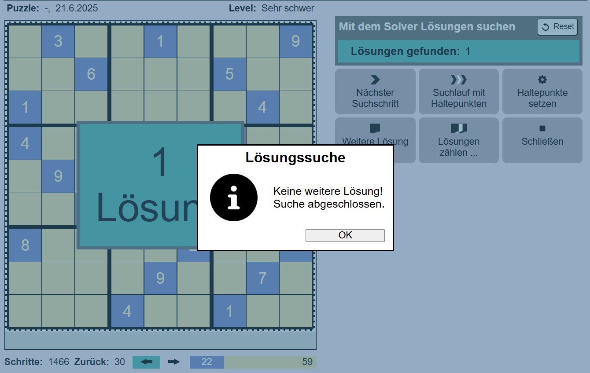
    <figcaption style="font-size: 16px; font-style: italic;">Keine weitere Lösung</figcaption>
</figure>

Genauer gesagt bedeutet dieses Ergebnis, dass dieser Sudoku-Trainer für dieses Puzzle eine Backtrack-Lösung gefunden hat, und dass diese Lösung die einzige ist. Der vorliegende Trainer hat keine rein logische Herleitung gefunden. Deshalb bewertet er das Puzzle mit dem Schwierigkeitsgrad "Sehr schwer".

Hinweis: Der vorliegende Solver findet weniger rein logische Herleitungen als beispielsweise die Solver von [Andrew Stuart](https://www.sudokuwiki.org/Main_Page) und [Jan Feldmann](https://sudoku.coach/). Das ist nicht sehr verwunderlich, da dieser Trainer nur sehr wenige Schlussregeln implementiert hat, verglichen mit den Solvern von Andrew Stuart und Jan Feldmann. Beide haben einen riesigen Katalog von Regeln implementiert. Mit ihren Fans sind sie ständig auf der Suche nach neuen, zusätzlichen Regeln, die bisher nicht logisch herleitbare Puzzlelösungen lösbar machen. Andrew Stuart hat dafür eine Rubrik "The weekly 'Unsolvalble'" [weekly-unsolvable](https://www.sudokuwiki.org/Weekly-Sudoku.aspx).

Zurück zu unserer Vermutung: "Es gibt Puzzles, die eine eindeutige Lösung haben, die aber vermutlich nicht durch logisches Schließen hergeleitet werden kann." Für unser Beispiel-Puzzle kann die vorliegende App keine logische Herleitung finden. Aber auch die Solver von Stuart und Feldmann können es nicht. Dies legt die Vermutung nahe, dass es derart schwierige Puzzles gibt, sodass sie prinzipiell nicht durch logisches Schließen gelöst werden können. Aber ein Beispiel ist kein Beweis. Deswegen können wir nur von einer Vermutung sprechen.

**9. Tatsache: Es gibt unlösbare Sudokus.**

Es gibt unlösbare Sudokus. Das ist erstmal eine triviale Aussage.

<figure >
   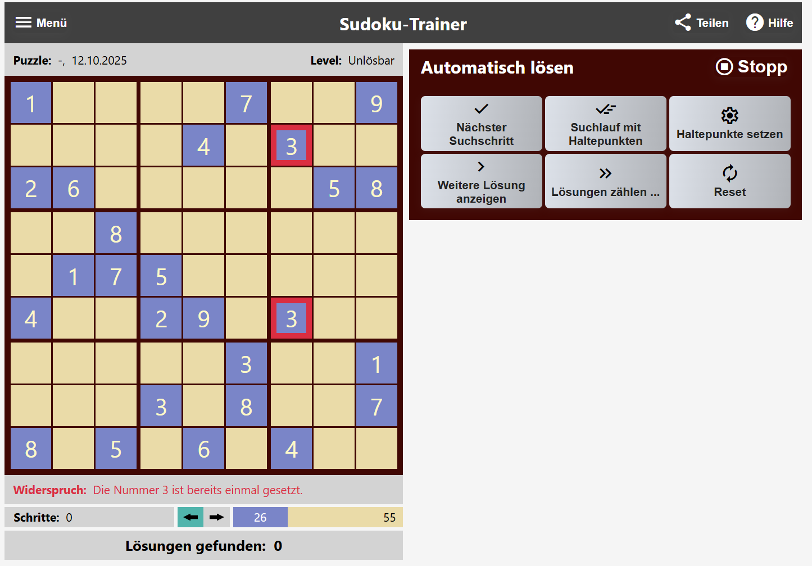
    <figcaption style="font-size: 16px; font-style: italic;">Unlösbar wegen offfensichtlichem Widerspruch</figcaption>
</figure>
<figure >
   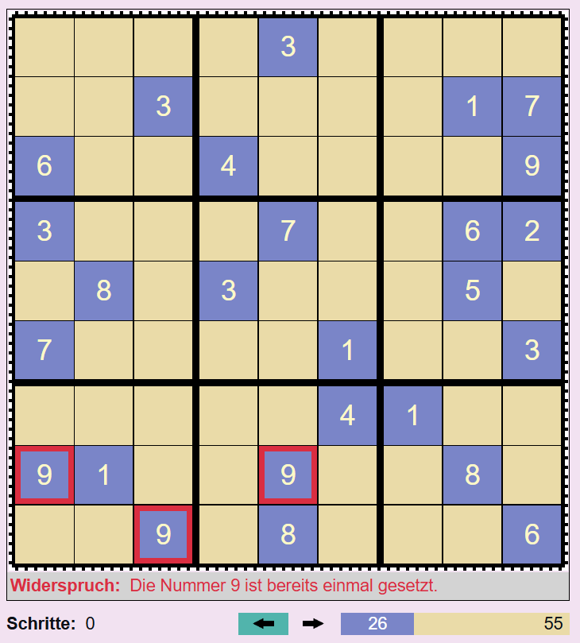
    <figcaption style="font-size: 16px; font-style: italic;">Widerspruch sichtbar bei Wechsel in den Suchmodus</figcaption>
</figure>

Es gibt aber auch nicht triviale Unlösbarkeiten. Sie werden erst erst nach vielen Suchschritten sichtbar.
Puzzle = 050600307710300056360050029509006000007204005436895700003560040001000000605000900

<figure >
   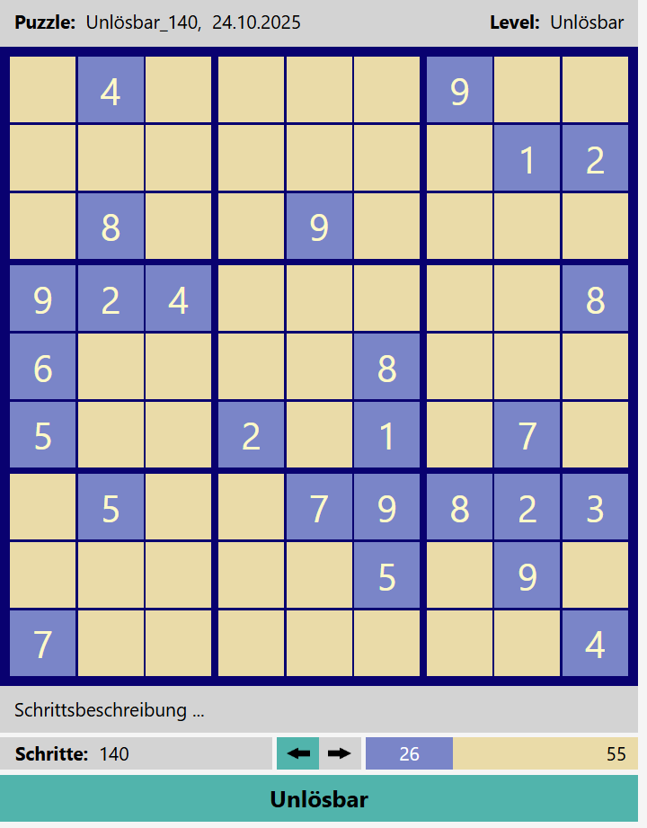
    <figcaption style="font-size: 16px; font-style: italic;">Widerspruch sichtbar nach 21 Suchschritten; </figcaption>
</figure>

<figure >
   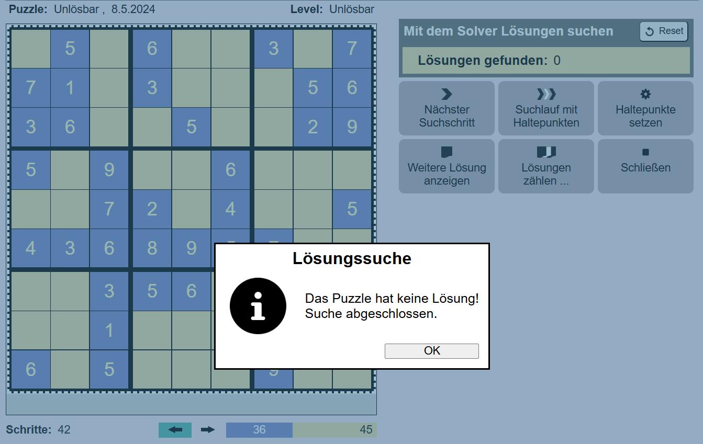
    <figcaption style="font-size: 16px; font-style: italic;">Nach abgeschlossener Suche: Keine Lösung</figcaption>
</figure>

## Schlussbemerkungen

Viele im Internet auffindbare Sudoku-Apps sind reine Sudoku-Solver. Die vorliegende Sudoku-App ist primär ein Sudoku-Trainer und erst sekundär ein Sudoku-Solver. Sie wendet sich an Gelegenheitsspieler. Also Spieler und Spielerinnen, die beispielsweise ein Puzzle aus einer Zeitschrift lösen wollen. Dabei aber steckenbleiben, weil sie die nächste setzbare Nummer nicht finden. Der vorliegende Sudoku-Trainer zeigt Schritt für Schritt, wie man das Puzzle lösen kann. Im Gegensatz zu Andrew Stuart und Jan Feldmann werden im vorliegenden Trainer bei Bedarf Logisches Schließen und BacKtracking ineinander verschränkt angewendet. Es zeigt sich, dass bei der Lösungssuche die Anwendung einfacher Schlussregeln kombiniert mit einem oder zwei Backtrack-Schritten nicht selten die Anwendung komplexer logischer Schlussregeln überflüssig macht.

Dem gegenüber gibt es aber auch "Sudoku-Freaks", die sich zum Ziel setzen, Puzzles allein durch logisches Schließen zu lösen. Ihre Herausforderung besteht darin, herauszufinden, welche der oben genannten Eliminationsregeln für eliminierbare Kandidaten (es gibt noch weitere, die in dieser App gar nicht implementiert sind) anwendbar sind. Für Sudoku-Interessierte sind die bereits erwähnten Seiten von [Andrew Stuart](https://www.sudokuwiki.org/Main_Page) und von [Jan Feldmann](https://sudoku.coach/) ein Muss. Dort findest Du einen kompletten Überblick über logische Lösungsstrategien für klassisches Sudoku und auch einen Überblick über nicht klassische Sudoku-Varianten.

Stuarts und Feldmanns Sudoku-Solver wollen wie der vorliegende Sudoku-Trainer nicht einfach nur Solver sein. Sie stellen die Anwendung logischer Lösungsstrategien in den Mittelpunkt. Ein Lösungsschritt besteht aus der Anwendung einer logischen Schlussregel. Das kann die Elimination von unzulässigen Kandidaten in mehreren Zellen sein aufgrund eines 'nackten Paares' oder die Setzung von 'versteckten Singles' (notwendigen Nummern) in mehreren Zellen gleichzeitig. Puzzles, die keine Lösung per logischem Schließen haben, löst Stuarts Solver (absichtlich) nicht. Echte Sudoku-Freaks verzichten auf Backtracking.

## Beispiel-Puzzles

**Sehr schwere Puzzles mit langen Backtracks**

Nachfolgend zwei sehr schwere Puzzles, 'Backtrack_5' und 'Backtrack_8'. Also Puzzles, die dieser Solver nur mit Backtracking lösen kann. Hinweis: dieser Solver hat nur eine Teilmenge der bekannten logischen Kriterien für die Lösung von Puzzles implementiert. Das ist aber nicht weiter problematisch, da sich die Kriterien überschneiden. D.h. in einer gegebenen Lösungssituation eines Puzzles sind mehrere Kriterien gleichzeitig anwendbar. In den Zeitungen und Zeitschriften findet man solche (sehr schwere) Puzzles nicht. Woher kann man sehr schwere Puzzles bekommen?

1. Dieser Trainer kann sehr schwere Puzzles generieren.
2. Im Internet kann man zum Beispiel bei [SoEinDing](https://sudoku.soeinding.de/sudokuExtraTeuflischSchwer.php) sehr schwere Puzzles finden.

**Backtrack_5:**
140006800000050002000094060004000000000008036750001900000300010090000005800000700

**Backtrack_22:**
030010009006000500100000040400003200090070008005600000800002003000090070000400100

Hinweis: Kopiere die Zeichenkette des gewünschten Puzzels ins Clipboard und füge es mit "Einfügen" aus der Navigationsbar in den Trainer ein.
