1. [Herzlich willkommen zur Sudoku-Explorer-App](#herzlich-willkommen-zur-sudoku-explorer-app)
2. [Sudoku-Explorer Installation](#sudoku-explorer-installation)
3. [Teilen der Sudoku-Explorer-App URL](#teilen-der-sudoku-explorer-app-url)
4. [Einführung in den Sudoku-Explorer](#einführung-in-den-sudoku-explorer)
   1. [Die möglichen Inhalte einer Sudoku-Zelle](#die-möglichen-inhalte-einer-sudoku-zelle)
   2. [Zwei Spielphasen](#zwei-spielphasen)
   3. [Jeder Lösungsschritt mit zwei Subschritten](#jeder-lösungsschritt-mit-zwei-subschritten)
   4. [Die Taste Menu](#die-taste-menu)
   5. [Die Taste Teilen](#die-taste-teilen)
   6. [Der Tastenblock 'Manuell Lösen'](#der-tastenblock-manuell-lösen)
   7. [Der Tastenblock 'Automatisch Lösen'](#der-tastenblock-automatisch-lösen)
   8. [Puzzle kopieren und einfügen via Clipboard](#puzzle-kopieren-und-einfügen-via-clipboard)
   9. [Die Puzzle-Datenbank](#die-puzzle-datenbank)
      1. [Operationen der Datenbank](#operationen-der-datenbank)
      2. [Import/Export](#importexport)
5. [Die Welt der 9x9 Sudokus im Sudoku-Explorer](#die-welt-der-9x9-sudokus-im-sudoku-explorer)
   1. [Standardbegriffe](#standardbegriffe)
   2. [In dieser App verwendete Begriffe](#in-dieser-app-verwendete-begriffe)
   3. [Kriterien für die Erkennung eliminierbarer Kandidaten](#kriterien-für-die-erkennung-eliminierbarer-kandidaten)
      1. [Eliminationskriterium: "Überschneidung"](#eliminationskriterium-überschneidung)
      2. [Eliminationskriterium "Nacktes Paar"](#eliminationskriterium-nacktes-paar)
      3. [Eliminationskriterium: "Zeiger-Paar", "Zeiger-Triple"](#eliminationskriterium-zeiger-paar-zeiger-triple)
      4. [Eliminationskriterium: "Verstecktes Paar"](#eliminationskriterium-verstecktes-paar)
      5. [Die mehrfache Kriterien-Anwendung in einem Schritt](#die-mehrfache-kriterien-anwendung-in-einem-schritt)
   4. [Die Lösungssuche des Explorers](#die-lösungssuche-des-explorers)
   5. [Lazy und strikte Kandidatenauswertung](#lazy-und-strikte-kandidatenauswertung)
   6. [Vergleich der Auswertungsmodi Lazy und Strikt](#vergleich-der-auswertungsmodi-lazy-und-strikt)
   7. [Sudoku-Puzzles](#sudoku-puzzles)
      1. [Unlösbare Puzzles](#unlösbare-puzzles)
      2. [Elementare Widersprüche in Zellen und Gruppen](#elementare-widersprüche-in-zellen-und-gruppen)
      3. [Puzzles mit genau einer Lösung](#puzzles-mit-genau-einer-lösung)
      4. [Puzzles mit mehreren Lösungen](#puzzles-mit-mehreren-lösungen)
      5. [Schwierigkeitsgrade (Levels) von Puzzles](#schwierigkeitsgrade-levels-von-puzzles)
   8. [Lösungsarchitektur dieses Sudoku-Explorers](#lösungsarchitektur-dieses-sudoku-explorers)
   9. [Ziele und Abgrenzung dieses Explorers](#ziele-und-abgrenzung-dieses-explorers)
   10. [Wo finde ich 'Sehr schwere' oder 'Extrem schwere' Puzzles?](#wo-finde-ich-sehr-schwere-oder-extrem-schwere-puzzles)
6. [Den Sudoku-Explorer praktisch nutzen](#den-sudoku-explorer-praktisch-nutzen)
   1. [Puzzles manuell lösen](#puzzles-manuell-lösen)
      1. [Puzzle eingeben](#puzzle-eingeben)
      2. [Puzzle-Eingabe beenden](#puzzle-eingabe-beenden)
      3. [Schwierigkeitsgrad des Puzzles prüfen](#schwierigkeitsgrad-des-puzzles-prüfen)
      4. [Puzzle lösen](#puzzle-lösen)
      5. [Prüfen der aktuell gesetzten Nummern](#prüfen-der-aktuell-gesetzten-nummern)
      6. [Bei Bedarf ein Tipp](#bei-bedarf-ein-tipp)
   2. [Puzzles automatisch lösen](#puzzles-automatisch-lösen)
      1. [Verschiedene Arten der automatischen Lösungssuche](#verschiedene-arten-der-automatischen-lösungssuche)
      2. [Backtracking und Such-Ende](#backtracking-und-such-ende)
   3. [Eine Beispiel-Lösungssuche mit dem Explorer](#eine-beispiel-lösungssuche-mit-dem-explorer)
7. [Sudoku-Explorer: Tatsachen und Einsichten über klassische 9x9-Sudokus](#sudoku-explorer-tatsachen-und-einsichten-über-klassische-9x9-sudokus)
8. [Schlussbemerkungen](#schlussbemerkungen)

# Herzlich willkommen zur Sudoku-Explorer-App

Viele Menschen haben Spass daran, Sudoku-Puzzles zu lösen, die sie in der Zeitung finden. 
Oft gibt es in der Zeitung eine Lösung des Puzzles am Folgtag. Besonders als Sudoku-Anfänger kann es Dir passieren,
dass Du bei der Lösungssuche steckenbleibst. Egal, ob die fertige Lösung am Folgetag in der Zeitung zu finden ist oder ob ein 
konventioneller Sudoku-Solver sie präsentiert, Du bleibst ratlos zurück mit der Frage: Wie hätte ich diese Lösung finden können?

Der vorliegende Explorer präsentiert nicht nur die fertige Lösung sondern auch einen Schritt-für-Schritt-Weg hin zur Lösung. Jeder Schritt wird erläutert. Wenn Du viele Male den Lösungsweg des Explorers beobachtet hast, wirst Du beim Lösen der Puzzles besser werden. 

Mit zunehmender Erfahrung entstehen neue, weitergehende Fragen, die über das Lösen konkreter Puzzles hinausgehen: 
- Was bedeuten eigentlich die unterschiedlichen Schwierigkeitsgrade von Sudokus?
- Gibt es für jedes Sudoku eine Lösung? Oder gar mehrere?
- Kann man alle Sudokus mit Hilfe logischer Schlussregeln lösen? 
- Was sind überhaupt logische Schlussregeln?
- Was bedeutet es, ein Puzzle per Backtracking zu lösen?

Mit dem Explorer lernst Du die Welt des klassischen 9x9 Sudoku umfassend kennen. Die Anwendung logischer Lösungstechniken, die Bedeutung der Puzzle-Schwierigkeitsgrade, die Puzzle-Kategorien: "eindeutig lösbar", "mehrfach lösbar" und "unlösbar" und das Backtracking, all dies kannst Du mit dem Explorer durchspielen. 

Und noch mehr: Wusstes Du, dass es 6.670.903.752.021.072.936.960 vollständig ausgefüllte 9x9 Sudokus gibt? Oder, dass die minimale Anzahl vorgegebener Zahlen in einem eindeutig lösbaren 9x9-Sudoku 17 ist? Wenn Du Interesse an solchen Fragen hast, dann schau in diese Hilfe und überprüfe die beschriebenen Einsichten mit Hilfe des Explorers.

Zusammengefasst, Sudoku macht Spaß. 

Viel Vergnügen mit dem Explorer beim Kennenlernen der Sudoku-Welt und natürlich auch beim Lösen konkreter Puzzles.

Hubert Bertling

# Sudoku-Explorer Installation

Technisch gesehen ist die App Sudoku-Explorer eine progressive Web-App (PWA). Als solche besitzt sie eine URL. Für die Installation benötigt man lediglich diese URL. Moderne Browser erkennen an der Manifest-Datei im Startverzeichnis, dass es sich um eine Web-App handelt, und zeigen die Möglichkeit der Installation an. Die Installation einer Web-App in einem Browser ist einfach und selbsterklärend. Die installlierte App funktioniert auch offline, wenn sie einmal geladen wurde.

<figure >
   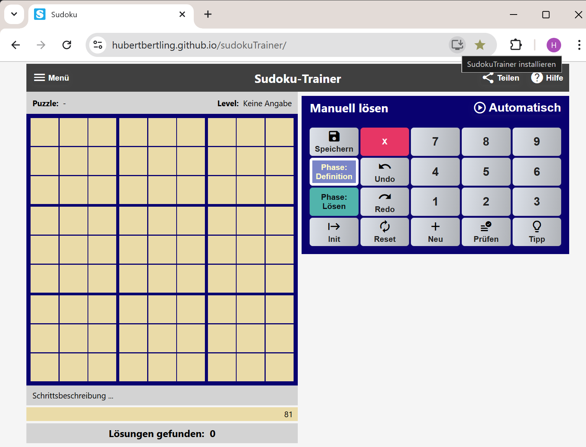
    <figcaption style="font-size: 16px; font-style: italic;">Installations-Icon in der URL-Zeile</figcaption>
</figure>

# Teilen der Sudoku-Explorer-App URL

In der Sudoku-Explorer-App kann die URL der App geteilt werden. Dies ist dann besonders nützlich, wenn man die App weitergeben will.

**Absender-Smartphone**

1. Teile-Taste
1. WhatsApp selektieren
1. Kontakt selektieren und senden

 {: width="400px"} 

**Ziel-Smartphone**

1. In WhatsApp in der empfangenen Nachricht auf den Link klicken.
1. In der geöffneten Web-Seite die PWAP-App installieren.

Hinweis: Bei dieser Vorgehensweise wird automatisch der eingestellte Standard-Browser als Installationsbasis gewählt. Z.B. der Samsung-Internet-Browser oder der Firefox-Browser. Besser ist es, Google-Chrome als Installationsbasis zu wählen. Wenn Chrome nicht als Standard-Browser eingestellt ist, kann man den Link aus der WhatsApp-Nachricht kopieren, den Chrome-Browser öffnen und den kopierten Link in das URL-Feld einfügen. Danach läuft alles wie beschrieben.

# Einführung in den Sudoku-Explorer

Wir führen hier die Konzepte dieses Sudoku-Explorers ein. Dazu benötigen wir Grundbegriffe des 9x9-Sudokus, die wir paralllel mitdefinieren bzw. erläutern. Im Abschnitt [Die Welt der 9x9 Sudokus](#die-welt-der-9x9-sudokus) geben wir dann in einem zweiten Durchgang detaillierte Definitionen und eräutern Hintergründe.  

Ein **Sudoku-Puzzle**, synonym auch ein **Sudoku** ist eine partiell gefüllte Tabelle. Die Tabelle hat 9 **Reihen**, 9 **Spalten** und 9 **Blöcke**. Die initial gesetzten Nummern heißen **Givens**. Eine Reihe, eine Spalte oder ein Block wird auch als **Gruppe** bezeichnet.

Die Givens werden blau unterlegt angezeigt. Grün unterlegte Zellen enthalten Lösungsnummern, die vom Spieler oder dem Solver gesetzt wurden.

<figure>
   
    <figcaption style="font-size: 16px; font-style: italic">Explorer-Darstellung eines Puzzles</figcaption>
</figure>

Der Spieler kann sich bei der Lösungssuche unterstützen lassen, indem er in den noch nicht gesetzten Zellen Kandidatennummern anzeigen lässt. Damit die Kandidatennummern angezeigt werden, muss in den Solver-Einstellungen der Parameter 'Kandidatenauswertung' auf 'Lazy' gesetzt sein.

<figure >
   
    <figcaption style="font-size: 16px; font-style: italic;">Explorer-Darstellung eines Puzzles, lazy</figcaption>
</figure>

## Die möglichen Inhalte einer Sudoku-Zelle

| Zelle                                                                                                                                       | Bedeutung                                                                                                                                                                                                                                                                                                                                                                                                                                                                                                                                                                                                                                                                                                                                                                          |
| ------------------------------------------------------------------------------------------------------------------------------------------- | ---------------------------------------------------------------------------------------------------------------------------------------------------------------------------------------------------------------------------------------------------------------------------------------------------------------------------------------------------------------------------------------------------------------------------------------------------------------------------------------------------------------------------------------------------------------------------------------------------------------------------------------------------------------------------------------------------------------------------------------------------------------------------------- |
| {:width="48rem"}                                                                                      | **Eine gegebene Nummer (Given):** In der Definitionsphase gesetzte Nummer.                                                                                                                                                                                                                                                                                                                                                                                                                                                                                                                                                                                                                                                                                                         |
| {:width="48rem"}                                                                                      | **Eine Lösungsnummer:** In der Lösungsphase gesetzte Nummer. In dieser Zelle wurde in der Lösungsphase manuell oder automatisch die Nummer 1 gesetzt.                                                                                                                                                                                                                                                                                                                                                                                                                                                                                                                                                                                                                              |
| {:width="48rem"}                                                                                   | **Kandidaten:** Für diese Zelle wurde noch keine Nummer gesetzt. Nur noch eine der Nummern 1, 2, 4 und 5 kann gewählt werden. Das sind die Kandidaten der Zelle. Die nicht aufgeführten Nummern sind unzulässig, weil sie bereits in einer anderen Zelle des Blocks, der Reihe oder Spalte gesetzt sind.                                                                                                                                                                                                                                                                                                                                                                                                                                                                           |
| {:width="48rem}                                                                                    | **Notwendiger Kandidat:** Für die nebenstehende Zelle wurde noch keine Nummer gesetzt. Kandidatnummern sind die Nummern 2, 5, 6 und 7. Jedoch hat der Solver ermittelt, dass der Kandidat 5 notwendig ist, damit das Sudoku lösbar bleibt. 5 ist eine notwendige Nummer für diese Zelle. Ein Kandidat in einer Zelle ist notwendig, wenn die Kandidatnummer in ihrem Block, in ihrer Reihe oder Spalte einzig ist. D.h. sie kann nur noch hier gesetzt werden. Hinweis: Im Wikipedia-Artikel [Wikipedia](https://en.wikipedia.org/wiki/Glossary_of_Sudoku) werden notwendige Kandidaten als "Hidden Singles" bezeichnet. Wir wollen diese Bezeichnung hier nicht übernehmen, weil wir diese Bezeichnung schon anderweitig benutzen: siehe nachfolgende Definition 'Hidden Single'. |
| {:width="48rem}                                                                        | **Eliminierbarer Kandidat:** Für die nebenstehende Zelle wurde noch keine Nummer gesetzt. Kandidaten dieser Zelle sind die drei Nummern 1, 3 und 6. Jedoch hat der Solver ermittelt, dass die Kandidatnummer 3 unzulässig ist. Wenn man sie setzen würde, würde der Solver sofort oder einige Schritte später die Widersprüchlichkeit des Puzzles feststellen.                                                                                                                                                                                                                                                                                                                                                                                                                     |
| {:width="48rem"}                                                                                     | **Einziger Kandidat (Single):** Eine Single-Nummer ist der Kandidat in einer Zelle, wenn es keine weiteren Kandidaten in der Zelle gibt. Im nebenstehendem Beispiel ist 1 ein Single.                                                                                                                                                                                                                                                                                                                                                                                                                                                                                                                                                                                              |
| {:width="48rem"}                                                                         | **Versteckt einziger Kandidat (Hidden Single):** im nebenstehenden Beispiel ist die 9 ein Versteckt einziger Kandidat. Die 9 ist in dieser Zelle ein Hidden Single, weil die anderen Kandidaten, die rote 5 und 6, eliminierbare Kandidaten sind.                                                                                                                                                                                                                                                                                                                                                                                                                                                                                                                                  |
| {: width="48rem"} {:width="48rem"} | **Widerspruch - Kein Kandidat:** Für diese Zelle wurde noch keine Nummer gesetzt. Allerdings gibt es keinen Kandidat mehr, der noch gesetzt werden könnte. Die Kandidaten 4 und 8 sind unzulässig. In der zweiten dargestellten Zelle gibt es nicht mal mehr Kandidatnummern. D.h. das Puzzle ist widersprüchlich. Wenn das Puzzle noch erfolgreich gelöst werden soll, müssen ein oder mehrere der bisherigen Nummernsetzungen zurückgenommen werden. Tritt während der automatischen Ausführung eine solche Zelle auf, schaltet der Solver in den Rückwärts-Modus um.                                                                                                                                                                                                            |
| {:width="48rem"}                                                                                 | **Widerspruch - Die Nummer 5 ist bereits einmal gesetzt:** Für diese Zelle wurde die Nummer 5 gesetzt. Diese Nummer ist direkt unzulässig, weil in der Spalte, Reihe oder dem Block dieser Zelle bereits eine 5 gesetzt ist. Das zweite oder dritte Auftreten der Nummer wird ebenfalls mit rotem Rand angezeigt.                                                                                                                                                                                                                                                                                                                                                                                                                                                                  |

| {:width="48rem"} | **Automatisch selektierte Zelle** mit notwendiger Nummer. Grauer Hintergrund.|

| {:width="48rem"} | **Automatisch selektierte Zelle** im Lazy-Modus. Grauer Hintergrund. |
| {:width="48rem"} | **Manuell selektierte Zelle** Schwarzer Hintergrund|
| {:width="48rem"} | **Manuell selektierte Zelle** im Lazy-Modus. Schwarzer Hintergrund.|

## Zwei Spielphasen

| Phase                                                | Bedeutung                                                                                                                                                                                                                                                                                                                                |
| ---------------------------------------------------- | ---------------------------------------------------------------------------------------------------------------------------------------------------------------------------------------------------------------------------------------------------------------------------------------------------------------------------------------- |
| {:width="200px"} | Die Taste **Phase: Definition**. Das Drücken dieser Taste versetzt den Solver in die Definitionsphase. In dieser Phase überträgt man das zu lösende Puzzle, sprich die Givens des Puzzles, in den Explorer. Nach der Initialisierung ist diese Taste automatisch gesetzt.                                                                 |
| 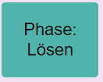{:width="200px"}      | Die Taste **Phase: Lösen**. Das Drücken dieser Taste versetzt den Explorer in die Lösungsphase. Gleichzeitig ermittelt der Explorer den Schwierigkeitsgrad des eingegebenen Puzzles. Die Lösungsphase kann manuell oder automatisch durchgeführt werden. Wird die automatische Ausführung gestartet, wird diese Taste automatisch gesetzt. |

Hinweis: Gegebene Nummern, die Givens - dies sind blaue Nummern - können in der Lösungsphase nicht gelöscht werden. Falls Givens gelöscht werden sollen, muss man zuvor die Phase-Definition-Taste drücken.

## Jeder Lösungsschritt mit zwei Subschritten

Beim Eingeben wie auch beim Lösen besteht ein **Lösungsschritt** aus zwei Subschritten:

1. **Sudoku-Zelle selektieren.**
2. **Nummer setzen bzw. löschen:** D.h. eine Nummer im rechten Tastenblock wählen. Es kann auch einfach nur eine Nummerntaste auf der Tastatur für die Eingabe einer Nummer benutzt werden.

Soll eine Nummern-Setzung zurückgenommen werden, muss die betroffene Zelle selektiert werden und dann die rote Lösch-Taste gedrückt werden.

## Die Taste Menu

<figure>
   
    <figcaption style="font-size: 16px; font-style: italic">Menü-Navigation</figcaption>
</figure>

**Menü-Option: Drucken.** Das aktuelle Puzzle wird ausgedruckt. Falls es noch nicht gespeichert wurde wird es zuvor mit einem Default-Namen 'Druck->>Datum<<' in der Datenbank gespeichert.

**Menü-Option: Einstellungen.** Aktuell kennt der Sudoku-Explorer 2 Einstellungsparameter

1. Kandidatenauswertung
1. Haltepunkte der automatischen Lösungssuche

{: style="text-align:center"}
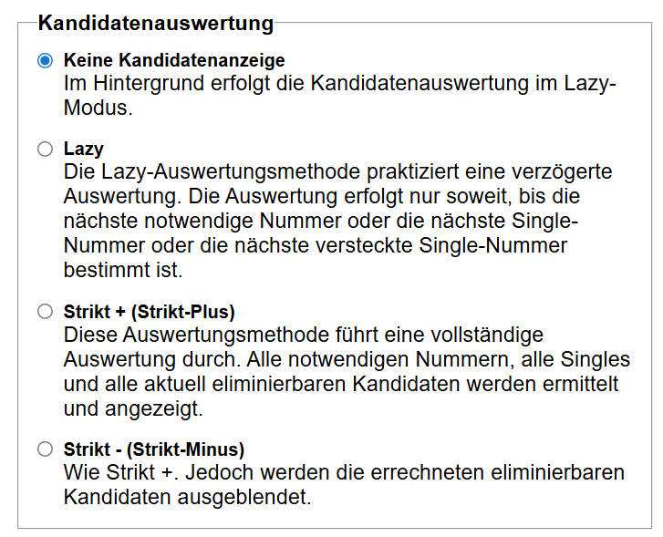{:width="100%"}

{: style="text-align:center"}
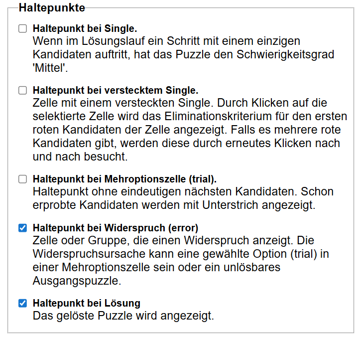{:width="100%"}

## Die Taste Teilen

Die Sudoku-Explorer-App ist eine Progressive Web App (PWA). Wie eine native App kann sie daher Inhalte, in unserem Fall ein Puzzle-File, mit anderen Apps teilen, z.B. mit WhatsApp oder einer EMAIL-App. Auf dem PC startet bei Doppel-Click auf diese Datei die Sudoku-App. Auf dem Android-SmartPhone ist dies leider noch nicht möglich.

## Der Tastenblock 'Manuell Lösen'

<figure>
   
    <figcaption style="font-size: 16px; font-style: italic">Tastenblock Manuell</figcaption>
</figure>

**Taste Init.** Jederzeit kann der Explorer initialisiert werden. Dabei wird das aktuell gespielte Puzzle gelöscht und der Solver initialisert. Die bereits gespeicherten Puzzles bleiben unverändert erhalten.

**Taste Reset.** Das aktuelle Puzzle wird zurückgesetzt auf die Aufgabenstellung. D.h. alle in der Lösungsphase gesetzten Zellen, die grünen Zellen, werden gelöscht. Die Givens bleiben erhalten. Per Undo kann diese Operation zurückgenommen werden.

**Taste: Neu.**

<figure >
   
    <figcaption style="font-size: 16px; font-style: italic;"

> Neues Puzzle selektieren noch während weitere Puzzles generiert werden.</figcaption>

</figure>

**Taste: Neu** öffnet den Dialog "Neue Puzzles". Der Explorer besitzt einen Vorrat neuer Puzzles, für jeden Schwierigkeitsgrad mindestens 1 Puzzle. Unmittelbar nach Start der App ist dieser Vorrat noch nicht vorhanden.

Die App startet im Hintergrund einen Puzzle-Generator, der solange neue Puzzles erzeugt, bis für jeden Schwierigkeitsgrad mindestens ein neues Puzzle existiert.

Hinweis: der Generator kann nicht gezielt ein Puzzle für einen vorgegebenen Schwierigkeitsgrad erzeugen. Vielmehr generiert er ein neues Puzzle und bestimmt dann, welchen Schwierigkeitsgrad das erzeugte Puzzle hat.

Der Spieler kann im Dialog einen nicht leeren Schwierigkeitsgrad selektieren und ein entsprechendes Puzzle laden. Er braucht nicht auf den Stopp des Generators zu warten.

**Taste: Undo.** Durch das Drücken dieser Taste wird die letzte Operation zurückgenommen.

**Taste: Redo.** Rücknahme des Undo.

**Taste: Prüfen.** Die gesetzten Lösungsnummern werden geprüft. Wenn sie falsch gesetzt sind, werden sie als fehlerhaft gekennzeichnet. Diese Funktion ist dann nützlich, wenn man das Puzzle manuell lösen will und man vermutet, dass man bereits einen Fehler gemacht hat.

**Taste: Tipp.** Wenn man bei der manuellen Lösung nicht mehr weiter weiss, kann man diese Taste nutzen.
Siehe [Bei Bedarf ein Tipp](#bei-bedarf-ein-tipp).

**Taste: Puzzle speichern.** Der Spielstand des aktuellen Puzzles wird in der Datenbank gespeichert. Gegebenenfalls wird das Puzzle in der DB neu angelegt und erhält dabei einen generierten Namen: 'PZ (>>Datum<<)'. Falls es schon in der Datenbank ist, wird es mit dem aktuellen Spielstand überschrieben. Der Name des Puzzles kann jederzeit umbenannt werden.

**Taste: Automatisch.**
Die Taste "Automatisch" startet den automatischen Solver der App.

## Der Tastenblock 'Automatisch Lösen'

<figure >
   
    <figcaption style="font-size: 16px; font-style: italic;">Tasteblock Automatik</figcaption>
</figure>

Die Tasten des automatischen Solvers haben folgende Bedeutung:

**Nächster Suchschritt**. Der Solver führt den nächsten automatischen Suchschritt aus. Wenn bereits ein automatischer Suchlauf aktiv ist, wird dieser pausiert. Mit dieser Taste kann man den Solver Schritt für Schritt arbeiten lassen und so jeden einzelnen seiner Schritte beobachten und verstehen.

**Suchlauf mit Haltepunkten.** Ein Timer wird gestartet, der die Ausführung automatischer Suchschritte anstößt. Wenn der automatische Suchprozess bereits läuft, wird er pausiert. Wenn er pausiert ist, wird er wieder gestartet. Der Suchlauf kann jederzeit unterbrochen werden, manuell oder durch gesetzte Haltepunkte. Der markanteste Haltepunkt ist wohl der Haltepunkt "bei Lösung". Der Suchlauf traversiert den gesamten Suchraum bis er schließlich sein Ende erreicht. Hinweis: der Haltepunkt "bei Lösung" ist verschieden vom Haltepunkt "Ende des Suchlaufs".

**Haltepunkte setzen.** Der Haltepunktedialog zur Einstellung von Haltepunkten wird geöffnet. Er ist Teil des Einstellungsdialogs der App.

**Weitere Lösung anzeigen**. Beim Drücken dieser Taste führt der Solver im Hintergrund eine Sequenz von Suchschritten durch bis er zur nächsten Lösung gelangt.

**Lösungen zählen ...** Ein Timer wird gestartet, der die Ausführung automatischer Suchschritte im Hintergrund anstößt. Für den Anwender sichtbar ist das Zählen der Lösungen. Interessant ist diese Funktion für extrem schwere Puzzles, also Puzzles mit mehreren Lösungen. Diese Operation ist sehr schnell, sodass für viele extrem schwere Puzzles die Anzahl möglicher Lösungen berechnet werden kann.

**Stopp.** Die automatische Suche wird abgebrochen bzw. beendet.

**Reset.** Reset Puzzle, ohne den Solver zu verlassen.

## Puzzle kopieren und einfügen via Clipboard

Die Textdarstellungen eignen sich für den sehr einfachen Austausch von Puzzles zwischen Spielern und zwischen Sudoku-Apps.

Textdarstellung 1:

    14.|..6|8..
    ...|.5.|..2
    ...|.94|.6.
    -----------
    ..4|...|...
    ...|..8|.36
    75.|..1|9..
    -----------
    ...|3..|.1.
    .9.|...|..5
    8..|...|7..

Textdarstellung 2

    140006800000050002000094060004000000000008036750001900000300010090000005800000700

Mit der Operation "Kopieren (Matrix)" der Navigationsbar wird das aktuell geladene Puzzle in der Textdarstellung 1 ins Clipboard kopiert, mit der Operation "Kopieren" in der Textdarstellung 2. Mit der Operation "Einfügen" wird das Puzzle in der Textdarstellung aus dem Clipboard in den Explorer geladen. Beide Textformate sind anwendbar.

## Die Puzzle-Datenbank

Sudoku-Puzzles und ihre Lösungen können im lokalen Speicher des Browsers gespeichert werden, aber nur mit Einschränkungen auf dem Computer selbst. D.h. Man kann seine gespeicherten Puzzles nur in dem Browser wiederfinden, in dem sie gespeichert wurden.

<figure >
   
    <figcaption style="font-size: 16px; font-style: italic;">Puzzle Datenbank</figcaption>
</figure>

Beim Abspeichern erhält das gespeicherte Puzzle automatisch einen Namen, das aktuelle Datum. Bei Bedarf kann der Name umbenannt werden. Bezüglich der Namen gibt es keine Einschränkungen.

| Attribut     | Bedeutung                                                                                                                                                                                                                                                                                                                                                                                                                                                                                                                                                                                                                     |
| ------------ | ----------------------------------------------------------------------------------------------------------------------------------------------------------------------------------------------------------------------------------------------------------------------------------------------------------------------------------------------------------------------------------------------------------------------------------------------------------------------------------------------------------------------------------------------------------------------------------------------------------------------------- |
| Laufende Nr. | Laufende Nr. in der Tabelle. Sie ist keine ID für Puzzles                                                                                                                                                                                                                                                                                                                                                                                                                                                                                                                                                                     |
| Puzzle-Name  | Name des gespeicherten Puzzles. Muss nicht eindeutig sein.                                                                                                                                                                                                                                                                                                                                                                                                                                                                                                                                                                    |
| #Givens      | Die Zahl der Givens des Puzzles.                                                                                                                                                                                                                                                                                                                                                                                                                                                                                                                                                                                              |
| #Gelöste     | Die Zahl der gelösten Zellen des Puzzles.                                                                                                                                                                                                                                                                                                                                                                                                                                                                                                                                                                                     |
| #Offene      | Die Zahl der offenen, ungelösten Zellen des Puzzles.                                                                                                                                                                                                                                                                                                                                                                                                                                                                                                                                                                          |
| Level        | Der ermittelte Schwierigkeitsgrad des gespeicherten Puzzles.                                                                                                                                                                                                                                                                                                                                                                                                                                                                                                                                                                  |
| #Error-RL    | Die Anzahl der Error-Rückwärtsläufe, die der Solver durchgeführt hat, um das Puzzle zu lösen. **Error-Rückwärtsläufe** erfolgen nach Auftreten eines Widerspruchs. Hinweis: Error-Rückwärtsläufe sind nur für sehr schwere Puzzles von Bedeutung. Sehr schwere Puzzles benötigen Backtracking für die Ermittlung ihrer eindeutigen Lösung. Leichtere Puzzles werden ohne Backtracking und damit ohne Rückwärtsläufe gelöst. Für extrem schwere Puzzles, also Puzzles mit mehreren Lösungen, gibt es zusätzlich **Lösungs-Rückwärtsläufe** nach dem Auftreten einer Lösung. Auf eine entsprechende Auswertung wird verzichtet. |
| Datum        | Datum, an dem das Puzzle angelegt wurde.                                                                                                                                                                                                                                                                                                                                                                                                                                                                                                                                                                                      |

### Operationen der Datenbank

| Taste              | Bedeutung                                                                                                                                                                                                                                                                |
| ------------------ | ------------------------------------------------------------------------------------------------------------------------------------------------------------------------------------------------------------------------------------------------------------------------ |
| Spaltenkopf        | **Sortieren.** Die Puzzles der Datenbank können sortiert werden nach jeder Spalte. Dazu einfach den Spaltenkopf klicken. Wiederholtes Klicken wechselt zwischen der aufsteigenden und der absteigenden Sortierung.                                                       |
| Pfeiltasten        | **Navigieren.** Mit den Pfeiltasten kann in der Tabelle vorwärts und rückwärts navigiert werden. Durch Klicken auf eine Reihe der Tabelle kann ein Puzzle direkt selektiert werden.                                                                                      |
| Laden              | **Puzzle laden.** Durch Drücken der Lade-Taste wird das selektierte Puzzle in den Sudoku-Solver geladen.                                                                                                                                                                 |
| Puzzle löschen     | **Puzzle löschen.** Gespeicherte Puzzles können auch wieder gelöscht werden.                                                                                                                                                                                             |
| DB löschen         | **DB löschen.** Die ganze DB kann gelöscht werden. Nützlich, wenn man die DB von einem anderen Gerät übernehmen will und die Übernahme nicht mit der aktuellen DB mischen will.                                                                                          |
| Drucken            | **Puzzle drucken.** Mittels der Taste Drucken kann das aktuell selektierte Puzzle gedruckt werden. Dabei wird nur die Aufgabe, nicht aber die Lösung ausgedruckt. Dies ist besonders dann nützlich wenn man ein generiertes Puzzle von Hand auf dem Papier lösen möchte. |
| Download Puzzle-DB | **Puzzle-Datenbank exportieren.** Durch Drücken dieser Taste wird die aktuelle Puzzle-Datenbank in ein txt-File 'Puzzle-DB.text' ausgegeben. Es befindet sich im Download-Ordner.                                                                                        |
| Download Puzzle    | **Puzzle exportieren.** Durch Drücken dieser Taste wird die aktuelle Puzzle mit dem Namen >>PuzzleName<< in ein txt-File '>>PuzzleName<<.text' ausgegeben. Es befindet sich im Download-Ordner.                                                                          |
| Import Puzzle(s)   | **Puzzle(s) importieren.** Mit dieser Taste wird ein File-Selection-Dialog gestartet. nur txt-Files können selektiert werden.                                                                                                                                         |

### Import/Export

Die Operationen Import/Export und Teilen sind sehr abhängig von der vorliegenden Betriebssystem- und Browser-Version. Konkret von den verfügbaren APIs. Es kann also vorkommen, dass manche der nachfolgend gezeigten Beispiele auf dem System des interessierten Anwenders nicht funktionieren.

# Die Welt der 9x9 Sudokus im Sudoku-Explorer

Es gibt eine Reihe von weitgehend akzeptierten Standardbegriffen im Bereich Sudoku – insbesondere unter Rätsellösern, Softwareentwicklern, Turnierspielern und Autoren von Sudoku-Literatur. Diese Begriffe stammen vor allem aus der englischsprachigen Community, werden aber auch im deutschsprachigen Raum verwendet, oft in eingedeutschter oder direkt übersetzter Form.

## Standardbegriffe

Hier ein Überblick über wichtige Grundbegriffe – jeweils mit englischem Originalbegriff, deutscher Entsprechung, Explorer-App-Begriff und kurzer Erklärung

| Englisch  | Deutsch              | Explorer            | Erklärung                                                                                                             |
| --------- | -------------------- | ------------------ | --------------------------------------------------------------------------------------------------------------------- |
| Cell      | Zelle                | Zelle              | Feld im 9x9-Raster                                                                                                    |
| Row       | Reihe                | Reihe              |                                                                                                                       |
| Column    | Spalte               | Spalte             |                                                                                                                       |
| Box/Block | Block (auch: Region) | Block              | Eines der neun 3x3-Quadrate                                                                                           |
| Unit      | Einheit              | Gruppe             | Jede Gruppe von 9 Zellen: Zeile, Spalte oder Block                                                                    |
| Candidate | Kandidat             | Kandidat           | Eine nicht direkt unzulässige Zahl in einer Zelle                                                                                     |
|           |                      | (Direkt) Unzulässige Nummer | In dem Block, in der Reihe oder Spalte der Zelle existiert eine andere Zelle, in der diese Nummer bereits gesetzt ist |
| Grid      | Raster / Gitter      | Grid / Matrix      | Die gesamte Sudoku-Matrix                                                                                             |
| Given     | Vorgabe              | Given              | Eine Zahl des eingegebenen Puzzles                                                                                    |

## In dieser App verwendete Begriffe

**Unzulässige Nummern: (Nicht-Kandidaten)** Für eine noch nicht belegte Zelle der Sudoku-Tabelle unterscheiden wir Unzulässige Nummern und Kandidatennummern, kurz **Kandidaten**. Für eine unbelegte Zelle ist eine Nummer unzulässig, wenn in dem Block, in der Reihe oder Spalte dieser Zelle eine andere Zelle existiert, in der diese Nummer bereits gesetzt ist. Im folgenden Beispiel ist die 5 in allen Zellen der rot gekennzeichneten Reihe und Spalte unzulässig, also kein Kandidat.

<figure>
   
    <figcaption style="font-size: 16px; font-style: italic;">Kandidaten</figcaption>
</figure>

Alle anderen Nummern sind **Kandidaten**. In einer unbelegten Zelle werden die Kandidaten der Zelle angezeigt, sofern in der Werkzeugeinstellung für den Einstellungsparameter "Kandidatenauswertung" nicht der Wert "Keine Kandidatenanzeige" gesetzt ist.

**Notwendige Kandidaten**

Eine Kandidatnummer in einer Zelle ist notwendig, wenn die Nummer in ihrem Block, in ihrer Reihe oder Spalte einzig ist. D.h. sie kann nur hier gesetzt werden.

<figure>
   
    <figcaption style="font-size: 16px; font-style: italic;">Notwendiger Kandidat 1</figcaption>
</figure>

 Im Bild ist die grüne 1 in der selektierten Zelle notwendig, weil sie in ihrem Block, grün umrandet, kein weiteres mal zulässig ist. Stuart spricht von der letzten verbleibenden Zelle für die 1 im siebten Block. Die Zellen mit den weiß gestrichelten Rahmen zeigen Einsen an, deretwegen in den Zellen des Blocks mit grünen Hintergründen keine 1 mehr gesetzt werden kann.

**Singles (Einzige Kandidaten)**

Eine Kandidatnummer in einer Zelle heißt "Single", wenn es keine weiteren Kandidaten in der Zelle gibt. 

<figure>
   
    <figcaption style="font-size: 16px; font-style: italic;">Single 3</figcaption>
</figure>

Im Beispiel ist die 3 ein einziger Kandidat. Die Nummern 1 und 2 und 4 ... 9 sind in dieser Zelle keine Kandidaten. Die gestrichelt weiß umrandeten Zellen sind die Gründe für das Nicht-Kandidat-sein der jeweiligen Nummer. Stuart spricht von der _Last Possible Number.

**Eliminierbare Kandidaten.** Auch Kandidaten können unzulässig sein. Eine Kandidatennummer ist unzulässig bzw. eliminierbar, wenn ihre Setzung das Puzzle widersprüchlich machen würde. Der Explorer würde das sofort oder einige Suchschritte später aufdecken. Eliminierbare Kandidaten werden mit rotem Hintergrund angezeigt.

<figure>
   
    <figcaption style="font-size: 16px; font-style: italic;">Eliminierbarer Kandidat 6</figcaption>
</figure>

Warum interessieren wir uns für eliminierbare Kandidaten? Wenn in einer Zelle alle Kandidatennummern bis auf eine (ein **versteckter Single**) eliminierbar sind, dann kann der versteckt einzige Kandidat, hier die 8, in der Zelle gesetzt werden.

## Kriterien für die Erkennung eliminierbarer Kandidaten

Egal, ob nur die 4 in diesem Explorer implementierten Kriterien zur Anwendung kommen, oder alle in der Community bekannten Kriterien. Sudokus, für die es bisher keine rein logische Lösung gibt, können immer noch durch Backtracking gelöst werden. Der vorliegende Solver unterstützt nachfolgend beschriebene logische Kriterien für das Erkennen der Eliminierbarkeit von Kandidaten.

### Eliminationskriterium: "Überschneidung"

Auch Line-Box-Kriterium genannt. Die folgende Abbildung sagt aus, dass die Eliminierbarkeit der 6 mit dem Überschneidungskriterium begründet werden kann. Die Überschneidungsbegründung wird angezeigt, wenn man auf die selektierte Zelle ein weiteres Mal klickt. Bei mehr als einem elimiierbaren Kandidaten kann man durch Klicken die eliminíerbaren Kandidaten der Reihe nach besuchen.

<figure >
   
    <figcaption style="font-size: 16px; font-style: italic;">Überschneidung</figcaption>
</figure>

Ein Block und eine Spalte oder Reihe überschneiden sich. In der Reihe gibt es Nummern, die nur in den gemeinsamen Zellen mit dem Block auftauchen. Im Beispiel die 6. Bitte beachten: die beiden 6 haben einen Magenta-Hintergrund. Sie sind nicht selbst eliminierbar. Damit es am Ende in der Reihe überhaupt eine 6 gibt, muss eine 6 in der Reihe gewählt werden. Dies wiederum bedeutet, dass die Nummern 6 in dem Block jenseits der Reihe gestrichen werden müssen.

### Eliminationskriterium "Nacktes Paar"

<figure >
   
    <figcaption style="font-size: 16px; font-style: italic;">Nacktes Paar</figcaption>
</figure>

Im Beispiel ist das 3-4-Paar ein nacktes Paar. Das 3-4-Paar macht in seiner Reihe alle 3 und 4 unzulässig. Der Grund: Das Paar bedeutet, dass die 3 und die 4 auf jeden Fall in einer der beiden Zellen des Paares gesetzt werden muss. Aktuell steht nur noch nicht fest, ob die 3 oder die 4 links ist. Fest steht aber jetzt schon, dass in den übrigen Zellen der Reihe keine 3 oder 4 mehr vorkommen können. Die 3 und 4 sind hier eliminierbar. 

### Eliminationskriterium: "Zeiger-Paar", "Zeiger-Triple"

Das "Zeiger-Paar", "Zeiger-Triple" wird auch **Box-Line-Kriterium** genannt. Die Box bzw. der Block bestimmt eliminierbare Kandidaten in der Zeile bzw. in der Spalte. Das Kriterium ist quasi Spiegelbild des Überschneidungskrieriums, das auch **Line-Box-Kriterium** genannt. Dort bestimmt die Line, Spalte oder Zeile, eliminierbare Kandidaten im Block.

<figure >
   
    <figcaption style="font-size: 16px; font-style: italic;">Zeiger-Paar, Zeiger-Tripel</figcaption>
</figure>

Das "Pointing Pair"-Kriterium kommt zur Anwendung, wenn ein Kandidat zweimal in einem Block vorkommt und zwar so, dass sich diese Vorkommen in derselben Zeile oder Spalte befinden. Ein Beispiel. Betrachten wir den Block 7. Alle Zellen des Blocks, die die Zahl 9 enthalten könnten, befinden sich in linken Spalte. Beachte wiederum den Magenta-Hintergrund der 9. Da die Zahl 9 in diesem Block mindestens einmal vorkommen sollte, wird sie in einer der Zellen, Zelle 4 oder Zelle 7, enthalten sein. In den übrigen Zellen der ganzen ZSpalte kann daher die 9 gestrichen werden.

### Eliminationskriterium: "Verstecktes Paar"

<figure >
   
    <figcaption style="font-size: 16px; font-style: italic;">Verstecktes Paar</figcaption>
</figure>

In einem Block, einer Spalte oder Reihe kann es ein verstecktes Paar geben. Ein verstecktes Paar besteht aus zwei Zellen, die zwei gemeinsame Nummern haben, im Beispiel 2 und 4, die in den übrigen Zellen nicht vorkommen. Daneben können sie weitere Nummern haben. Am Ende können in diesen beiden Zellen nur die beiden Nummern 2 und 4 untergebracht werden. Deshalb müssen die übrigen Nummern der beiden Zellen eliminiert werden.

### Die mehrfache Kriterien-Anwendung in einem Schritt

Bei der Suche nach einem versteckten Single kommt es vor, dass in einem Suchschritt mehrere Kriterien angewendet werden müssen. Ein Beispiel:

<figure >
   
    <figcaption style="font-size: 16px; font-style: italic;">Hidden Single 9 mit zwei eliminierten Kandidaten 4 und 6</figcaption>
</figure>

Wir überprüfen jetzt den Kandidaten 4, indem wir auf die selektierte Zelle {4, 6, 9} klicken. 

<figure >
   
    <figcaption style="font-size: 16px; font-style: italic;">Anwendung Nacktes Paar {2, 4} </figcaption>
</figure>

Wir ekennen, dass die 4 durch das Nackte Paar {2, 4} eliminiert wurde. Aber ist das Kriterium hier wirklich anwendbar? Liegt vielleicht ein Zirkelschluss vor? Die beiden Zellen enthalten neben den Kandidaten {2, 4} noch jeweils ein eliminierten Kandidaten. Klicken wir auf die obere Nackte-Paar-Zelle, um die 6 zu überprüfen.

<figure >
   
    <figcaption style="font-size: 16px; font-style: italic;">6 eliminierbar wegen Zeigerpaar </figcaption>
</figure>

Die 6 ist also korrekterweise eliminiert. Überprüfen wir nun die zweite Zelle des Nackten Paares, indem wir auf die Zelle {2, 3, 4} 2-mal klicken. Dann stoßen wir auf das Versteckte Paar {2, 4}, das wir im vorigen Abschnitt schon betrachtet haben. 

Insgesamt haben wir also keinen Zirkelschluss. Die 4 in der Ausgangszelle {4, 6, 9} wurde also zurecht eliminiert.

## Die Lösungssuche des Explorers

Der automatische Solver dieser App wendet für das Lösen von Sudoku-Puzzles ein ineinander verschränktes Verfahren aus Scannen, Eliminieren und Backtracking an. Solange das Puzzle nicht gelöst ist, werden folgende Schritte durchgeführt:

1. **Scanne notwendige Kandidaten:** Der Solver wählt in der Tabelle zunächst eine offene Zelle, die in der Menge ihrer Kandidaten eine notwendige Nummer hat. Diese notwendige Nummer wird dann in der Zelle gesetzt.
2. **Scanne Singles:** Wenn es keine Zelle mit notwendigem Kandidat mehr gibt, wählt der Solver eine Zelle mit nur einem einzigen Kandidat. Er setzt diese Nummer.
3. **Scanne versteckte Singles** Wenn es keine Zelle mit notwendiger Nummer oder mit Single mehr gibt, eliminiert der Solver Kandidaten, solange bis ein **verstecktes Single** übrig bleibt und setzt es. Dabei wendet er Kriterien aus der Menge der folgenden 4 Eliminationskriterien an:
   1. **Nacktes Paar**
   2. **Verstecktes Paar**
   3. **Überschneidung**
   4. **Zeiger-Paar, Zeiger-Tripel**
4. **Backtracking**
   1. **Scanne Kandidaten-Optionen:** Sind keine Zellen mehr verfügbar mit notwendigem Kandidat, mit einem einzigen Kandidat oder mit eimem versteckt einzigen Kandidat, wählt der Solver eine Zelle mit minimaler Anzahl von Kandidaten. Die sogenannten **Optionen der Zelle**. Meist besteht die minimale Optionenmenge aus zwei Optionen. Die Selektion ist aber nicht eindeutig, d.h. es gibt in der Regel mehrere Zellen mit zwei Optionen. In dieser Menge wählt der Solver zufällig eine Zelle.
   2. **Trial&Error der Optionen** Der Solver setzt eine der beiden Optionennummern. Im Laufe der weiteren Suche kann sich herausstellen, dass diese Nummer keine Lösung des Puzzles erlaubt. Der Backtracking-Prozess kehrt im weiteren Verlauf zu dieser Zelle zurück und versucht dann mit der Wahl der zweiten Nummer aus der Optionenmenge die Lösung zu finden.
   3. **Vorwärts und Rückwärts** (Backtracking) Der Solver zeigt an, wie er im Suchprozess vorwärts und rückwärts geht. Rückwärts muss er gehen, wenn die aktuell gesetzte Nummer zur Widersprüchlichkeit des Sudokus führt. **Rückwärtsgehen** bedeutet, dass der Solver der Reihe nach zuvor gesetzte Nummern wieder zurücknimmt, bis er auf eine Zelle trifft, in der er mehrere Kandidatnummern zur Auswahl hatte, also eine Zelle mit Optionen. Er wählt dann die nächste noch nicht probierte Zahl der Optionenmenge und geht wieder in den Vorwärts-Modus. Sind alle Kandidatnummern durchprobiert, geht er weiter rückwärts. Wenn er im Rückwärtsgehen bei der ersten gesetzten Zelle ankommt, und die erste Zelle keine weiteren unprobierten Kandidaten mehr hat, hat das Sudoku-Puzzle keine Lösung. Der Solver zeigt die Anzahl der zurückgelegten Schritte an. Jedes Setzen einer Zelle sowie die Rücknahme einer Setzung erhöht den Zähler um 1. Ebenso zeigt der Solver die Anzahl der **Error-Rückwärtsläufe** an. Hinweis: Error-Rückwärtsläufe erfolgen nach Auftreten eines Widerspruchs. Für extrem schwere Puzzles, also Puzzles mit mehreren Lösungen, gibt es zusätzlich **Lösungs-Rückwärtsläufe**. Lösungs-Rückwärtsläufe erfolgen nach Aufdeckung einer Lösung, um zu untersuchen, ob es weitere Lösungen gibt.

## Lazy und strikte Kandidatenauswertung

Unter Kandidatenauswertung verstehen wir die Anwendung der Scan-und Eliminationsregeln, die im vorigen Abschnitt eingeführt wurden. Der Solver unterscheidet mehrere Methoden der Kandidatenauswertung.

1. **Keine Kandidatenanzeige** Kandidatenauswertung. Der Solver zeigt keine Kandidaten an, wenngleich er im Hintergrund weiter mit Kandidaten arbeitet. Diese Option ist wünschenswert, wenn der Spieler ohne Hilfe des Solvers eine manuelle Lösung des Puzzles suchen will.

1. **Lazy** Kandidatenauswertung. Wenn die Anzahl eliminierbarer Kandidaten (die roten Nummern) groß wird, wird es immer schwieriger, nackte Paare oder versteckte Paare zu erkennen. Die Lazy-Auswertungsmethode praktiziert eine verzögerte Auswertung. Die Auswertung erfolgt nur soweit, bis die nächste notwendige Nummer oder die nächste Single-Nummer oder die nächste versteckte Single-Nummer bestimmt ist. Nur im Lazy-Modus, können in den oben gezeigten Beispielen die Erläuterungen der Kandidatennummern angezeigt werden.

1. **Strikt +**: Diese Auswertungsmethode führt eine vollständige Auswertung durch. Alle aktuell eliminierbaren Kandidaten, alle notwendigen Nummern, alle Singles und versteckten Singles werden ermittelt und angezeigt.

1. **Strikt -** : Wie Strikt +. Jedoch werden die errechneten eliminierbaren Kandidaten ausgeblendet.

Das nachfolgende Bild zeigt ein Puzzle im Strikt-Plus-Auswertungsmodus. Bei genauerer Betrachtung dieses Beispiels fällt auf, dass in allen Zellen nur noch eine Nummer zulässig ist.

<figure >
   
    <figcaption style="font-size: 16px; font-style: italic;">Strikt-Plus</figcaption>
</figure>

Das nachfolgende Bild zeigt die vorige Tabelle im Strikt-Minus-Modus. Im Strikt-Minus-Modus ist unmittelbar sichtbar, dass alle Zellen dieses Beispiels nur noch genau eine zulässige Nummer haben. Alle Nummern sind Singles. Mit anderen Worten: wir sehen hier die Lösung des Sudokus. Der Solver präsentiert hier eine Lösung ohne Backtracking. Nur die zuvor erläuterten Kriterien für eliminierbare Kandidaten wurden angewandt. Aber ... von Hand ist das kaum zu machen. Es ist eine andere Art der automatischen Lösungssuche.

<figure >
   
    <figcaption style="font-size: 16px; font-style: italic;">Strikt-Minus</figcaption>
</figure>

## Vergleich der Auswertungsmodi Lazy und Strikt

Wir vergleichen die jeweiligen Vorteile der Auswertungsmodi.

**Vorteil der Lazy-Auswertung: Nachvollziehbarkeit des Lösungsweges.** Die Lazy-Auswertung ist vorteilhaft, wenn man den Lösungsweg im Einzelnen nachvollziehen will. Es werden nur eliminierbare Kandidaten berechnet und angezeigt, die für den nächsten Schritt relevant sind. Für diese wenigen eliminierbaren Kandidaten ist ihre Verursachung leicht visuell darstellbar und damit verstehbar.

Im Lazy-Modus wird die Verursachung notwendiger Nummern oder eliminierbarer Kandidaten angezeigt durch gestrichelte Rahmen, wenn die Zelle der notwendigen Nummer oder eliminierbaren Nummer selektiert ist. Durch erneutes Klicken der selektierten Zelle können die Ursachen der notwendigen und eliminierbaren Kandidaten der Reihe nach jeweils angezeigt werden. Wenn alle Kandidaten angezeigt wurden, führt das erneute Klicken der Zelle zur Deselektion der Zelle.

**Vorteil der strikten Auswertung: Lösung des Puzzles mit weniger Schritten.** Im Auswertungsmodus Strikt benötigt der Solver im Allgemeinen weniger Schritte bis zur Lösung des Puzzles als im Ausführungsmodus Lazy. Im Lazy-Modus braucht der Solver für die Lösung des Puzzles 'Backtrack_10' 224 Schritte und 5 Rückwärtsläufe. Im Strikt-Modus dagegen nur 76 Schritte.

Woran liegt das? Es liegt daran, dass der Solver im Ausführungsmodus Strikt sehr viel früher die Widersprüchlichkeit, falls vorhanden, der aktuellen Nummernbelegungen feststellt. Dies wiederum führt dazu, dass die Anzahl der Vorwärts- und Rückwärtsschritte entsprechend geringer wird und damit die Anzahl der Schritte insgesamt. Die Anzahl der Rückwärtsläufe bleibt in beiden Ausführungsmodi gleich. Der Solver untersucht in beiden Auswertungsmodi dieselben möglichen Nummernsetzungen.

Dieser Sudoku-Explorer zeichnet sich in erster Linie durch seine nachvollziehbare Lösungssuche aus. Die Schrittminimierung ist kein Ziel. Daher ist die Einstellung "Keine Kandidatenanzeige" mit der Lazy-Auswertung im Hintergrund der Default-Auswertungsmodus.

## Sudoku-Puzzles

Wir unterscheiden drei Kategorien von Sudoku-Puzzles

1. Unlösbare Puzzles
2. Puzzles mit genau einer Lösung
3. Puzzles mit mehr als einer Lösung

### Unlösbare Puzzles

Ein Puzzle ist **unlösbar**, wenn es keine Belegung aller offenen Zellen des Puzzles gibt, sodass alle Sudoku-Regeln erfüllt sind. Ein (offenes) Puzzle ist **widerspruchsvoll**, wenn seine aktuelle Belegung den Sudoku-Regeln widerspricht. Jedes widerspruchvolle Puzzle ist unlösbar. Aber nicht jedes unlösbare Puzzle ist widerspruchsvoll.

Ist ein Puzzle widerspruchsvoll, dann ist das Setzen weiterer Zellen nicht mehr sinnvoll, da dadurch der schon bestehende Widerspruch nicht mehr aufgehoben werden kann. Oft gibt es mehrere Widersprüchlichkeiten gleichzeitig. Sie brauchen nicht alle ermittelt zu werden, da sie an der Unlösbarkeit nichts mehr ändern.

<figure >
   
    <figcaption style="font-size: 16px; font-style: italic;">Beispiel 1: Unlösbar wegen sichtbarem Widerspruch vor dem ersten Lösungsschritt</figcaption>
</figure>

Im ersten Beispiel wird ein Widerspruch sichtbar unmittelbar nach Wechsel in den Modus "Automatisch lösen". Die siebte Spalte enthält zweimal die Drei, ein Widerspruch zur Sudoku-Regel, dass eine Zahl nur einmal in der Spalte vorkommen darf.

Ein weiteres Beispiel.
Puzzle: 000000000000002000000001000021000000000000000000000120000100000000200000000000000

<figure >
   
    <figcaption style="font-size: 16px; font-style: italic;">Beispiel 2: Schritt_1: Widerspruch in Block 5 
    nach Setzen der notwendigen 1 im Schritt 1</figcaption>
</figure>

<figure >
   
    <figcaption style="font-size: 16px; font-style: italic;">Beispiel 2: Schritt_2 Widerspruch in Block 5 im Schritt 1</figcaption>
</figure>

Im Schritt 1 wird die notwendige 1 gesetzt. Danach ergibt sich der Widerspruch im Block 5: Im Block 5 kann keine 2 mehr gesetzt werden. D.h. der Block 5 wird ohne die Ziffer 2 bleiben. Ein Widerspruch zur Sudoku-Regel, dass in jedem Block jede Ziffer genau einmal vorkommen muss. Es gibt keine weitere Option mehr. Die Suche ist abgeschlossen. Das Puzzle hat keine Lösung.

Die beiden Beispiel-Puzzles zeigen Widersprüche zu den Sudoku-Regeln. Sie sind deshalb unlösbar. Es gibt aber auch unlösbare Puzzles, die (noch) nicht widerspruchsvoll sind. Sie erweisen sich erst nach vielen Suchschritten als widerspruchsvoll.

Puzzle = 040000900000000012080090000924000008600008000500201070050079823000005090700000004

Nach 140 Trial&error-Schritten wurde der Suchbaum vollständig durchlaufen, ohne dass eine Lösung gefunden wurde.

<figure >
   
    <figcaption style="font-size: 16px; font-style: italic;">Nach abgeschlossener Suche: Keine Lösung</figcaption>
</figure>

Zusammengefasst: der Solver berechnet die Unlösbarkeit von Puzzles, indem er sie zu lösen versucht: Stößt er dabei auf elementare Widersprüche, die keinen weiteren Try nach sich haben, ist das Ausgangspuzzle unlösbar.

### Elementare Widersprüche in Zellen und Gruppen

Der automatische Solver setzt solange weitere Nummern in der Tabelle, bis er entweder alle Zellen gesetzt hat (das Sudoku ist gelöst), oder er erkennt, dass das Sudoku unlösbar ist. Ein Puzzle ist nachgewiesen unlösbar, wenn es widerspruchsvolle Zellen oder Gruppen enthält, oder wenn im Laufe der Lösungssuche widerspruchsvolle Zellen oder Gruppen entstehen. Ein Sudoku-Puzzle ist widerspruchsvoll, wenn es

1. eine widerspruchsvolle Zelle besitzt, oder
1. eine widerspruchsvollen Gruppe.

Es können mehrere dieser Bedingungen gleichzeitig vorliegen. Der vorliegende Solver zeigt der Übersichtlichkeit halber immer nur eine Widerspruchsbedingung an.

**Widerspruchsvolle Zellen**

{:width="50px"; height="50px"}
{:width="50px"; height="50px"}
{:width="50px"; height="50px"}
{:width="50px"; height="50px"}

Widerspruchsvolle Zellen hatten wir oben schon kennengelernt. Es sind dies

1. Zellen ohne zulässige Kandidaten und
2. Zellen, die mit einer direkt unzulässigen Nummer, also einer Nummer, die es bereits an anderer Stelle in der Zeile, Spalte oder Block der Zelle einmal gibt.

Zellen ohne zulässige Kandidaten widersprechen der Sudoku-Grundregel, dass jede Zeile, jede Spalte und jeder der neun 3x3-Blöcke die Zahlen von 1 bis 9 jeweils genau einmal enthalten muss. Dies ist nicht möglich, wenn Zellen leer bleiben.

Wenn eine Zelle eine direkt unzulässige Nummer enthält, dann enthält ihre Zeile oder Spalte oder Block die Nummer ein zweites mal. Ein Widerspruch zu den Sudoku-Grundregeln.

**Widerspruchsvolle Gruppen**

Wir betrachten hier die abstrakte Gruppe. Eine konkrete Gruppe ist immer entweder eine Reihe oder eine Spalte oder ein Block. So wie es widerspruchsvolle Zellen geben kann - erkennbar an ihrem roten Rand - kann es auch widerspruchsvolle Gruppen geben. Eine Gruppe ist widerspruchsvoll, wenn eine der folgenden Bedingungen vorliegt:

1. **Widerspruch - Zwei gleiche Singles:**

      <figure >
      
       <figcaption style="font-size: 16px; font-style: italic; text-align:center">Widerspruch - Zwei gleiche Singles</figcaption>
   </figure>

   Ein Single, hier die 4, taucht gleichzeitig in verschiedenen Zellen der Gruppe auf. Fordert also dieselbe Nummer mehrmals in der Gruppe zu setzen. Ein Widerspruch zur bereits mehrfach erwähnten Sudoku-Regel, dass jede Nummer exakt einmal in einer Gruppe vertreten sein muss.

2. **Widerspruch - Fehlende Nummer:**

   <figure >
      
       <figcaption style="font-size: 16px; font-style: italic; text-align:center">Widerspruch - Fehlende Nummer</figcaption>
   </figure>

   In der Gruppe kommt eine Nummer überhaupt nicht vor. Hier die 5. Tritt während der automatischen Ausführung eine solche widerspruchsvolle Gruppe auf, schaltet der Solver in den Rückwärts-Modus um.Bitte beachten: Der Explorer zeigt für jede noch offene Zelle der Gruppe, warum die 5 nicht gesetzt werden kann.

### Puzzles mit genau einer Lösung

Für ein Puzzle mit genau einer Lösung gibt es genau eine fehlerfreie Belegung aller offenen Zellen. Deshalb kann der Explorer bei einer manuellen Lösung des Puzzles prüfen, ob alle bisher belegten Zellen korrekt belegt sind. Der Spieler bzw. die Spielerin kann die Prüfung mit der Prüfen-Taste im manuellen Tastenblock anstoßen.

Hegt der Spieler bzw. die Spielerin Zweifel, dass das gegebene Puzzle tatsächlich nur eine Lösung hat, kann er beispielsweise mit der Taste "Suchlauf mit Haltepunkten" nach der Lieferung der ersten Lösung die Suche fortsetzen. Der Suchlauf sollte dann mit der Meldung "Keine weitere Lösung! Suche abgeschlossen" enden.

Puzzles mit genau einer Lösung sind die Voraussetzung für die Anwendung logischer Eliminationskriterien.

### Puzzles mit mehreren Lösungen

Puzzles mit mehreren Lösungen spielen in der Praxis keine große Rolle, da sie für logisches Schließen nicht geeignet sind. Der vorliegende Explorer liefert die Lösungen per Backtracking. Er zeigt die Backtracking-Schritte an. Reizvoll zu beobachten ist dabei, wie nah verschiedene Lösungen beieinander liegen können.

### Schwierigkeitsgrade (Levels) von Puzzles

Der Schwierigkeitsgrad eines Sudoku-Puzzles kann auf verschiedene Weisen definiert werden. Dieser Solver unterscheidet Schwierigkeitsgrade anhand der Komplexität der erforderlichen Lösungstechniken. Folgende Schwierigkeitsgrade werden unterschieden:

1. **Unlösbar:** Es gibt keine Belegung aller offenen Zellen des Puzzles, sodass alle Sudoku-Regeln erfüllt sind.
1. **Sehr Leicht:** Allein durch das Scannen Notwendiger Kandidaten kann die Lösung des Sudokus erreicht werden.
1. **Leicht:** Wie Sehr Leicht, jedoch ist die Anzahl der Givens minimal.
1. **Mittel:** Neben dem Scannen notwendiger Kandidaten benötigt der Solver mindestens einen Scann-Single-Schritt, um das Puzzle zu lösen. Zugleich ist dies der höchste Schwierigkeitsgrad, der ohne eine Kandidatenbuchführung auskommt.
1. **Schwer:** Bei diesem Schwierigkeitsgrad benötigt der Solver mindestens ein Verstecktes-Single, um das Puzzle zu lösen. Für die Bestimmung des versteckten Singles müssen eliminierbare Kandidaten (rot dargestellt) bestimmt werden mit Hilfe der [Kriterien für die Erkennung eliminierbarer Kandidaten](#kriterien-für-die-erkennung-eliminierbarer-kandidaten). Dies unterscheidet diesen Schwierigkeitsgrad vom Schwierigkeitsgrad 'Mittel'. Zugleich ist dies der höchste Schwierigkeitsgrad, der ohne Backtracking auskommt.
1. **Sehr Schwer:** Bei diesem Schwierigkeitsgrad muss der Solver für mindestens eine Zelle ein Trial&Error durchführen, also eine Nummer raten und ausprobieren. "Backtracking" ist das dazugehörige Stichwort. Der Solver führt für die Berechnung der eindeutigen Lösung unter Umständen zahlreiche Error-Rückwärtsläufe (Error-RL)durch. Die Anzahl der für die (eindeutige) Lösung nötigen Rückwärtsläufe '# Error-RL' wird in der Datenbanktabelle angezeigt.
1. **Extrem Schwer**: 'Extrem schwer' sind Puzzles, die mehrere Lösungen haben. Mit der Taste 'Lösungen zählen ...' kann die Suche nach den Lösungen angestoßen werden. Wenn alle Lösungen aufgezählt sind, hält der Suchprozess an und zeigt die Anzahl der gefundenen Lösungen an. Aber Achtung: Die Anzahl der Lösungen kann sehr groß werden. Betrachten wir beispielsweise das vollständig leere Puzzle. Es hat überhaupt keine Givens. Die Menge der Lösungen dieses Puzzles entspricht der Menge der verschiedenen, vollständig ausgefüllten 9×9-Standard-Sudokus. Die Größe dieser Menge liegt bei ca. 6,7 Trilliarden. Siehe Wikipedia Abschnitt "Die Anzahl der Sudokus". [https://de.wikipedia.org/wiki/Sudoku](https://de.wikipedia.org/wiki/Sudoku). Wenn die Anzahl der Lösungen sehr groß ist, wird der Spieler den automatischen Suchprozess sinnvollerweise abbrechen.

## Lösungsarchitektur dieses Sudoku-Explorers

<figure>
   
    <figcaption style="font-size: 16px; font-style: italic;">Lösungsarchitektur des Sudoku-Explorers</figcaption>
</figure>

## Ziele und Abgrenzung dieses Explorers

<figure >
   
    <figcaption style="font-size: 16px; font-style: italic;">Ziele des Explorers</figcaption>
</figure>

Viele im Internet auffindbare Sudoku-Apps sind reine Sudoku-Solver. Sie lösen ein gegebenes Sudoku-Puzzle automatisch. Die vorliegende Sudoku-App ist primär ein Sudoku-Trainer und Sudoku-Explorer und erst sekundär ein Sudoku-Solver. Sie wendet sich an Gelegenheitsspieler. Also Spieler und Spielerinnen, die beispielsweise ein Puzzle aus einer Zeitschrift lösen wollen, dabei aber steckenbleiben, weil sie die nächste setzbare Nummer nicht finden. Der vorliegende Sudoku-Explorer zeigt Schritt für Schritt, wie man das Puzzle lösen kann. Er liefert also nicht nur die Lösung sondern auch den Weg zur Lösung.

Neben reinen Sudoku-Solvern findet man im Internet auch Sudoku-Trainer. Die Sudoku-Trainer-Portale sind häufig sehr aufwendig gestaltet und decken auch nicht-klassische Sudoku-Varianten ab. Zwei Beispiele sind die Seiten von [Andrew Stuart](https://www.sudokuwiki.org/Main_Page) und von [Jan Feldmann](https://sudoku.coach/). Ihre Trainer-Apps unterstützen den Spieler bei der Anwendung komplexer logischer Schlussregeln für die Lösung von Puzzles. Die Herausforderung besteht darin, völlig ohne Backtracking, allein durch Anwendung der Schlussregeln, das gegebene Puzzle zu lösen. Eine besondere Herausforderung ist die Weiterentwicklung der Schlussregeln. Es gibt Puzzles, die eine eindeutige Lösung haben, aber es wurde bisher noch keine logische Herleitung der Lösung gefunden.

Das Ziel des vorliegenden Explorers ist neben der Einübung der Anwendung logischer Schlussregeln auch die Vermittlung eines Überblicks über den Raum der 9x9-Sudokus. Anders als die erwähnten Sudoku-Trainer betrachtet der vorliegende Explorer auch unlösbare Puzzles und Puzzles mit mehr als einer Lösung. Sie gehören offensichtlich zum Raum der 9x9-Sudoku dazu. Technisch wendet er ineinander verschränkt beides an, logisches Schließen und Backtracking.

## Wo finde ich 'Sehr schwere' oder 'Extrem schwere' Puzzles?

Also Puzzles, die dieser Solver nur mit Backtracking lösen kann. In den Zeitungen und Zeitschriften findet man solche (sehr schwere) Puzzles nicht. Woher kann man sehr schwere Puzzles bekommen?

1. Dieser Explorer kann sehr schwere und extrem schwere Puzzles generieren.
2. Im Internet kann man zum Beispiel bei [SoEinDing](https://sudoku.soeinding.de/sudokuExtraTeuflischSchwer.php) sehr schwere Puzzles finden.

# Den Sudoku-Explorer praktisch nutzen

Anhand konkreter Beispiele zeigen wir, wie man den Sudoku-Explorer in der Praxis nutzen kann.

## Puzzles manuell lösen

Explorer-Einstellung:
- **Kandidatenauswertung:** Keine Kandidatenanzeige
- **Explorer-Status:** initialisiert.
- **Taste "Phase Definition"** gesetzt.

### Puzzle eingeben
Der Explorer befindet sich in der Phase Definition. Jetzt können die Givens des Puzzles eingegeben werden.

### Puzzle-Eingabe beenden

Mit der Taste "Phase: Lösen" beendest Du die Eingabe des Puzzles. Im Hintergrund berechnet der Explorer den Schwierigkeitsgrad des eingegebenen Puzzles

### Schwierigkeitsgrad des Puzzles prüfen

Wenn wir ein Puzzle manuell lösen wollen, ist die Frage nach dem Schwierigkeitsgrad des Puzzles von entscheidender Bedeutung. Wenn Du ein Puzzle beim Warten im Wartezimmer lösen willst, sollte das eingebene Puzzle 'Sehr leicht', 'Leicht' oder 'Mittel'. Der Explorer zeigt den Schwierigkeits des eingegebenen Puzzle in der rechten obere Ecke der Matrix an.

Puzzles mit einem der 3 genannten Schwierigkeitsrade können allein mit dem Scannen nach 'notwendigen' und 'single' Kandidaten gelöst werden. Es bedarf keinerlei Buchführunng von Kandidaten. 

### Puzzle lösen

Der Spieler setzt jetzt Zelle für Zelle die von ihm erkannten notwendigen oder einzig gebliebenen Kandidaten in den Zellen. Der Spieler kann sich darauf verlassen, dass er nur nach 'notwendigen' und 'single' Kandidaten Ausschau halten muss.

### Prüfen der aktuell gesetzten Nummern

Beim manuellen Lösen kann es passieren, dass eine Nummer falsch gesetzt wird. Viele Setzungen danach laufen in Abhängigkeit von dieser ersten Fehlersetzung Gefahr, ebenfalls falsch gesetzt zu werden. Mit der Prüfen-Taste kann in diesem Fall geprüft werden, ob und welche bisherigen Nummern-Setzungen bereits fehlerhaft sind. Der Spieler kann die Falschsetzungen zurücknehmen.

{: style="text-align:center"}
{: width="400px"}

### Bei Bedarf ein Tipp 

Wenn man bei der manuellen Lösung nicht mehr weiter weiss, kann man die Taste "Tipp" nutzen. Durch das Drücken dieser Taste wird automatisch die Zelle in der Matrix selektiert, die der Solver bei der automatischen Lösung als nächste Zelle selektieren würde.

<figure >
   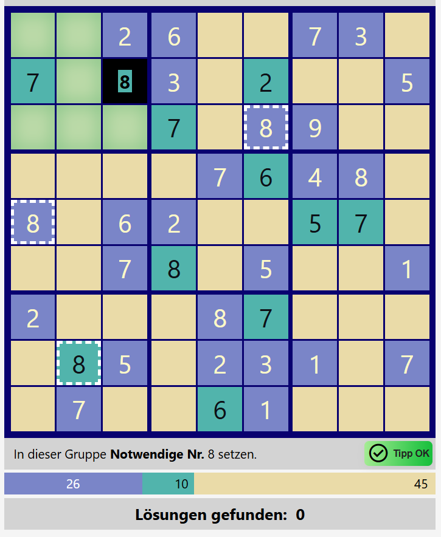
    <figcaption style="font-size: 16px; font-style: italic;">Tipp Ok Taste</figcaption>
</figure>

Der Spieler hat dann zwei Möglichkeiten:

1. Die vorgeschlagene Nummer in der Zelle setzen, durch Drücken der Tipp-OK-Taste unten rechts an der Tabelle, oder
1. Die Tipp-Taste erneut drücken. Dann wird die Selektion zurückgenommen.

## Puzzles automatisch lösen

### Verschiedene Arten der automatischen Lösungssuche

Mit dem Explorer gibt es verschiedene Arten der automatischen Lösungssuche.

1. **Schritt für Schritt**: Manueller Anstoß jedes automatischen Schrittes.
1. **Von Haltepunkt zu Haltepunkt**: automatische Ausführung einer Sequenz von Such- bzw. Lösungsschritten.
1. **Verborgene Suche der nächsten Lösung**.
1. **Von Lösung zu Lösung** (nur im Fall von 'Extrem schweren Puzzles', also Puzles mit mehr als einer Lösung).

Zwischen diesen Arten der automatischen Lösungssuche kann jederzeit gewechselt werden. Gleiches gilt für die Einstellung der Kandidatenauswertung. Allerdings sind die statistischen Anzeigen bei der Lösungsfindung nicht mehr aussagekräftig. 

### Backtracking und Such-Ende

Bei genaueren Betrachtung ist die Ausführungsart 'Von Lösung zu Lösung' im letzten Schritt eigentlich ein Schritt von Letzter Lösung zu Such-Ende. Es gibt keine weitere Lösung mehr. Und noch einmal genau hingesehen, gilt das auch für die anderen Ausführungsarten. Der jeweilige nächste Schritt kann auf das Such-Ende stoßen.

## Eine Beispiel-Lösungssuche mit dem Explorer

Werkzeugeinstellung:
- **Kandidatenauswertung:** Keine Kandidatenanzeige oder Lazy.
- **Haltepunkte:** Haltepunkte nach Bedarf zu- und abschalten.

Die folgenden Darstellungen nehmen Bezug auf das Puzzle

**Beispiel-Puzzle**
140006800000050002000094060004000000000008036750001900000300010090000005800000700

Wir kopieren die Ziffernkette und fügen sie in den Explorer ein, z.B. mit ctrl-v oder Menu/Einfügen.

<figure>
   
    <figcaption style="font-size: 16px; font-style: italic;">Das eingefügte Puzzle</figcaption>
</figure>

Nach dm Einfügen hat der Explorer den Schwieigkeitsgrad berechnet. Siehe oben rechts: "Sehr schwer". Wir speichern das Puzzle unter dm Namen: "demo-puzzle". Danach wechseln wir in die automatische Lösungssuche.

Die im Folgenden dargestellten Schritte erreichen wir durch Drücken der Schritttaste "Nächster Suchschritt" oder der Suchlauftaste "Suchlauf mit Haltepunkten". Für die Verwendung der Suchlauftaste im Beispiel werden jeweils die gewünschten Haltepunkte gesetzt.

<h3> ==> Schritttaste einmal gedrückt:</h3>

**Schritt 1: Zelle mit mehreren Optionen.** Schon im ersten Schritt erweist sich dieses Puzzle als sehr schwer, da der Solver keine Zelle mit eindeutiger Nummernbelegung findet und stattdessen eine Zelle mit 2 Optionen selektiert: 2 und 7. Der Solver versucht zuerst die 2.

<figure>
   
    <figcaption style="font-size: 16px; font-style: italic;">Schritt 1.a: Zelle mit Optionen {2, 7}</figcaption>
</figure>

Bitte den Eintrag im Suchpfad beachten: Dort wird dokumentiert, dass in diesem Schritt die erste der beiden Optionen gewählt wurde.

Nach der Setzung der ersten Option durch Drücken der Schrittaste.

<figure>
   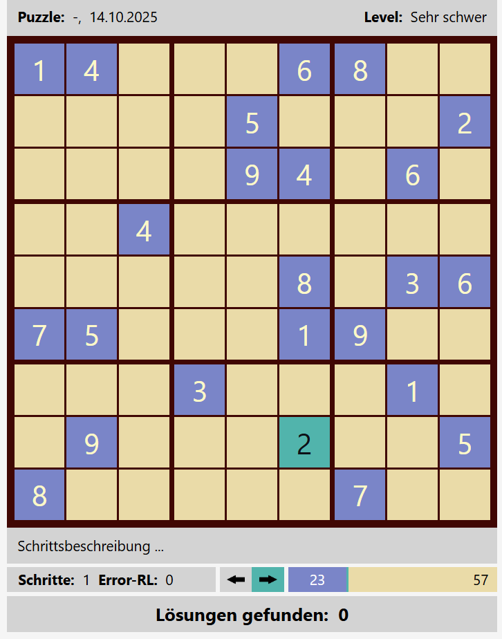
    <figcaption style="font-size: 16px; font-style: italic;">Schritt 1.b: Kandidat 2 gesetzt.</figcaption>
</figure>

<h3> ==> Schritttaste mehrmals drücken bis Schritt 4.a: </h3>

<figure>
   
    <figcaption style="font-size: 16px; font-style: italic;">Schritt 4.a</figcaption>
</figure>

**Schritt 4: Zelle mit notwendiger Nummer.** Im vierten Schritt selektiert der Solver eine Zelle mit notwendiger Nummer 3. Sie ist notwendig, weil in dem Block in allen freien Zellen, einen grünen Hintergrund haben und keine 3 mehr gesetzt werden kann. Die weiß gerahmten Zellen liefern die Begründung. Das heißt alle diese Zellen tragen die Nummer 3.

<figure>
   
    <figcaption style="font-size: 16px; font-style: italic;">Schritt 4.b: Notwendiger Kandidat 3 gesetzt.</figcaption>
</figure>

<h3> ==> Haltepunkt "Bei Single" gesetzt. Suchlauftaste gedrückt: </h3>

**Schritt 13: Zelle mit Single.** Im Schritt 13.a selektiert der Solver eine Zelle mit nur einem Kandidaten, die 7, einem Single. Alle anderen Nummern sind in dieser Zelle unzulässig. Die Zellen mit gestricheltem weißen Rand liefern die Bedingung dafür. Das heißt, für jede Zahl außer 7 gibt es eine solche Zelle.

<figure>
   
    <figcaption style="font-size: 16px; font-style: italic;">Schritt 13.a: Single</figcaption>
</figure>

<h3> ==> Haltepunkt "Bei Widerspruch" gesetzt. Suchlauftaste gedrückt: </h3>

**Schritt 23: Block mit Widerspruch.** Im Schritt 23.a entdeckt der Solver einen widerspruchsvollen Block. Deshalb wurde der Solver in den Rückwärts-Modus gesetzt (grüner Pfeil links).

<figure>
   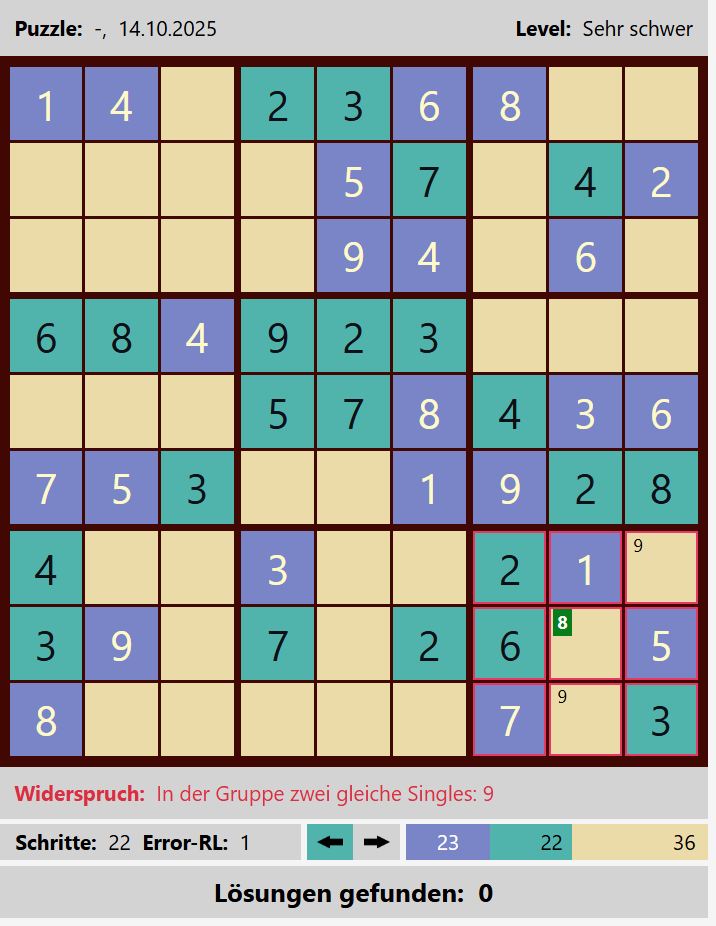
    <figcaption style="font-size: 16px; font-style: italic;">Schritt 22.b: Widerspruch</figcaption>
</figure>

<h3> ==> Schritttaste einmal gedrückt</h3>

**Schritt 23: Zelle im Rückwärts-Modus zurücksetzen (Rückwärtsschritt)**

<figure>
   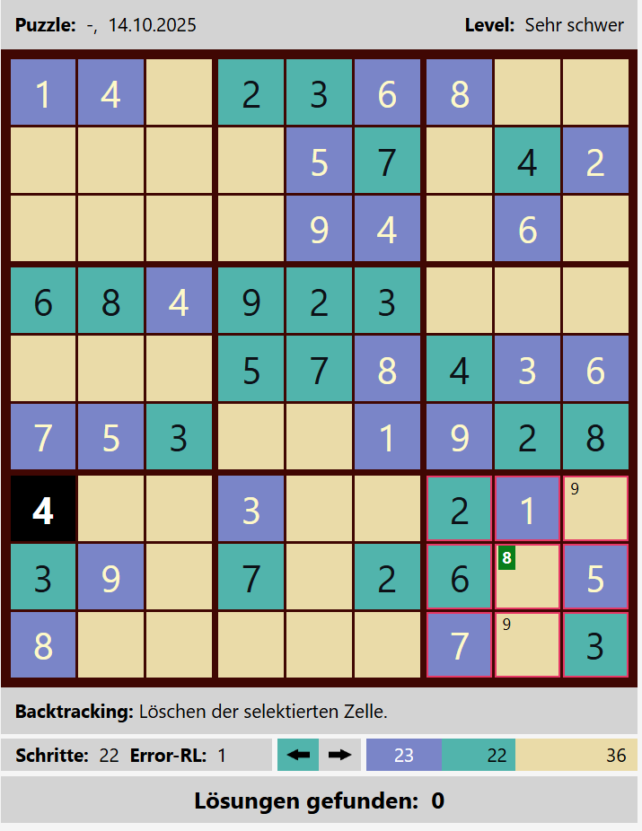
    <figcaption style="font-size: 16px; font-style: italic;">Schritt 23.a: Zurückzusetzende Zelle mit der Nummer 4 selektiert</figcaption>
</figure>

<h3> ==> Haltepunkt "Bei Selektionsoptionen" gesetzt und "Bei Widerspruch" zurückgenommen. Suchlauftaste gedrückt:</h3>

**Schritt 43: Zweiter Besuch in der Zelle.** Im Schritt 43.a kehrt der Solver in die Zelle zurück, in der er beim ersten Besuch die 3 gewählt hatte. Zu sehen an der unterstrichenen 3. Nun schaltet er wieder in den Vorwärts-Modus, grüner Pfeil rechts, und selektiert den zweiten Kandidaten mit der Nummer 7.

<figure>
   
    <figcaption style="font-size: 16px; font-style: italic;">Schritt 43.a: Zweiter Besuch in der Zelle</figcaption>
</figure>

<h3> ==> Schritttaste gedrückt:</h3>

<figure>
   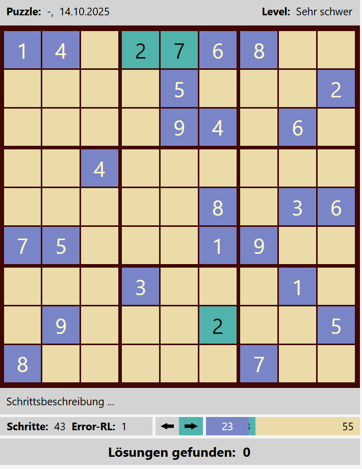
    <figcaption style="font-size: 16px; font-style: italic;">Schritt 43.b: Zweite Option in der Zelle, die 7,  gesetzt.</figcaption>
</figure>

<h3> ==> Haltepunkt "Bei Lösung" gesetzt und andere Haltepunkte zurückgenommen. Suchlauftaste gedrückt:</h3>

**Schritt 224: Alle Zellen belegt.** Im Schritt 224 belegt der Solver die letzte offene Zelle. Das Puzzle ist gelöst.

<figure>
   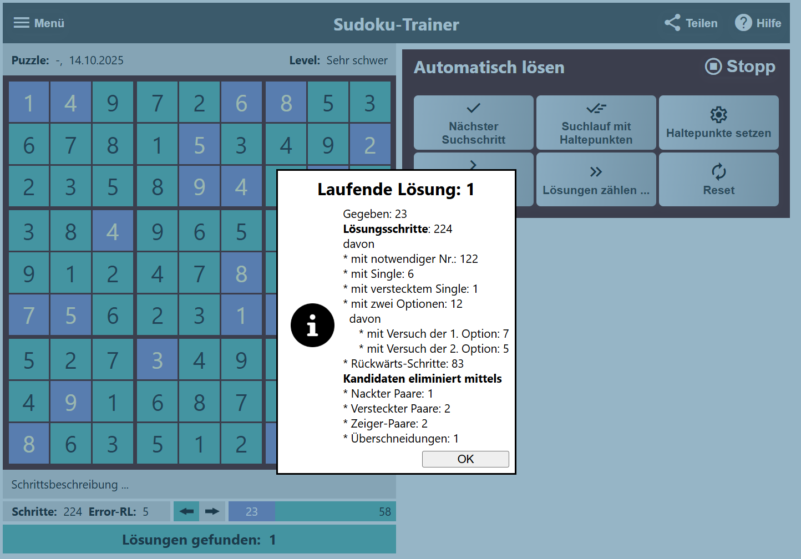
    <figcaption style="font-size: 16px; font-style: italic;">Schritt 224.b: Alle Zellen belegt.</figcaption>
</figure>

# Sudoku-Explorer: Tatsachen und Einsichten über klassische 9x9-Sudokus

Im Laufe der Entwicklung dieser App ergaben sich für den Autor zahlreiche neue Einsichten und Tatsachen über klassische 9x9-Sudokus. Viele davon stammen von Recherchen im Internet. Nicht wenige aber auch aus den Erfahrungen mit der vorliegenden App. Diese sollen in diesem Abschnitt vorgetragen werden.

**1. Beobachtung: Die Schwierigkeitsgrade von Sudoku-Puzzles sind in der Regel werkzeugabhängig definiert.**

Das trifft für den vorliegenden Sudoku-Explorer zu, aber auch für den Sudoku-Coach von [Jan Feldmann](https://sudoku.coach/) und dem Solver von [Andrew Stuart](https://www.sudokuwiki.org/Main_Page). Das hat seine Ursache darin, dass die Definition der Schwierigkeitsgrade von den Definitionen und Implementierungen der Kandidaten-Eliminationsregeln abhängig sind. Letztere sind werkzeugabhängig definiert.

**2. Beobachtung: Sudokus in Zeitschriften sind in der Regel fair.**

Sudoku-Puzzles in den Zeitschriften und Magazinen besitzen in der Regel die Schwierigkeitsgrade 'Sehr leicht', 'Leicht', 'Mittel' oder selten auch einmal 'Schwer'. Sie sind "fair". Die Rede ist von Schwierigkeitsgraden gemäß der Definition dieses Sudoku-Explorers. D.h. für die Zeitschriften-Puzzles benötigt man kein Backtracking und nur selten die Anwendung von Kandidaten-Eliminationsregeln. Für die Schwierigskeitsgrade 'Sehr leicht', 'Leicht' und 'Mittel' bedarf es auch keiner Buchführung über Zell-Kandidaten.

**3. Beobachtung: Faire Puzzles automatisch zu lösen ist langweilig.**

Faire Puzzles können ohne Backtracking gelöst werden. Dies macht die Anwendung des Sudoku-Explorers auf faire Puzzles gleich ein wenig langweilig. Es werden immer nur exakt soviel Schritte für die Lösung des Puzzles gebraucht, wie das Puzzle offene Zellen hat. Also mit der Schritttaste einmal alle offenen Zellen klicken und schon ist das Puzzle gelöst. Wieder spannend wird es, wenn man die Gründe für jeden Schritt nachvollziehen will. Der vorliegende Solver zeigt mit seinem beobachtbaren Backtracker für jede automatische Nummernsetzung die zugehörige Begründung an. Auf Wunsch gibt er auch einen Tipp für die nächste setzbare Zelle, siehe [Bei Bedarf ein Tipp](#bei-bedarf-ein-tipp).

**4. Tatsache: Ein Puzzle mit eindeutiger Lösung besitzt mindestens 17 Givens.**

2012 haben Mathematiker bewiesen, dass 17 die kleinste Anzahl von Givens ist, die noch eine eindeutige Lösung garantieren kann. [FAZ 2012](https://www.faz.net/aktuell/wissen/physik-mehr/mathematik-der-heilige-gral-der-sudokus-11682905.html).

**5. Falsche Vermutung: Je weniger Givens ein Puzzle hat, um so schwieriger ist das Puzzle.**

Wir betrachten das folgende Puzzle und kopieren die Textdarstellung des Puzzle in die Zwischenablage. D.h. wir selektieren die Textdarstellung vollständig und kopieren mit der Kopier-Operation in der Navgationsbar oder mit Strg+C. Dann öffnen wir die App und fügen die Kopie mit der Einfüge-Operation der Navigationsbar in den Sudoku-Explorer ein.

<figure >
   
    <figcaption style="font-size: 16px; font-style: italic;">17 Givens, kleinstes Puzzle. 
    Puzzle = 040000080007000060000010000410000200000005000030000000006007003005806000000000001</figcaption>
</figure>

Der Sudoku-Explorer berechnet nach dem Einfügen des Puzzles den Schwierigkeitsgrad, in diesem Fall 'Leicht', siehe oben rechts. Das Puzzle hat nur 17 Givens. Lassen wir das Puzzle lösen: Taste "Starte Suche", dann Taste "Weitere Lösung anzeigen".

<figure>
   
    <figcaption style="font-size: 16px; font-style: italic;">Puzzle gelöst</figcaption>
</figure>

Das Puzzle ist gelöst. Für seine Lösung brauchten nur Notwendig-Schritte angewendet zu werden. D.h. das Puzzle hat den Schwierigkeitsgrad Leicht. Die Vermutung "Je weniger Givens ein Puzzle hat, um so schwieriger ist das Puzzle." ist also falsch.

**6. Falsche Vermutung: Je mehr Givens ein Puzzle hat, um so einfacher ist das Puzzle.**

Wir kopieren die Textdarstellung des Puzzle in die Zwischenablage und in den Sudoku-Explorer ein.

<figure >
   
    <figcaption style="font-size: 16px; font-style: italic;">77 Givens
    Puzzle = 123748569597612438468539217986157342314286795752394681879465123241073056635021074</figcaption>
</figure>

Der Sudoku-Explorer berechnet nach dem Einfügen des Puzzles den Schwierigkeitsgrad, in diesem Fall "Extrem schwer", siehe oben rechts. Extrem schwer bedeutet, dass das Puzzle mehrere Lösungen hat. Schauen wir uns die Lösungen an: Taste “Starte Suche”, dann Taste “Weitere Lösung anzeigen”.

<figure >
   
    <figcaption style="font-size: 16px; font-style: italic;">77 Givens, Lösung 1</figcaption>
</figure>

<figure >
   
    <figcaption style="font-size: 16px; font-style: italic;">77 Givens, Lösung 2</figcaption>
</figure>

<figure >
   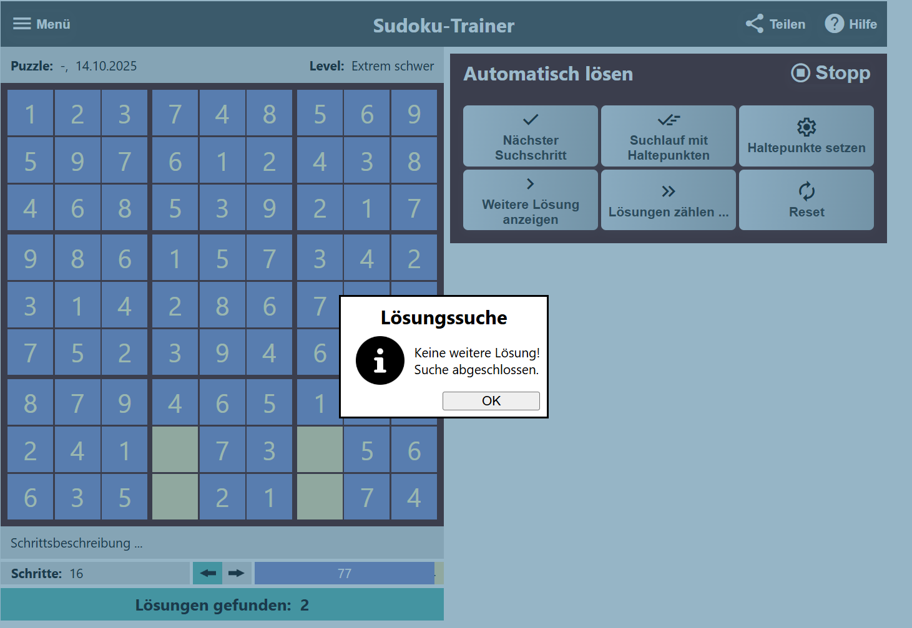
    <figcaption style="font-size: 16px; font-style: italic;">77 Givens, Keine weitere Lösung</figcaption>
</figure>

Dieses Puzzle hat genau zwei Lösungen.

**7. Einsicht: Puzzles mit mehreren Lösungen lassen sich nicht "lösen" sondern ihre Lösungen lassen sich aufzählen.**

Puzzles, die mehrere Lösungen besitzen, lassen sich nicht "lösen" sondern ihre Lösungen lassen sich aufzählen. In dem besonders einfachen Fall des vorigen Beispiels gibt es nur zwei Lösungen, die unmittelbar ersichtlich sind. Es kann aber sehr viel mehr Lösungen eines Puzzles geben. So gibt es ca. 6,7 Trilliarden verschiedene, vollständig ausgefüllte 9×9-Standard-Sudokus [Wikipedia](https://de.wikipedia.org/wiki/Sudoku#Die_Anzahl_der_Sudokus). D.h. die Lösungen mehrdeutiger Puzzles lassen sich prinzipiell aufzählen. Pragmatisch stößt diese Aufzählung bei großen Lösungsmengen an ihre Grenzen.

**8. Vermutung: Nicht alle Puzzles mit eindeutiger Lösung können durch logisches Schließen gelöst werden.**
Ende November 2006 behauptete der finnische Mathematiker Arto Inkala, das schwierigste Sudoku der Welt entwickelt zu haben. „Ich habe das Rätsel AI Escargot genannt, weil es wie eine Schnecke aussieht. Es zu lösen ist wie ein intellektuelles kulinarisches Vergnügen. AI sind meine Initialen”, sagte er. Siehe [AI-Escargot](https://www.sudokuwiki.org/Escargot).
AI-Escargot = 100007090030020008009600500005300900010080002600004000300000010040000007007000300

<figure >
   
    <figcaption style="font-size: 16px; font-style: italic;">Logisch unlösbar. Puzzle = 030010009006000500100000040400003200090070008005600000800002003000090070000400100
</figcaption>
</figure>

<figure >
   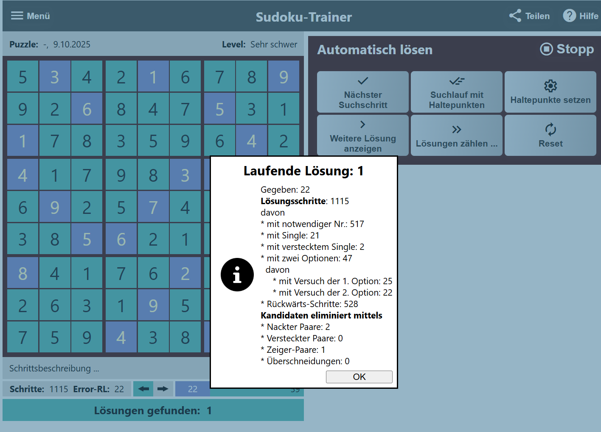
    <figcaption style="font-size: 16px; font-style: italic;">Logisch unlösbar, per Backtracking lösbar</figcaption>
</figure>

<figure >
   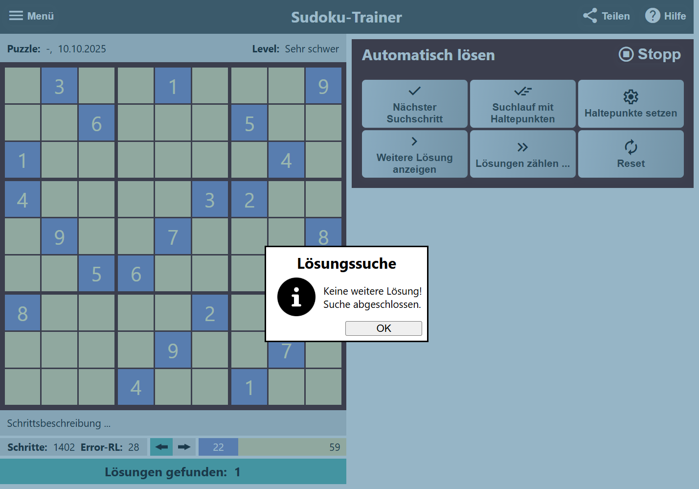
    <figcaption style="font-size: 16px; font-style: italic;">Keine weitere Lösung</figcaption>
</figure>

Genauer gesagt bedeutet dieses Ergebnis, dass dieser Sudoku-Explorer für dieses Puzzle eine Backtrack-Lösung gefunden hat, und dass diese Lösung die einzige ist. Der vorliegende Explorer hat keine rein logische Herleitung gefunden. Deshalb bewertet er das Puzzle mit dem Schwierigkeitsgrad "Sehr schwer".

Hinweis: Der vorliegende Solver findet weniger rein logische Herleitungen als beispielsweise die Solver von [Andrew Stuart](https://www.sudokuwiki.org/Main_Page) und [Jan Feldmann](https://sudoku.coach/). Das ist nicht sehr verwunderlich, da dieser Explorer nur vier grundlegende Eliminationsregeln implementiert hat. Hingegen haben Andrew Stuart und Jan Feldmann einen riesigen Katalog von Regeln implementiert. Mit ihren Fans sind sie ständig auf der Suche nach neuen, zusätzlichen Regeln, die bisher nicht logisch herleitbare Puzzlelösungen lösbar machen. Andrew Stuart hat dafür eine Rubrik "The weekly 'Unsolvalble'" [weekly-unsolvable](https://www.sudokuwiki.org/Weekly-Sudoku.aspx).

Zurück zu unserer Vermutung: "Es gibt Puzzles, die eine eindeutige Lösung haben, die aber vermutlich nicht durch logisches Schließen hergeleitet werden kann." Für unser Beispiel-Puzzle kann die vorliegende App keine logische Herleitung finden. Aber auch die Solver von Stuart und Feldmann können es nicht. Dies legt die Vermutung nahe, dass es derart schwierige Puzzles gibt, sodass sie prinzipiell nicht durch logisches Schließen gelöst werden können. Aber ein Beispiel ist kein Beweis. Deswegen können wir nur von einer Vermutung sprechen.

**9. Tatsache: Eindeutige Puzzles, also Puzzles mit genau einer Lösung, können per Backtracking gelöst werden.**

Diese Einsicht unterstreicht noch einmal, dass es Stuart und Feldmann nicht darum geht, überhaupt eine Lösung für ein gegebenes Puzzle zu finden, sondern darum, ein eindeutiges Puzzle ohne Backtracking logisch zu lösen.

**10. Tatsache: Es gibt nicht-elementar unlösbare Sudokus.**

Wir haben gelernt, dass es nicht-elementar unlösbare Sudokus gibt. Siehe [Unlösbare Puzzles](#unlösbare-puzzles). Nicht-elementar unlösbare Sudukus sieht man ihre Unlösbarkeit nicht unmittelbar an. Jedoch führen sie bei ihrer Lösung zu elementaren Widersprüchen, die das Puzzle evident unlösbar machen.

**11. Beobachtung: Logisches Schließen und Backtracking ineinander verschränkt können die Lösungssuche vereinfachen.**

Reines Backtracking aber auch die Anwendung komplexer Kandidaten-Eliminationsregeln sind ohne Computerunterstützung kaum denkbar. Mit Bleistift und Papier kann man nicht tausende von Backtrack-Schritten managen. Manuelles Kandidatenmangement und die Überprüfung der Anwendbarkeit komplexer Eliminationsregeln auf das aktuelle Kandidatenportfolio stellen ebenso eine erhebliche Herausforderung dar. Hinzu kommt, dass die Eliminationsregeln nicht überschneidungsfrei sind. Welche Regel soll zuerst angewandt werden. Ist die Reihenfolge der Regelanwendung kritisch? Brauche ich für die Regelanwendung nicht erneut einen Backtracking-Prozess?

Im Gegensatz zu Andrew Stuart und Jan Feldmann werden im vorliegenden Explorer bei Bedarf Logisches Schließen und BacKtracking ineinander verschränkt angewendet. Es zeigt sich, dass bei der Lösungssuche die Anwendung einfacher Schlussregeln kombiniert mit einem oder zwei Backtrack-Schritten nicht selten die Anwendung komplexer logischer Schlussregeln überflüssig macht.

# Schlussbemerkungen

Der vorliegende Explorer will nicht einfach nur Solver sein. Er will auf zweifache Weise Explorer sein, einmal indem er den Spieler bei der manuellen Lösung seines Puzzles unterstützt und andererseits, indem er den interessierten Spieler seinen automatischen Lösungsprozess beobachten lässt. So gewinnt der Spieler/die Spielerin auf eher leichte Weise einen Überblick über die Welt des klassischen 9x9 Sudokus:

- Die Anwendung logischer Lösungstechniken
- Die Anwendung von Backtracking-Methoden,
- die Bedeutung von Schwierigkeitsgraden und
- die Bedeutung der Puzzle-Kategorien: "eindeutig lösbar", "mehrfach lösbar" und "unlösbar".

Dieser Explorer macht Spaß, weil man mit ihm nachvollziehbar beliebige Sudokus lösen kann. Sehr einfach kann
man mit allen Schwierigkeitsgraden experimentieren, weil der Explorer Sudokus für alle Schwierigkeitsgrade generieren kann. Interessante Sodokus können in der Datenbank gespeichert werden, sodass sie für spätere Vergleiche und weitere Experimente zur Verfügung stehen.

